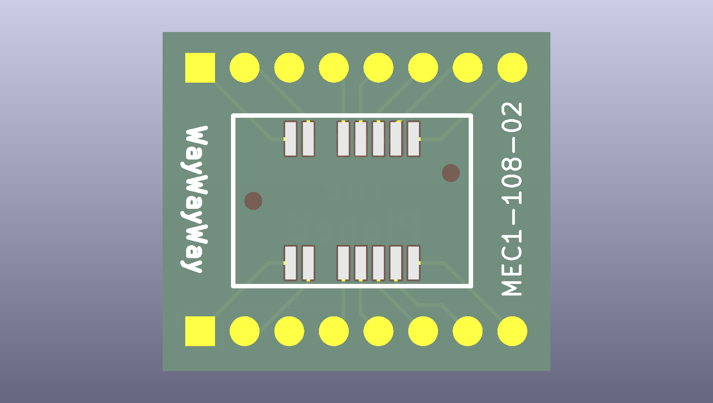
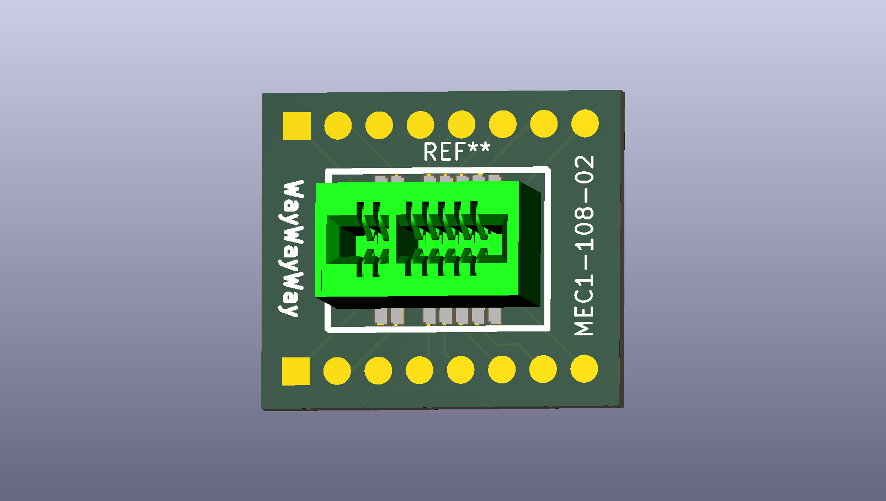

# MEC1-108-02 breakout (PACE 5268AC front debug / console port)

This folder supports the **Samtec MEC1** family **1.00 mm mini edge-card socket** used on the **PACE 5268AC** gateway: the narrow edge-finger opening on the **front panel** is intended to mate with a vertical MEC1 socket so you can reach the **console / debug** interface without opening the enclosure.

Official product page (example vertical part): [Samtec MEC1-108-02-F-D-A](https://www.samtec.com/products/mec1-108-02-f-d-a).

## What is in this directory

| Item | Description |
| --- | --- |
| [<code>MEC1-108-2 Breakout.kicad_pcb</code>](<MEC1-108-2 Breakout.kicad_pcb>) | KiCad **8** PCB layout for a small breakout that lands the MEC1 footprint to **two rows of eight** hand-solder / header pads (**16 nets**). The file metadata shows it was produced from a **GerbView** import, so treat it as the editable PCB artifact rather than a full KiCad project with schematic. |
| [`mec1.pdf`](mec1.pdf) | Samtec **MEC1** series mechanical / footprint reference (local copy; confirm against the latest print on Samtec’s site before fabrication). |
| [`MEC1-108-02-F-D-A/`](MEC1-108-02-F-D-A/) | Samtec-supplied **symbol**, **footprint**, **STEP**, and license/readme for the **MEC1-108-02-F-D-A** configuration. |
| [`gbr/`](gbr/) | **Gerber + drill** outputs for ordering PCBs (see [Fabrication (gerbers)](#fabrication-gerbers) below). |
| [`MEC1-108-2-breakout-bare-pcb.png`](MEC1-108-2-breakout-bare-pcb.png) | **2D** board render — bare PCB (no socket). |
| [`MEC1-108-2-breakout-assembled.png`](MEC1-108-2-breakout-assembled.png) | **3D** board render — populated with **Samtec MEC1-108-02** socket. |

## Board photos

**Bare PCB** (socket footprint and breakout pads):

**Assembled** with **Samtec MEC1-108-02** socket soldered:

Silk on the board identifies the **MEC1-108-02** land pattern. On each breakout row, the **square** pad marks **pin 1**; use the Samtec drawing in `mec1.pdf` together with your system documentation when assigning signals (this repo does not ship a verified netlist for the gateway edge fingers).

## Fabrication (gerbers)

Folder **[`gbr/`](gbr/)** contains a **KiCad 8.0.4** export for this breakout. The embedded KiCad project name is **`pace 5268ac`** (see `gbr/pace 5268ac-job.gbrjob`).

| File | Role |
| --- | --- |
| `gbr/pace 5268ac-job.gbrjob` | KiCad Gerber job — preferred upload to fabs that accept it |
| `gbr/pace 5268ac-F_Cu.gbr` / `gbr/pace 5268ac-B_Cu.gbr` | Copper top / bottom |
| `gbr/pace 5268ac-F_Mask.gbr` / `gbr/pace 5268ac-B_Mask.gbr` | Solder mask |
| `gbr/pace 5268ac-F_Paste.gbr` / `gbr/pace 5268ac-B_Paste.gbr` | Paste layers (SMT socket) |
| `gbr/pace 5268ac-F_Silkscreen.gbr` / `gbr/pace 5268ac-B_Silkscreen.gbr` | Silkscreen |
| `gbr/pace 5268ac-Edge_Cuts.gbr` | Board outline |
| `gbr/pace 5268ac-PTH.drl` | **16** plated through-holes (0.0394 in) — matches the **16** breakout holes |
| `gbr/pace 5268ac-NPTH.drl` | **2** non-plated holes (0.0402 in) — **MEC1 alignment / polarization** features on the socket land pattern |

From `pace 5268ac-job.gbrjob` at export: **2-layer** board, **1.6 mm** stackup in metadata, outline size about **22.1 × 19.4 mm** (always confirm in CAM). Re-import or diff against [<code>MEC1-108-2 Breakout.kicad_pcb</code>](<MEC1-108-2 Breakout.kicad_pcb>) if you regenerate from KiCad.

Run a **DFM preview** at your PCB vendor. The **gerber** filenames under `gbr/` contain **spaces**; some fabs’ uploaders need copies renamed.

## Third-party CAD

Samtec’s models and terms live under [`MEC1-108-02-F-D-A/License.txt`](MEC1-108-02-F-D-A/License.txt) and [`MEC1-108-02-F-D-A/readme-and-terms-of-use-3d-cad-models.txt`](MEC1-108-02-F-D-A/readme-and-terms-of-use-3d-cad-models.txt). Use their documentation as the authority for dimensions, plating options, and ordering suffixes (e.g. **-F-D-A** vs other variants).
