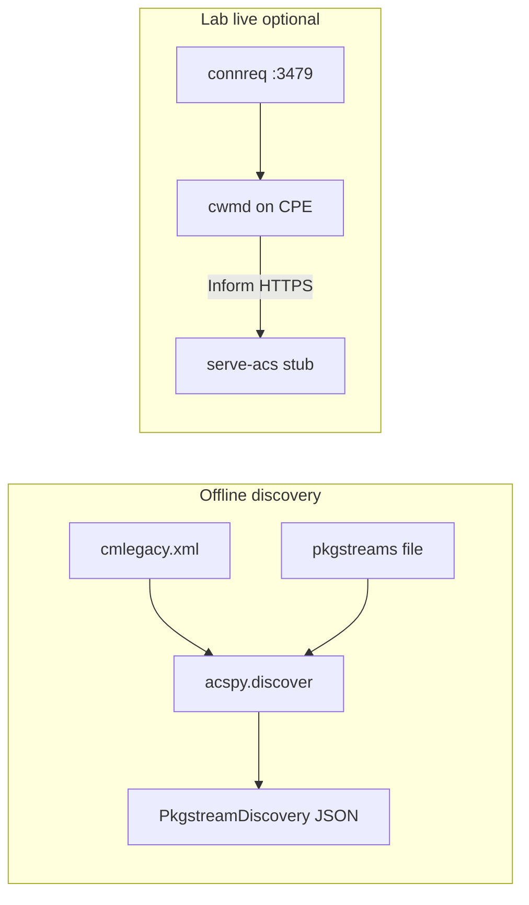

# acspy — ACS lab client and pkgstream discovery

**`acspy`** is a Python package in this repo for **authorized lab work** on owned AT&T 5268AC / Pace gateways. It emulates **ACS-side** TR-069 behavior (not the CPE): Connection Request to the CPE, optional minimal HTTP ACS stub for Inform capture, and **offline** merging of CMDB package tables with the [`pkgstreams`](../pkgstreams) CDN catalog.

It does **not** bypass carrier TLS, keycode bootstrap, or production `cwmp.c01.sbcglobal.net` infrastructure. For inventory without a live session, prefer **`acspy discover`** on a flash CMDB extract.

See also: [`firmware_upgrade_process.md`](firmware_upgrade_process.md), [`cmdb_security.md`](cmdb_security.md), [`cwmp_cpe_authentication.md`](cwmp_cpe_authentication.md), [`firmware.md`](firmware.md).

For **inbound BDC diagnostic pull** (HTTPS port **61001**, Basic auth, IPDR export), use **`bdcspy`** — [`bdc_diagnostic_pull.md`](bdc_diagnostic_pull.md).

---

## Install

From repo root (editable workspace):

```bash
pip install -e .
```

Module entry point:

```bash
python -m acspy --help
```

---

## Subcommands

### `discover` (offline, recommended)

Parses **`mgmt`**, **`mgmt_upgstate`**, and **`pkgs`** from `cmlegacy.*.xml` (UTF-16 LE), then matches active firmware version to **`pkgstreams`** HTTPS URLs for the device code from **`connreq_username`** (e.g. `00D09E-…` → `00D09E`).

```bash
python -m acspy discover --cmdb cmlegacy.203.xml
python -m acspy discover --cmdb cmlegacy.203.xml --json
```

### `catalog`

Resolve CDN URLs only (no CMDB):

```bash
python -m acspy catalog --device 00D09E --version 11.5.1.532678
```

### `connreq` (live CPE, LAN)

Sends HTTP(S) **Connection Request** to **`cwmd`** on port **3479** using digest credentials from CMDB **`mgmt.connreq_*`**.

```bash
python -m acspy connreq --host 192.168.1.254 --cmdb cmlegacy.203.xml
```

Use only on **your** lab unit. A successful response may cause the CPE to open an outbound CWMP session to **`acs_url`** (carrier ACS by default).

### `identity` (offline CPE fingerprint)

Maps **CMDB** + Ghidra **`cwmd`** defaults to TR-069 **DeviceId** and lab HTTP credential guesses. See [`cwmp_cpe_authentication.md`](cwmp_cpe_authentication.md).

```bash
python -m acspy identity --cmdb cmlegacy.203.xml
python -m acspy identity --cmdb cmlegacy.203.xml --json
```

### `inform` (CPE Inform builder / POST)

Builds SOAP **Inform** like **`soap_msg_inform`**. Default **dry-run** prints XML. POST is blocked against **`sbcglobal.net`** unless you pass **`--i-understand-production`** (authorized research only). Prefer **`serve-acs`** in lab.

```bash
python -m acspy inform --cmdb cmlegacy.203.xml --dry-run
python -m acspy inform --cmdb cmlegacy.203.xml --acs-url http://127.0.0.1:8080/cwmp/services/CWMP
```

### `serve-acs` (lab ACS HTTP stub)

Binds a minimal listener (default `http://127.0.0.1:8080/cwmp/services/CWMP`) that accepts **Inform** POSTs and returns **InformResponse** (or queued **GetParameterValues** if pre-queued on `AcsSoapSession`). Point **`mgmt.acs_url`** at this stub only in a controlled lab (CM edit / redirect / MITM).

```bash
python -m acspy serve-acs --host 0.0.0.0 --port 8080
```

---

## Python API

```python
from acspy.discover import discover_from_cmdb
from acspy.cmdb import load_cmdb_snapshot
from acspy.connreq import ConnreqClient

report = discover_from_cmdb("cmlegacy.203.xml", pkgstreams_catalog="pkgstreams")
snap = load_cmdb_snapshot("cmlegacy.203.xml")
cr = ConnreqClient.from_mgmt("192.168.1.254",
    connreq_port=snap.mgmt.connreq_port,
    connreq_username=snap.mgmt.connreq_username,
    connreq_passwd=snap.mgmt.connreq_passwd,
)
result = cr.send()
```

---

## Architecture



| Module | Role |
|--------|------|
| `acspy.cmdb` | UTF-16 CMDB XML → `MgmtConfig`, `UpgradeState`, `pkgs` |
| `acspy.gateway_catalog` | Parse `pkgstreams` → `GatewayEntry` HTTPS URLs |
| `acspy.discover` | Merge CMDB + catalog |
| `acspy.connreq` | Digest HTTP client to CPE |
| `acspy.cwmp` | SOAP Inform / GetParameterValues builders |
| `acspy.acs_http` | Threading HTTP ACS stub |

---

## Security note

CMDB extracts contain **`connreq_passwd`**, **`keycode`**, and other secrets ([`cmdb_security.md`](cmdb_security.md)). Do not commit decoded passwords or publish captures. **`connreq`** against production CPEs on the public Internet without authorization is out of scope.
