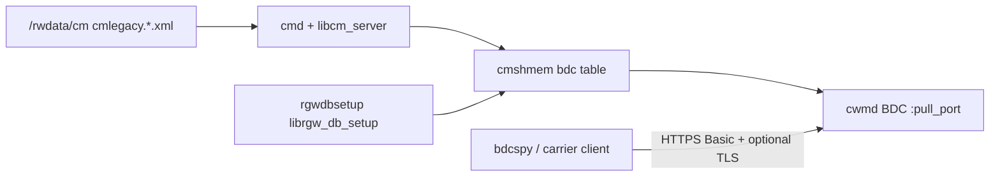

# BDC diagnostic pull (inbound HTTPS on port 61001)

Carrier **Broadband Diagnostic Channel (BDC)** on the AT&T 5268AC / Pace gateway is an **inbound** HTTPS listener inside **`cwmd`**. A client on the LAN (carrier tool or lab host) connects to the CPE, authenticates with CMDB **`pull_user` / `pull_passwd`**, and receives a diagnostic payload—primarily an **IPDR** document built by **`libbdcipdr.so`**.

This is **not** TR-069 Connection Request (port **3479**), **not** the web UI, and **not** outbound **`bdc_default`** telemetry POSTs.

See also: [`cmdb_security.md`](cmdb_security.md), [`acspy.md`](acspy.md), [`cwmp_cpe_authentication.md`](cwmp_cpe_authentication.md), [`output/bdc_cwmd_re_notes.md`](../output/bdc_cwmd_re_notes.md), [`LEGAL.md`](../LEGAL.md).

---

## Architecture



| Component | Role |
|-----------|------|
| **`rgwdbsetup`** | Boot: `librgw_db_setup: bdc db setup success` |
| **`librgw_compat`** | `tw_ulib_bdc_get_pull_password`, `tw_ulib_bdc_set_pull_password` |
| **`cwmd`** | `cwmd_bdc_*`, `bdc_conn_*`, HTTP parser `bhttp_par_*` |
| **`libbdcipdr.so`** | `createListIPDRData`, `writeIPDRDoc` on successful GET |
| **`rulemgrd`** | `update_bdc`, port publish helpers |
| Firewall | CMDB **`ports`** row **`pm_bdc`** → TCP **61001** |

Flash logs use prefix **`acs:`** (e.g. `acs: bdc started`); the binary is still **`cwmd`**.

---

## Credential provenance

| Item | Scope | Notes |
|------|--------|--------|
| **Storage** | Per-CPE **CMDB** `TABLE bdc` row 0 in `/rwdata/cm` | Not in install squashfs; not NAND board_params |
| **`pull_user` / `pull_passwd`** | **Device-specific secrets** (lab assumption until multi-unit compare) | `base64:…` in XML; decoded at runtime; writable via **`mifd` / `upgrade_pass`** |
| **`pull_realm`** | **Product constant** | HTTP Basic **realm label** only (typically `BDC Realm`), not the password |
| **`pull_port`, `ssl`, `pull_authtype`, `enable`** | **Product defaults** | 61001, TLS on, BASIC, enabled unless CMDB overrides |
| **Open question** | Same creds fleet-wide vs per serial | Compare redacted fingerprints from **two+** owned gateways |

Live pull requires **this unit’s** CMDB extract (`paceflash`, `cmlegacy.*.xml`)—not firmware image alone.

---

## Protocol (532678 Ghidra)

### URL path

```text
GET|POST https://<cpe-lan-ip>:<pull_port>/bdc/<ProductClass>_<SerialNumber>
```

- **ProductClass** / **SerialNumber** match TR-069 DeviceId sources (`board_info_*` in `cwmd_bdc_init`), not `pull_user`.
- Lab default product class: **`homeportal`** ([`cwmp_cpe_authentication.md`](cwmp_cpe_authentication.md)).
- Serial: suffix of **`mgmt.connreq_username`** after `00D09E-` (see `acspy identity`).

### Methods

| Method | Behavior |
|--------|----------|
| **GET** | Read body (often empty) → build parameter map → **`writeIPDRDoc`** → **`application/octet-stream`** |
| **POST** | `Content-Type`: `application/x-www-form-urlencoded`, `multipart/form-data`, or `text/xml` → **`mif_find_params`** / **`mif_get_params`** (CWMP OID tree); may return IPDR or SOAP-shaped data |

### Authentication

- **`Authorization: Basic`** when `pull_authtype` is BASIC (CMDB enum).
- **401** + `WWW-Authenticate: Basic realm="<pull_realm>"` if missing/invalid.
- **Digest** branch exists when authtype is not BASIC (`bdc_conn_auth_digest*`).

### TLS

When **`bdc.ssl`** is enabled, accept uses **`bdc_conn_ssl_init`** with device material from **`keys` / `root_rsa`** ([`cmdb_security.md`](cmdb_security.md)). Lab clients use `--insecure` or pin the cert from the first handshake.

---

## CMDB fields (`TABLE bdc`)

| Field | Example | Note |
|-------|---------|------|
| `enable` | `1` | `acs: bdc stopped` when off |
| `ssl` | `1` | HTTPS listener |
| `pull_port` | `61001` | Also `pm_bdc` in `ports` |
| `pull_user` | (per device) | HTTP Basic username |
| `pull_passwd` | `base64:…` | Decoded after `base64:` prefix |
| `pull_authtype` | `BASIC` | |
| `pull_realm` | `BDC Realm` | Realm string only |

---

## Lab tooling (`bdcspy`)

Authorized **owned** CPE on LAN only.

```bash
pip install -e .

# Redacted BDC row + path template
python -m bdcspy identity --cmdb cmlegacy.203.xml

# Probe paths (401 without creds is success for reachability)
python -m bdcspy probe --host 192.168.1.254 --cmdb cmlegacy.203.xml --insecure

# GET diagnostic (IPDR octet stream)
python -m bdcspy pull --host 192.168.1.254 --cmdb cmlegacy.203.xml --insecure --out output/bdc_capture/pull.bin

# Save trace JSON under output/bdc_capture/ (gitignored)
python -m bdcspy capture --host 192.168.1.254 --cmdb cmlegacy.203.xml --insecure
```

`--decode-secrets` prints real `pull_passwd` locally only; never commit captures or decoded passwords.

---

## Live checklist

1. CPE on LAN; note gateway IP (e.g. `192.168.1.254`).
2. Confirm **`bdc.enable=1`** in CMDB (or flash extract).
3. Confirm listener: `:::61001` / `0.0.0.0:61001` (UART `netstat` if needed).
4. `bdcspy identity` → build `/bdc/homeportal_<serial>` path.
5. `bdcspy probe` → expect **401** without auth, **200** + octet-stream with valid Basic auth.
6. Inspect IPDR with `bdcspy` helpers or external IPDR tools.

---

## Contrasts

| Mechanism | Direction | Port | Creds |
|-----------|-----------|------|-------|
| **BDC pull** | Inbound to CPE | 61001 | `bdc.pull_*` |
| **TR-069 ConnReq** | Inbound wake | 3479 | `connreq_*` (`tr069 connreq`; see [`tr069_connection_request.md`](tr069_connection_request.md)) |
| **CWMP Inform** | Outbound to ACS | 443/80 | ACS HTTP user/pass |
| **`bdc_default`** | Outbound telemetry | carrier URL | `http_username` / `http_password` in profile |
