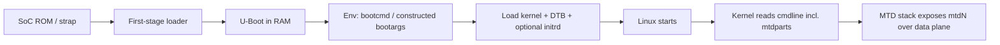
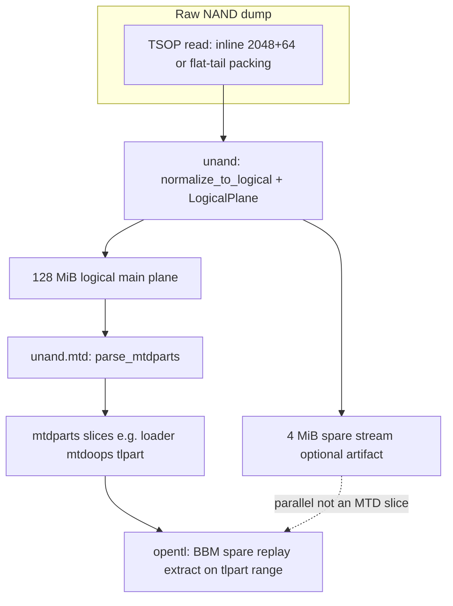

# Boot chain and storage (5268-class Pace offline model)

This note aligns **repository packages** with how Linux and MTD treat the NAND **data plane**, and where **U-Boot strings** fit. It complements [hardware.md](hardware.md), [firmware.md](firmware.md), and [tools.md](tools.md).

## Boot chain (reset → Linux)

On real devices, **`mtdparts=` almost always appears in the kernel command line (`bootargs`)**, not as literal text inside a minimal `bootcmd`. U-Boot may **build** `bootargs` via `setenv`, `run` scripts, or defaults—grammar varies by vendor. The **`uboot`** package supports conservative offline parsing of merged **Linux cmdline** strings and simple **`bootcmd`** segments (see `uboot/bootcmd.py`).

**Important:** `mtdparts=` is **kernel cmdline configuration**. It is **not** an on-NAND structure like a partition table sector (though boot code may also probe spare for markers—see [unand/README.md](../unand/README.md) and [opentl.md](opentl.md)).

## Storage / MTD stack (offline mirror)

- **Raw dump → logical plane:** `unand` geometry and `normalize_to_logical` produce the **128 MiB** contiguous **main** bytes MTD indexes, plus an optional **4 MiB** spare file in page order ([unand/README.md](../unand/README.md)).
- **Partitions:** `unand.mtd.parse_mtdparts` is the **single parser of record** for `mtdparts=mtd-0:…` on that logical plane.
- **Boot string bridge:** `uboot` extracts the space-delimited `mtdparts=…` token from a full `bootargs` string and delegates partition math to `unand.mtd` (`uboot/mtdparts.py`).
- **Env image → `mtdparts` (offline):** `boardfs.flash_layout` **`try_mtdparts_from_uboot_env`** reads fixed-size **U-Boot env v1** blobs on the **logical** plane (`uboot.env.parse_uboot_env_v1` + `unand.layout.read_logical_plane_interval`), validates the table with **`unand.mtd`**, and is used by **`build_layout_interactive`** before string **`mtd-scan`** fallback. Pace-class full-chip file sizes map remainder math to **128 MiB** via **`effective_mtd_reference_size`**.
- **OpenTL:** Consumes **partition-relative** main bytes (and spare aligned by page index) within the `tlpart` slice—see package docstring in `opentl/__init__.py`.
- **UBI on MTD:** Linux **`ubi.mtd=`** attaches UBI to an MTD partition (often **`tlpart`**). **`root=ubi0:...`** selects a **UBI volume**, not raw MTD bytes. Offline carving / decode lives in **`boardfs.ubi_carve`** and **`boardfs.ubifs_decode`**. Cmdline parsing, backing **`BlockDev`**, and VID header hits: **`boardfs`** — see **[boardfs.md](boardfs.md)**. **`/etc/fstab`** from an ext2/3/4 image: **`paceflash.fstab`** — **[paceflash.md](paceflash.md)**.

## Offline tool mapping

| Diagram stage | Primary package / entry |
|---------------|-------------------------|
| Raw dump layout, logicalize | `unand` — `unand.io.normalize_to_logical`, `unand.plane.LogicalPlane` |
| `mtdparts` math on logical plane | `unand.mtd` — `parse_mtdparts`, `MtdPart` |
| `bootargs` / `bootcmd` strings → `mtdparts` token | `uboot` — `get_mtdparts_token`, `partition_table_from_bootargs` |
| Raw dump → env-sized logical read (no full copy) | `unand.layout` — `read_logical_plane_interval` (used by `boardfs.flash_layout` env probe) |
| Env v1 blob → validated `mtdparts` table | `boardfs.flash_layout` — `try_mtdparts_from_uboot_env`, `build_layout_interactive` |
| OpenTL BBM / spare / extract | `opentl` — `tl_bbm`, `spare_chain_replay`, `open_tl`, `extract` |
| TL disklabel slices (`opentla*`) | `opentl` — **`tldisk`** (`enumerate_tl_slices`, …); see **[boardfs.md](boardfs.md)** |
| MTD + TL + `ubi.mtd=` orchestration | **`boardfs`** (repo root) — **[boardfs.md](boardfs.md)** |
| Flash inventory CLI + `/etc/fstab` on ext image | **`paceflash`** — **[paceflash.md](paceflash.md)** |
| UBI / UBIFS carve + decode | `boardfs` — **`ubi_carve`**, **`ubifs_decode`** |
| Firmware artifact indexing | `corpus` + `lib2spy` + `paceflash` — see [tools.md](tools.md) |
