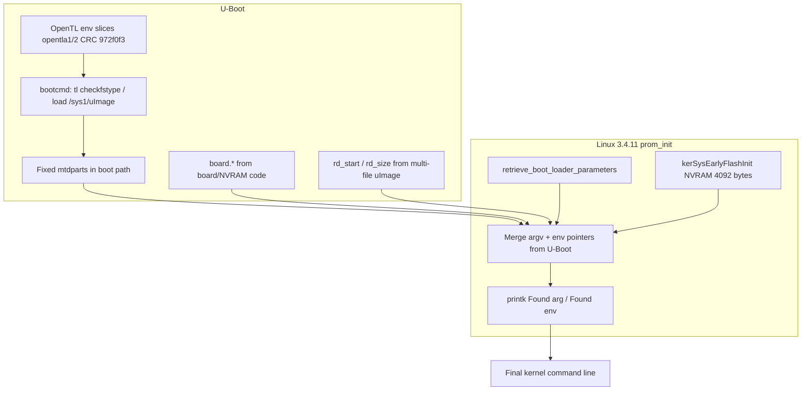

# Boot environment, kernel cmdline, and `trust_engcert`

Firmware slice: **11.5.1.532678** (5268AC). How the **kernel command line** is built, where **U-Boot/OpenTL environment** lives, and **practical ways to set `gw:trust_engcert`** (engineering trust + serial UART — see [`console_uart_disable.md`](console_uart_disable.md)).

---

## Kernel command line: where it comes from

### Observed line (install / upgrade boot)

From `fwupgrade.txt` (and matching flash log strings):

```text
console=ttyS0,115200 mtdoops.mtddev=mtdoops mtdoops.record_size=131072
mtdparts=mtd-0:524288(loader),1048576(mtdoops),-(tlpart)
init=/bin/init
rd_start=0x80A9A000 rd_size=0xF73DA
board.battery_index=0 board.gmac=1 board.dsl_afe=3 board.enet_mac=12
board.ext_intr=6 board.board_features=9 board.gpio_map=9 board.gpio_overlay=8
board.single_lan_led=1 board.srom_patch=5 board.voice_parm=1 board.wlan_config=2
irqaffinity=0
```

U-Boot prints before handoff:

```text
Starting kernel commandline=console=ttyS0,115200 mtdoops... init=/bin/init ...
## U-boot passing env 0x80A9A000
## U-boot passing env 0xF73DA
```

### Assembly pipeline



| Stage | Source | Notes |
|-------|--------|-------|
| **Base console / mtdparts** | U-Boot + kernel `prom_init` | `console=ttyS0,115200`; `mtdparts=mtd-0:524288(loader),1048576(mtdoops),-(tlpart)` fixed in boot log |
| **`board.*=…`** | U-Boot → kernel env | PCA / strap-derived; e.g. `260-2173300` prom init, `board.enet_mac=12` |
| **`rd_start` / `rd_size`** | U-Boot from **embedded initrd** in multi-file `uImage` | Second payload ~989 KiB; standalone `/sys1/initrd` may be absent |
| **`init=/bin/init`** | U-Boot | BusyBox init → `inittab` → `rcS` |
| **NVRAM** | `kerSysEarlyFlashInit: NVRAM size=4092` | Broadcom **4092-byte** NVRAM region (CRC logged); distinct from factory `sn=` block and from paramtool DB |

Kernel **`prom_init`** ([`prom_init_ghidra.md`](prom_init_ghidra.md)) merges **argv-style** and **env-pointer** strings (`Found arg …` / `Found env …` in dmesg). Default embedded mtd string in `.rodata` targets a **different** layout (`393216(loader),-(ubipart)`) — **not** what this product boot uses; runtime line comes from **U-Boot**.

### What you cannot set from cmdline alone

- **`trust_engcert`** — **not** a kernel boot argument. It is a **`paramtool` / `board_param_*`** key (`gw:trust_engcert`).
- **UART enable** — not a standard kernel param; controlled by **`S01UART`** + `/proc/bcmlog` after rootfs init ([`console_uart_disable.md`](console_uart_disable.md)).

Changing **`console=`** in U-Boot env would affect **which device is the kernel console**, not the **`S01UART` MMIO disable** (that runs later in userland).

---

## U-Boot / OpenTL environment

### MTD layout (cmdline)

```text
mtdparts=mtd-0:524288(loader),1048576(mtdoops),-(tlpart)
```

| Partition | Size | Role |
|-----------|------|------|
| **loader** | 512 KiB | U-Boot, factory block, NVRAM-related data |
| **mtdoops** | 1 MiB | Oops log (`mtdoops` driver) |
| **tlpart** | remainder | OpenTL → `opentla1`…`opentla4` (ext2 on `opentla4` for `/rwdata`) |

### OpenTL env (U-Boot)

Boot log:

```text
tldisk env part info: CRC=972f0f3/972f0f3 env_size=65531
env dump ... bootcmd=if tl checkfstype 5 ...
```

| Item | Detail |
|------|--------|
| **Slices** | **`opentla1`** / **`opentla2`** — primary/backup env (**type `0x1d`**, ~128 sectors each) |
| **CRC** | **`972f0f3`** (per-build fingerprint for grep in `tlpart` dumps) |
| **`bootcmd`** | Starts with **`if tl checkfstype 5 7; then`** … **`ufsls` / `ufsload` / `ext2load`** paths to load **`/sys1/uImage`** from **OpenTL partition 5** |
| **Install image** | Upgrade path loads **`Install image (5268/att)`** from `/sys1/uImage` on `opentla0:5` |

Full `bootcmd` string is **truncated** in flash dumps (~59 chars visible); complete command spans **UFS + ext2** branches ([`firmware.md`](firmware.md) § U-Boot boot target).

### Changing boot environment (conceptual)

| Goal | Leverage |
|------|----------|
| Change boot image / cmdline fragments U-Boot passes | Edit **`bootcmd` / `bootargs`** in **`opentla1`/`opentla2`** env (U-Boot `setenv` + save, or offline edit with CRC repair) |
| Change kernel-only params | Same env vars U-Boot appends before `bootm` |
| Persist across flash | Must update **both** env copies or rely on primary+backup repair logic |

**Risk:** invalid CRC or `env_size` → U-Boot falls back or fails env load; keep **`972f0f3`**-style validation in mind when diffing builds.

### `stdin` / `stdout` / `stderr` and `serverip` (not Linux console policy)

On lab flash dumps, the **same persisted env region** as `gw:trust_engcert` and `*_p12` also carries classic **U-Boot environment** keys (primary + backup copies, e.g. ~`0x41E27xx` and ~`0x41F2Fxx` in `flash strings.txt`):

| Key | Example value | Role |
|-----|----------------|------|
| `baudrate` | `115200` | Serial console speed in U-Boot |
| `ipaddr` | `192.168.1.1` | Board IPv4 when Ethernet is up in U-Boot |
| `serverip` | `192.168.1.10` | TFTP server for **`tftpboot`** / network load (U-Boot prints `*** ERROR: 'serverip' not set` if missing) |
| `stdin` / `stdout` / `stderr` | `serial` | U-Boot **stdio device names** — console I/O bound to UART during bootloader |
| `bootdelay` | `3` | Interrupt window before `bootcmd` |
| `bootcmd` | long OpenTL script | Image load path |

**What this does *not* mean**

- **`stdin=serial` is not “pick serial vs another input mode” for Linux.** It names the **U-Boot** console device. After `bootm`, the kernel uses **`console=ttyS0,115200`** from merged cmdline; post-boot UART gating is **`S01UART`** + **`/proc/bcmlog`**, not `stdin=` ([`console_uart_disable.md`](console_uart_disable.md)).
- **`serverip` is not an alternative serial path.** It enables **factory/lab TFTP** on a `192.168.1.x` bench subnet alongside `ipaddr`, not operator shell over the network.
- **No other `stdin=` values appear in the 532678 flash string sweep** — only `stdin=serial` (same for `stdout` / `stderr`). Generic U-Boot builds can support other stdio device strings on some platforms; this **shipped env** does not persist `stdin=nc`, USB tty, etc.

**Relation to `paramtool`**

- `gw:*` and `*_p12` keys are **Pace board_param** entries stored in the **same NUL-separated `key=value` blob** U-Boot/env tooling uses; `paceflash paramtool` picks up `stdin`, `serverip`, `baudrate`, … via **region parse** around `gw:trust_engcert=`, not only the `gw:` regex.
- Changing `stdin` in flash would affect **pre-Linux bootloader** interaction only; it does not bypass **`gw:trust_engcert=false`** + **`S01UART`** for runtime serial disable.

---

## `gw:trust_engcert` and `trust_eng` — storage and consumers

### `gw:trust_engcert` (paramtool / board_param)

| Property | Detail |
|----------|--------|
| **API** | `/usr/bin/paramtool` → `board_param_open` / `board_param_get` / `board_param_set` ([`libboard.md`](libboard.md)) |
| **Key format** | `gw:trust_engcert` (namespace `gw:` + name) |
| **Values** | Corpus: **`false`**; scripts expect literal **`true`** for enable |
| **Flash comment** | `# in the paramtool flash partition` in `lib.sh` |
| **File extension** | `.board_param` appears in flash strings (structured blob) |

**Consumers:**

- `get_perm_trusteng()` → **`S01UART`**, `chk_enable_trusteng`, `chk_enable_sshd`
- `librgw_compat` **`tw_ulib_is_trustengcert_enabled`** → pkgstream engineering-root policy ([`pkgstream_security.md`](pkgstream_security.md))
- `lib2sp` via pkgd at install time

**CMDB OID** for the same logical flag is **not** fully resolved in static RE (PIC `.got`); runtime path for UART is **definitely paramtool**, not `cmc` alone.

### `cmlegacy.temp.0.trust_eng` (CMDB)

| Property | Detail |
|----------|--------|
| **Default** | **`0`** in captured `cmlegacy.*.xml` blobs (flash strings) |
| **Set by** | `cmc -c set cmlegacy.temp.0.trust_eng "1"` when `get_perm_trusteng` succeeds |
| **Effect** | Engineering/lab services (SSH bind, pkg hooks reading CMDB) |

Setting **only** CMDB **without** paramtool does **not** stop **`S01UART`** from disabling the UART on boot.

---

## Dual stores: paramtool vs CMDB (pkgstream vs UART)

| API / key | Store | UART (`S01UART`) | Pkgstream (`lib2sp`) | Linked at runtime? |
|-----------|-------|------------------|----------------------|--------------------|
| **`gw:trust_engcert`** | **`board_param_*`** via **`paramtool`** | **Yes** — `get_perm_trusteng()` requires file content **`true`** | **No** (not read by `tw_ulib_*` in RE) | Source of truth for boot UART |
| **`cmlegacy.temp.0.trust_eng`** | CMDB `/rwdata/cm/` | **No** alone | **`tw_ulib_is_trustengcert_enabled`** uses **`cm_tran_get_*`** (OID in `.rodata`, not plain ASCII in `strings`) | **`chk_enable_trusteng`** sets CMDB **`1`** only when paramtool already **`true`** |

Flash CMDB snapshots show **`trust_eng=0`** (not a separate `trust_engcert` XML field). The librgw symbol is named **`trustengcert`** but the persisted CMDB column is **`trust_eng`**.

**Practical rule:** flip **`gw:trust_engcert`** with **`paramtool`** for serial + boot; expect **`att.sh` / `chk_enable_trusteng`** to mirror **`trust_eng=1`** in CMDB for pkg/SSH policy.

---

## `paramtool` CLI (Ghidra `/usr/bin/paramtool`, `main` @ `0x00400ad0`)

Usage string in `.rodata`:

```text
paramtool -show
paramtool -set <name> [-in <file> | <value>]
paramtool -get <name> [-out <file>]
paramtool -del <name>
paramtool -clear
```

`-set` calls **`board_param_set`** with either an inline **`<value>`** string (up to 64 KiB read path for `-in`) or file contents from **`-in`**.

---

## How to set `trust_engcert` (operator / RE)

### 1. On a running system (preferred if you have root)

```sh
# Read (must be exactly "true" for get_perm_trusteng / S01UART)
paramtool -get gw:trust_engcert -out /tmp/_trustengcert
cat /tmp/_trustengcert

# Write (confirmed from paramtool main — inline value form)
paramtool -set gw:trust_engcert true

# Verify
paramtool -get gw:trust_engcert -out /tmp/_trustengcert && cat /tmp/_trustengcert
```

`get_perm_trusteng()` in `/rwdata/config/lib.sh` (flash strings @ `0x54BFF4`):

```sh
paramtool -get gw:trust_engcert -out /tmp/_trustengcert > /dev/null 2>&1
if [ "$?" -eq "0" ]; then
    TEOK=`cat /tmp/_trustengcert`
    if [ ! -z "$TEOK" ] && [ "$TEOK" = "true" ]; then
        return 1   # enabled
    fi
fi
return 0
```

After reboot, **`S01UART`** uses the same check. **`chk_enable_trusteng`** then runs:

```sh
cmc -c set cmlegacy.temp.0.trust_eng "1"
```

Then **reboot** and confirm:

- `S01UART` message: **`***** Enabled the BRCM UART *****`**
- Optional: `cmc -c get cmlegacy.temp.0.trust_eng` → `1` after `NetworkAutoDetection` / `att.sh` runs

**Also try CMDB path for SSH/lab** (after paramtool is true):

```sh
cmc -c set cmlegacy.temp.0.trust_eng "1"
```

### 2. Via provisioning / pkg scripts

If a **labs** or **engineering** pkg installs `/rwdata/config/att.sh` and sets paramtool, **`NetworkAutoDetection.sh`** cron (`*/1 * * * *` in corpus) re-sources policy.

### 3. Offline flash edit

Use **`paceflash patch-trust-engcert`** (see [`nand_patch_install.md`](nand_patch_install.md)) — patches **`gw:trust_engcert`** in **primary + backup** **`tlpart`** board_param env copies and appends **`trust_engcert=true`** to the **loader** manufacturing factory block (~`0x1F004`).

Manual / RE path:

1. **`paceflash paramtool`** — dump keys from assembled **`tlpart`** (see [`paceflash.md`](paceflash.md) § `paramtool`).
2. Locate **paramtool partition** in **loader** or rwfs image (grep **`gw:trust_engcert=false`** in full flash dump — offsets **`0x41E27A7`** / **`0x41F2FA7`** in one corpus).
3. Patch to **`true`** preserving blob format/CRC (**`board_param_open`** validates length/CRC — needs RE or live `paramtool`).
4. Reflash or replace partition.

### 4. Factory / manufacturing block

Factory block at loader **`~0x1F004`** (anchor **`model=`** at **`~0x1FF84`**) includes **`factory_mode`**, **`sn=`**, **`devkey=`**, etc. ([`board_params_nand.md`](board_params_nand.md)). Stock dumps have **no** `trust_engcert` key; **`patch-trust-engcert`** appends **`trust_engcert=true`** into the zero-padded tail so factory/hard reset may re-seed paramtool from manufacturing defaults. **Authoritative runtime key** remains **`gw:trust_engcert`** in **`tlpart`** board_param — factory copy is best-effort until verified on live reset.

### 5. What does **not** work

| Approach | Why |
|----------|-----|
| Kernel cmdline `trust_engcert=1` | Not parsed by `prom_init` for this purpose |
| U-Boot `bootargs` only | Does not set paramtool store |
| CMDB-only `trust_eng=1` before boot | **`S01UART` runs before** full `att.sh`; uses **paramtool** only |
| bcmnand `uboot_console_enable` sysfs (unconfirmed) | Not wired in Linux init scripts; separate from `S01UART` |

---

## Boot timeline (trust + UART)

| Time | Component | Action |
|------|-----------|--------|
| t0 | U-Boot | Load uImage+initrd; build cmdline + `board.*` |
| t1 | Kernel | `console=ttyS0` enabled; drivers bind |
| t2 | `init` / `rcS` | **`S01UART`**: paramtool get → disable or enable UART |
| t3 | `serviceinit` | `rgwdbsetup`, `pkgd`, runit services |
| t4 | `getty` | `ttyS0` getty (may have no RX) |
| t5+ | `NetworkAutoDetection.sh` / `att.sh` | If `trust_engcert=true`: CMDB `trust_eng`, SSH, UART poke, lab passwd |

---

## Related files on device

| Path | Role |
|------|------|
| `/rwdata/config/lib.sh` | `get_perm_trusteng`, `chk_enable_trusteng`, `chk_enable_sshd`, `fast_config_*` |
| `/rwdata/config/att.sh` | Main ATT config; lab trust block |
| `/rwdata/config/NetworkAutoDetection.sh` | Sources `lib.sh` + `att.sh`; cron |
| `/rwdata/cm/` | CMDB persistence (`trust_eng`, etc.) |
| `/proc/bcmlog` | MMIO poke interface |
| `/sys1/uImage` on OpenTL | Install/recovery kernel image |

Squashfs ships **`etc/init.d/S01UART`** only; **`lib.sh` / `att.sh`** are on **`/rwdata/config/`** (writable tree).

---

## Open RE

- **`paramtool` main**: confirm `-set` / `-list` / flush semantics and on-disk path.
- Map **paramtool partition** to MTD/UBI/file (loader vs `opentla*`).
- Full **`bootcmd`** string and whether **`bootargs`** variable exists beside inline cmdline build.
- **`tw_ulib_set_trustengcert`** — who can call it (httpd? cmcli?); ACL on CMDB writes.
- NVRAM **4092** region vs **board_param** blob — overlap or separate.

---

## See also

- [`console_uart_disable.md`](console_uart_disable.md) — `/proc/bcmlog`, `S01UART`, MMIO values
- [`pkgstream_security.md`](pkgstream_security.md) — engineering cert gate
- [`firmware.md`](firmware.md) — OpenTL / uImage boot path
- [`prom_init_ghidra.md`](prom_init_ghidra.md) — kernel cmdline merge
- [`cm_cmdb.md`](cm_cmdb.md) — CMDB / `cmc` tooling
