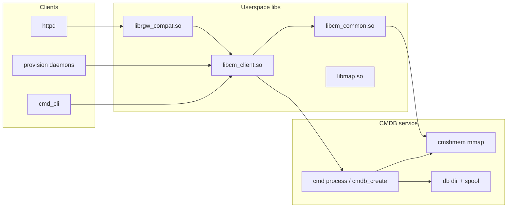

# Configuration manager (CM) and CMDB (`cm_*`, `cmdb_*`)

Firmware slice: **`att-5268-11.5.1.532678_prod_lightspeed-install`**, MIPS big-endian. Analysis uses Ghidra project **`5268ac`** and symbol grep via **[`output/elf_symbol_master_att532678_squashfs_0x0000ab0c.tsv`](output/elf_symbol_master_att532678_squashfs_0x0000ab0c.tsv)** (generated by **[`tools/elf_symbol_master.py`](tools/elf_symbol_master.py)**).

This doc ties together **library APIs**, the **CMDB control plane**, **runtime shared-memory access**, and **where passwords live** relative to the secondary squashfs UI config (`conf/*.xml`).

## Architecture (logical)

- **`libcm_client`**: transaction API (**`cm_tran_*`**), DB connect (**`cm_db_connect`**), RPC stubs (**`cmdb_*`**, **`ar_clnt_*`**).
- **`libcm_common`**: OID/string/schema helpers (**`cm_oid_*`**, **`cmschema_*`**, **`cmtype_*`**), **shared-memory accessors** (**`cmshmem_*`**) backed by **`mmap`/`msync`** (see imports on **`libcm_common`**).
- **`librgw_compat`**: high-level **`tw_ulib_*`** including **`tw_ulib_pwd_*`**; implements password checks on top of **`cm_tran_*`** / user-table walks (not XSLT).

The **`/usr/bin/cmd`** binary (present in the Ghidra project) exposes **CMDB embedding APIs** by string: **`cmdb_create`**, **`cmdb_process`**, **`cmdb_attr_setdbdir`**, **`cmdb_attr_settmpdir`**, **`cmdb_attr_setmanaged`**, **`cmdb_spool_1`**, **`cmdb_stop_1`**. It also references **`libcm_server.so.0`**, **`libcm_client.so.0`**, **`libcm_common.so.0`** — consistent with **`cmd`** being the **on-box CMDB driver** (or loader) that configures **database directory** and **temp/spool** before processing.

## API families (concise)

### `cm_tran_*` (`libcm_client`)

Typed **transaction** accessors on configuration objects: allocate OID rows, get/set scalars (**`cm_tran_get_str`** / **`cm_tran_set_str`**), maps (**`cm_tran_get_map_str`**), flags, buffers; **`cm_tran_commit`** / **`cm_tran_abort`** (and async variants); **`cm_tran_verify`** / dump helpers. This is the primary API **`librgw_compat`** uses under **`tw_ulib_*`**.

### `cm_oid_*`, `cmschema_*`, `cmtype_*` (`libcm_common`)

- **`cm_oid_*`**: construct, compare, hash, print **OID paths** (dot-separated TR-069–style names).
- **`cmschema_*`**: load schema, resolve enums/flags, **`cmschema_get`**, lookup iterators.
- **`cmtype_*`**: stringify / parse typed CM values (int, bool, time, IP, MAC, etc.).

### `cmshmem_*` (`libcm_common`)

**`cmshmem_ro_open`** / **`cmshmem_rw_open`**, **`cmshmem_*_lookup`**, **`cmshmem_*_dump`**, malloc/free/realloc — **read-mostly and read-write views** of CM backing storage. Decompilation of **`cmshmem_ro_open`** (`0x0002951c`) shows **`open`/`mmap`-style** failure paths and **`syslog`** on errors; **`libcm_common`** imports **`mmap64`**, **`msync`**, **`munmap`** — consistent with **mmap’d shared segment(s)** for live configuration.

### `cmdb_*` / AXDR (`libcm_client` imports)

Imported symbols include **`cmdb_connect_1`**, **`cmdb_rdlock_1`**, **`cmdb_wrlock_1`**, **`cmdb_commit_1`**, **`cmdb_abort_1`**, **`cmdb_spool_1`**, **`cmdb_notify_1_svc`**, and **`axdr_cmdbx_*`** / **`axdr_cmdb_*`** types — **RPC marshalling** to the CMDB service (SunRPC-style **`ar_clnt_call`** family in the same import list).

### `cm_db_connect` (anchor RE)

**Address:** **`libcm_client.so.0`** @ **`0x0001f1d0`**.

Decompilation shows: validation of arguments; allocation of a connection context; **`ar_clnt`-style** registration calls with procedure IDs **`0x2000000a`** and **`0x2000000b`**; enumeration/fill of a vector of transport endpoints; on success returns a pointer to a **`cm_db`**-style handle used by **`cm_tran_*`**.

**Return codes observed:** **`0x16`** (22) on invalid args — aligns with **`EINVAL`**-style usage elsewhere in Pace code.

## Dependency libraries (why they appear)

| Library | Role in CM stack |
|---------|-------------------|
| **`libcm_client.so`**, **`libcm_common.so`** | CM API + schema + shmem |
| **`libcm_server.so`** | Referenced by **`cmd`** strings — server-side CMDB glue (daemon/library) |
| **`libmap.so`** | **`map_*`** hash maps used in **`libcm_client`** imports (transaction side tables) |
| **`libnl*`**, **`libcurl`**, **`libdsl`**, **`libwifi`**, OpenSSL | Pulled in by **`librgw_compat`** for network/DSl/WiFi/crypto — **not** the CM core, but same daemons often hold **`cm_db`** handles |

## Passwords and secrets

| Fact | Detail |
|------|--------|
| **Not in secondary squashfs XML** | **`webs_conf.xml`** / **`soap_conf.xml`** define vhosts, rewrites, SOAP policy — **not** the CM user/password database. |
| **`tw_ulib_pwd_auth`** | **`httpd`** **imports**; **`librgw_compat.so.0.0.0`** **exports** — see TSV lines: `IMPORT ... httpd ... tw_ulib_pwd_auth` and `EXPORT ... librgw_compat ... tw_ulib_pwd_auth`. |
| **Implementation** | **`tw_ulib_pwd_auth`** (`~0x000c03dc`): resolves user via **`_find_user_row_byuser`**, reads passwd-related leaves through **`cm_tran_*`** / OID walks; **`tw_ulib_pwd_get_passwd`** reads **two OID segments** (indices **`1`** and **`2`** in the decompilation) into buffers, then optionally decrypts/expands (**`param_5 == 2`** branch). Plain HTTP passwords are compared against **CM-stored** material (possibly hashed via **`tw_ulib_pwd_hash`**). |
| **TR-064 digest** | Parallel track: **`soap_conf.xml`** realm **`TR-064`** / user **`dslf-config`** — digest verification path in **`httpd`** / SOAP stack, still backed by CM for credential mapping where applicable. |

For grep-style symbol lookup across ELFs under **`bin`/`usr/bin`/`lib`/`usr/lib`**, use **`tools/elf_symbol_master.py`** output (see **`output/elf_symbol_master_*.tsv`**).

## Storage mechanism (evidence and hypotheses)

### What we can state from binaries

1. **Runtime:** **`cmshmem_*`** + **`mmap`/`msync`** imply a **memory-mapped** (or shared-file-backed) **live CM image** used for fast reads/writes.
2. **CMDB control:** **`/usr/bin/cmd`** strings prove configurable **`cmdb_attr_setdbdir`** and **`cmdb_attr_settmpdir`** and **`cmdb_spool_1`** — persistence is **directory-oriented** (database dir + temp + **spool** for commits/journal-style I/O), not a single magic inode name inside **`librgw_compat`**.
3. **Client RPC:** **`cm_db_connect`** talks to a service using **`ar_clnt_*`** and fixed RPC program/procedure constants — the **authoritative writer** for durable state is **server-side** ( **`cmd` / `libcm_server` / dedicated daemon**), not **`httpd`**.

### NAND / MTD correlation (repo artifacts)

- **[`output/nand_rwdata_cm.md`](output/nand_rwdata_cm.md)** — **MTD index → `tlpart` offsets**, OpenTL **partition 5** sector math, UBIFS scan results on **`PACE 5268AC S34ML01G1@TSOP48.BIN`**, **`tmpdir`** / **`cmshmem_rw_open`** notes.
- **`pace_tl_map.json`**: **OpenTL / BBM** geometry (**`logical_prefix_bytes`**, **`virt_to_phys_block`**) — use when carving **raw NAND** images; it does **not** name CM paths (no **`rwdata`** strings in that JSON).
- **`opentl_kernel_ghidra.md`**: kernel **`opentl_add_mtd`**, **`tlpart`**, **512/2048** page model — align extractions with **`tl-extract`** / **`KERNEL_NAND_PAGE_BYTES`**.
- **`fwupgrade.txt`**: runtime log references **`/rwdata/sys2/version.txt`** — indicates a **writable filesystem** (often UBIFS overlay) for **per-install state**; CMDB **`dbdir`** / **`tmpdir`** on product builds are **likely under a writable mount** (e.g. **`/rwdata`** or similar), but **exact paths must be recovered** from init scripts or **`strings cmd`** on a full rootfs / live device — **not yet resolved in Ghidra-only pass**.

### Open questions (for NAND dump analysis)

- ~~Default **`cmdb_attr_setdbdir`** path~~ — **`etc/sv/cmd/run`** invokes **`cmd --dbdir /rwdata/cm --start`** (see [`output/sv_runit_busybox_re.md`](output/sv_runit_busybox_re.md)); **`serviceinit`** runs **`sv up cmd`** before **`rgwdbsetup`** so CMDB is up first.
- Whether password blobs are **hashed at rest** only, or **encrypted** with a device key (follow **`tw_ulib_pwd_get_passwd`** **`param_5 == 2`** branch vs OpenSSL symbols in **`librgw_compat`**). The ext2 install tree **`/cm`** directory block on opentla4 is **opaque** on factory PACE dumps — see [`pace_ext2_cm_directory.md`](pace_ext2_cm_directory.md); durable CMDB files are under **`/rwdata/cm`**, not ext2 dirents.
- Whether **`cmshmem`** maps a **single file** or **anonymous shared memory** (finish **`cmshmem_rw_open`** decompilation + xref **`mmap`** args).

## Ghidra reverse-engineering checklist (continued work)

1. **`/usr/bin/cmd`**: done — see [`output/cmd_cmdb_re.md`](output/cmd_cmdb_re.md) (**`main`** order **`cmdb_attr_*` → **`cmdb_create`** → **`cmdb_process`**; RPC **`/tmp/cmdb`**). Extract **default path strings** from init **`rc`** / live FS if still needed.
2. **`libcm_client`**: xref **`cm_db_connect`**; resolve **`ar_clnt_tli_create`** target (host/socket path).
3. **`libcm_common`**: **`cmshmem_rw_open`** (`0x000293cc`) — confirm **`mmap`** prot/flags and backing file name.
4. **`librgw_compat`**: xref **`tw_ulib_pwd_auth`** → **`cm_tran_get_str`** / **`cm_tran_get_map_str`**; rename locals once OID string tables (**`_cmlegacy_user_*`** in **`libcm_common`** data) are mapped.

## See also

- [`pace_ext2_cm_directory.md`](pace_ext2_cm_directory.md) — ext2 **`/cm`** (inode **6833**) vs UBIFS **`/rwdata/cm`**; why **`paceflash ls cm`** is opaque on PACE NAND.
- [`output/nand_rwdata_cm.md`](output/nand_rwdata_cm.md) — finding **`/rwdata/cm`** in **NAND / MTD** dumps (`tlpart`, UBIFS, OpenTL part **5**).
- [`output/cmdb_ondisk_format.md`](output/cmdb_ondisk_format.md) — **`libcm_server`** **`_cmdb_load`** / **oplist** / XML-type strings.
- [`output/carved_flash/README_extraction.md`](output/carved_flash/README_extraction.md) — **`tlpart`** OpenTL **`opentla4`** extract attempt on factory carve.
- [`tools/cmdb_tree_inventory.py`](tools/cmdb_tree_inventory.py) — JSON manifest of an extracted **`dbdir`** tree.
- [`output/sv_runit_busybox_re.md`](output/sv_runit_busybox_re.md) — **`sv`** = BusyBox **`sv_main`**; **`sv up cmd`** + **`/rwdata/cm`** via **`etc/sv/cmd/run`**.
- [`output/cmd_cmdb_re.md`](output/cmd_cmdb_re.md) — **`cmd`** binary, **`cmdb_*`** client stubs, **`cmdb_process`** / **`_cmdb_load`** server path.
- [`libboard.md`](libboard.md) — **`libboard.so`**: serial number / **`board_key_*`** access-code inputs, file-backed **`board_info_*`** reads, relation to **NAND** via VFS (complements CMDB — not the same subsystem).
- [`output/tw_ulib_pwd_re.md`](output/tw_ulib_pwd_re.md) — **`tw_ulib_pwd_*`** functions, OID columns, **`tw_ulib_pwd_auth`** parameters (Ghidra).
- [`httpd.md`](httpd.md) — web stack; links here for CM vs UI config.
- [`httpd_endpoints.md`](httpd_endpoints.md) — **`cm_tran_*`** in HURL path.
- [`output/cm_scrape_parsed.md`](output/cm_scrape_parsed.md) — **`CM:*`** page commands from XSLT (`GETLIST`, `LOCK`, `COMMIT`, etc.); machine JSON [`cm_scrape_parsed.json`](output/cm_scrape_parsed.json), tool [`tools/parse_cm_scrape.py`](tools/parse_cm_scrape.py).
- [`cmdb_security.md`](cmdb_security.md) — flash confidentiality, `bdc`/`keys` consumers, URL/cloud notes.
- [`security.md`](security.md) — threat framing.
- [`opentl_kernel_ghidra.md`](opentl_kernel_ghidra.md) — NAND **`tlpart`** / **`opentl`**.
- [`tools/elf_symbol_master.py`](tools/elf_symbol_master.py) — grep-friendly import/export index.
