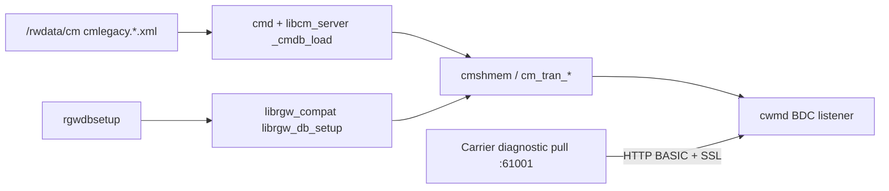

# CMDB security impact (5268AC)

Readable **CMDB XML** from a flash dump, UART capture, or stolen CPE yields **credentials, private keys, Wi‑Fi secrets, TR-069 parameters, and carrier telemetry URLs** without breaking crypto. This document ties **on-disk inventory** (redacted) to **firmware consumers** (Ghidra + symbol index). **Do not commit decoded secrets** from lab extracts.

## Tools and artifacts

| Artifact | Role |
|----------|------|
| [`tools/cmdb_xml_validate.py`](../tools/cmdb_xml_validate.py) | UTF-16 LE detection, ElementTree check, glitch flags, `key_data` vs `key_len` |
| [`tools/cmdb_security_inventory.py`](../tools/cmdb_security_inventory.py) | Redacted table/URL inventory → [`output/cmdb_security_inventory.json`](../output/cmdb_security_inventory.json) |
| [`output/cmdb_xml_validate.json`](../output/cmdb_xml_validate.json) | Validation report for `cmlegacy.203.xml` / `cmlegacy.498.xml` |
| [`output/elf_symbol_master_att532678_squashfs.tsv`](../output/elf_symbol_master_att532678_squashfs.tsv) | IMPORT/EXPORT sweep (532678 squashfs-root) |
| [`output/cmdb_corpus_sweep.md`](../output/cmdb_corpus_sweep.md) | Corpus string/symbol findings (no SQLite index) |

## Threat model

**Primary attacker:** anyone with **physical access** to NAND/flash (PACE dump, `paceflash cat`, `--cmdb-recover`) or a **live compromise** that can read `/rwdata/cm`.

| Scenario | Impact |
|----------|--------|
| **Flash / dump read** | Full export of CMDB XML (UTF-16 LE on captured units); `base64:` is **encoding only** |
| **Discarded CPE** | Same as dump; factory reset may **not** erase all `cmlegacy.*` revisions |
| **LAN attacker** | Gains little from CMDB **unless** they already read flash or exploit a daemon; web passwords are also in CM via `tw_ulib_pwd_*` |
| **WAN attacker** | `bdc` pull credentials do **not** grant S3 ListBucket; BDC is a **diagnostic HTTPS pull** on **TCP 61001** (see firewall `pm_bdc`) |
| **Fleet-wide** | If `pull_user` / `pull_passwd` or `root_rsa` are **shared across devices**, one dump scales — compare multiple units in lab |

CMDB is **orthogonal** to pkgstream signature bugs but **amplifies** them: trust OIDs and keys are **mutable on disk** ([`pkgstream_security.md`](pkgstream_security.md)).

## XML quality (recovery vs security)

Both repo-root extracts fail strict ElementTree parse (malformed `N=` attributes, `<?xll` header typo, truncated URLs with trailing `<`). Security conclusions on **field presence** are still valid; treat **498** `key_data` length mismatch (`declared=608` vs longer hex) as **incomplete splice** before DER analysis.

Runtime durable store: **`cmd --dbdir /rwdata/cm`** ([`cm_cmdb.md`](cm_cmdb.md)); loader is **`libcm_server` `_cmdb_load`** @ **`0x1a15c`** — `opendir` + **`xmlReadFile`**, no encryption ([`output/cmdb_ondisk_format.md`](../output/cmdb_ondisk_format.md), [`ghidra_ext2_cm_cmdb_kernel_mcp.md`](ghidra_ext2_cm_cmdb_kernel_mcp.md)).

## High-impact CMDB areas (redacted inventory)

Summary from [`output/cmdb_security_inventory.md`](../output/cmdb_security_inventory.md) (May 2026):

| TABLE / area | Example fields | Security note |
|--------------|----------------|---------------|
| **`bdc`** | `enable`, `ssl`, `pull_port` **61001**, `pull_user`, `pull_passwd` **`base64:…`**, `pull_authtype` BASIC | Carrier **diagnostic pull** credentials on disk; consumed by **`cwmd`** (see below) |
| **`keys`** | `type` **root_rsa**, `key_len`, `key_data` (DER hex) | **RSA private key** material; used for **server cert generation** (`tw_ulib_sec_get_rsa_key`), not only pkgstream |
| **`ap` / `hotspot`** | `preshared_key`, `custom_key`, `encrypt_key` | LAN Wi‑Fi compromise from dump |
| **TR-069 / ACS** | `acs_url`, `connreq_*`, `keycode` | Remote management plane |
| **Telemetry HTTP** | `http_url`, `http_username`, `http_password` (×7–10 in 203) | Outbound authenticated HTTP — **`bulkdatad`**, **`rgc`**, diagnostics (symbol consumers) |
| **`pkgcfg` / `pkgs`** | `trust_eng`, `trust_2sp_cn`, `digest` | Firmware trust policy ([`pkgstream_security.md`](pkgstream_security.md)) |
| **`user` / `webs`** | via `tw_ulib_pwd_*` OIDs | Web admin passwords ([`reference/security.md`](security.md)) |
| **`ipsec_data`** | PSK fields | VPN material via `tw_ulib_ipsec_data_*` |

## URLs and cloud (no S3 bucket listing)

**No `s3://` or `*.s3.amazonaws.com`** in 203/498 inventory. “AWS” URLs are **HTTPS APIs** (IoT Core rules, bulk data, storage heartbeat) requiring **device/credential auth**, not anonymous object listing.

| Category | Example hosts (203) | CMDB creds | Notes |
|----------|---------------------|------------|-------|
| TR-069 | `cwmp.c01.sbcglobal.net` | `connreq_*`, `keycode`, certs | CPE Inform auth map: [`cwmp_cpe_authentication.md`](cwmp_cpe_authentication.md); lab: [`acspy.md`](acspy.md) |
| Bulk | `bulkdata-G1.eco.cloud.att.com` | `http_password` | API, not bucket |
| IoT | `*.nimbus-iotcore.aws.cloud.att.com` | device identity / `root_rsa`? | Topic publish, not `pull_passwd` |
| Portal | `myhomenetwork.att.com` | user-facing | Not device secret |
| CMS | `css://css.cms.2wire.com:3428` | `css_key` | Proprietary channel |

**`http_password` consumers (firmware):** daemons that **import `cm_tran_get_str`** and ship HTTP client stacks — e.g. **`bulkdatad`**, **`httpd`** (indirect), **`mifd`**, **`rgc`** path via librgw. Map per-OID in follow-on RE; do not assume one password unlocks all hosts.

**`bdc` `pull_passwd`:** scoped to **BDC diagnostic pull** on port **61001**, not S3 or IoT topic URLs.

**Lab pull client:** [`bdc_diagnostic_pull.md`](bdc_diagnostic_pull.md) and **`bdcspy`** (`python -m bdcspy identity|probe|pull`) — inbound HTTPS on **`pull_port`**, path `/bdc/{ProductClass}_{SerialNumber}` (Ghidra `cwmd`).

## Consumers — `bdc` chain

Flash logs say **`acs: bdc started`**; firmware ships **`/usr/bin/cwmd`** (CWMP daemon) with embedded **BDC** module — logs prefix **`acs:`** while fault strings reference **`CWMD`**.

| Component | Evidence |
|-----------|----------|
| **Boot DB registration** | **`rgwdbsetup`** **imports `librgw_db_setup`**; boot log **`librgw_db_setup: bdc db setup success`** ([`fwupgrade.txt`](../fwupgrade.txt)) |
| **Schema setup** | **`librgw_db_setup`** @ **`0x36ae0`** (`librgw_compat.so.0.0.0`) — sequential per-logical-DB setup functions; one failure aborts batch |
| **Read `pull_passwd`** | **`tw_ulib_bdc_get_pull_password`** @ **`0x38cbc`** — `cm_tran_get_str` with OID vector, then string transform (strips **`base64:`**-style prefix via rodata helper) |
| **BDC runtime** | **`cwmd`**: **`cwmd_bdc_init`** @ **`0x42f9c4`**, **`cwmd_bdc_getcfg`** @ **`0x42f7c4`**, **`bdc_conn_auth_basic`** @ **`0x42fe4c`**, **`bdc_ssl_init`**, listen on **`pull_port`** |
| **Inbound auth** | **`bdc_conn_auth_basic`**: **`nu_b64_pton`** on Authorization payload, split **user:password**, compare to stored pull creds (supports MD5 digest mode via `*piStack_194 == 2`) |
| **Port map** | CMDB **`ports` / `pm_bdc`** → **61001** TCP (flash XML strings) |

**`pull_passwd` / `pull_user` do not appear as literal strings in squashfs** — only as **CMDB XML field names** on flash; runtime access is via **`cm_tran_*`** OIDs.

## Consumers — `keys` / `root_rsa`

| Finding | Detail |
|---------|--------|
| **Rodata** | **`root_rsa`** beside *"failed to generate the server certificate"* in **`cwmd`**, **`httpd`**, **`librgw_compat`** |
| **API** | **`tw_ulib_sec_get_rsa_key`** @ **`0xc3878`** — **`tw_keys_find()`** then **`cm_tran_get_*`** on **`keys`** table row; loads blob for OpenSSL-style use |
| **`libcm_common`** | Exports XML field name **`key_data`** (schema), not `root_rsa` string |
| **`lib2sp` / `pkgd`** | No `root_rsa` string hit in 532678 sweep — pkgstream trust uses separate OIDs ([`pkgstream_security.md`](pkgstream_security.md)) |

**Impact:** dump of **`keys`/`root_rsa`** compromises **device TLS/server identity** (BDC and web cert generation paths), distinct from but as serious as **pkgstream** trust toggles.

**Offline check:** parse `key_data` hex as DER; confirm RSA **private** key size ~609 bytes before publishing metadata.

## `base64:` encoding

- **`libcm_server`**: libxml2 path + **`string_base64_*`** symbols (shared XML stack), not field-specific names in rodata.
- **BDC inbound**: **`nu_b64_pton`** in **`bdc_conn_auth_basic`** (HTTP Basic header).
- **CM passwords**: parallel track in **`tw_ulib_pwd_get_passwd`** (`param_5 == 2` branch) per [`cm_cmdb.md`](cm_cmdb.md).

## Corpus / symbol sweep (Phase 2A)

SQLite **`corpus_index.sqlite`** was not present; sweep used:

1. **`tools/elf_symbol_master.py`** on 532678 **`squashfs-root`** → TSV above.
2. **Byte search** of install squashfs carve (no `pull_passwd` literals — expected).
3. **Per-ELF string hits** — see [`output/cmdb_corpus_sweep.md`](../output/cmdb_corpus_sweep.md).

## Legal / ethics

Follow [`tools.md`](tools.md): lab-only dumps, redact in publications, no WAN probing of carrier endpoints without authorization.

## See also

- [`flash_sysinit_credentials.md`](flash_sysinit_credentials.md) — **`sysinit/etc/shadow`** on opentla4 (Unix root hash, offline crack)
- [`cm_cmdb.md`](cm_cmdb.md) — CM stack
- [`security.md`](security.md) — web attack surface
- [`pkgstream_security.md`](pkgstream_security.md) — trust OIDs + signing
- [`board_params_nand.md`](board_params_nand.md) — factory serial vs CMDB (`sn=` in loader MTD vs `connreq_username`)
- [`paceflash.md`](paceflash.md) — dump recovery
- [`ghidra_ext2_cm_cmdb_kernel_mcp.md`](ghidra_ext2_cm_cmdb_kernel_mcp.md) — ext2 vs `/rwdata/cm`
