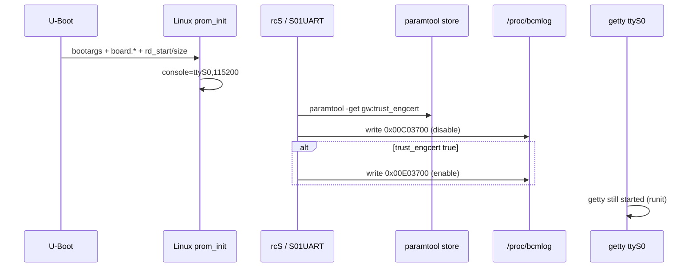

# Console UART disable and re-enable (5268AC)

Firmware slice: **11.5.1.532678** (ATT Lightspeed install). Evidence: squashfs `etc/init.d/S01UART`, `/rwdata/config/lib.sh` + `att.sh` (flash strings), boot log `fwupgrade.txt`, kernel `ttyS0` @ MMIO `0xb0000180`.

Related: [`pkgstream_security.md`](pkgstream_security.md) (`trust_engcert`), [`firmware.md`](firmware.md) (boot trace), [`board_params_nand.md`](board_params_nand.md), [`libboard.md`](libboard.md) (`board_param_*` / `paramtool`).

---

## Summary

| Question | Answer |
|----------|--------|
| Is console input disabled via **bcmnand sysfs** in init? | **No** — not found in squashfs `etc/init.d/*` or `etc/sv/*`. |
| What actually disables RX? | **`S01UART`** writes **`/proc/bcmlog`** to poke **UART MMIO** at `0xb0000180` (same base as kernel `ttyS0`). |
| Does getty still run? | **Yes** — `etc/sv/getty/run` → `getty -L ttyS0 115200`; output may work while **hardware RX is off**. |
| Persistent re-enable at boot? | Set **`gw:trust_engcert=true`** in the **paramtool / board_param** store (see [`boot_environment_trust_eng.md`](boot_environment_trust_eng.md)). |
| Immediate re-enable (root)? | `echo w 0xb0000180 0x00E03700 1 w > /proc/bcmlog` |
| Lab / engineering path? | Same flag + **`/rwdata/config/att.sh`** block: SSH, root password, UART, `cmlegacy.temp.0.trust_eng` |

**U-Boot** exposes string **`uboot_console_enable`** in `uboot_from_loader.elf`; no squashfs init script references it. That is separate from the Linux **`S01UART`** path.

---

## Boot-time disable: `S01UART`

`rcS` runs `etc/init.d/S??*` in sorted order; **`S01UART`** runs early.

```sh
# Disable the UART
echo w 0xb0000180 0x00C03700 1 w > /proc/bcmlog
echo "***** Disabled the BRCM UART *****"

get_perm_trusteng   # duplicated from /rwdata/config/lib.sh when lib.sh missing (factory reset)
if [ "$?" -eq "1" ]; then
  echo w 0xb0000180 0x00E03700 1 w > /proc/bcmlog
  echo "***** Enabled the BRCM UART *****"
fi
```

| Value | Role |
|-------|------|
| `0x00C03700` | Disable UART RX (prod default) |
| `0x00E03700` | Enable UART RX (`0x00200000` bit difference) |
| `0xb0000180` | BCM63xx **`ttyS0`** control register block |

Log anchor (`fwupgrade.txt` ~18.8s): `***** Disabled the BRCM UART *****`.

---

## `/proc/bcmlog` (kernel)

- Proc entry name: **`bcmlog`** (`bcmLog_init` in kernel ELF, string at `0x804dbf1c`).
- Userland write grammar: **`w <phys_addr> <value> <count> w`**
- Bypasses the tty driver; direct **physical MMIO** write (Broadcom debug/logger facility).

**Not** the same as **`bcmLog_*`** logging APIs in `.rodata` (module name collision in strings only).

---

## Two “trust” flags (do not conflate)

| Name | Storage | Read by | Effect on UART |
|------|---------|---------|----------------|
| **`gw:trust_engcert`** | **paramtool / `board_param_*`** flash-backed store | `paramtool -get`, `get_perm_trusteng()` in `lib.sh`, **`S01UART`**, `librgw_compat` / pkg verify | **`true`** → `S01UART` writes **enable** value |
| **`cmlegacy.temp.0.trust_eng`** | **CMDB** `/rwdata/cm/` | `cmc -c get/set`, `chk_enable_trusteng()` in `lib.sh` | Sets CMDB flag + enables SSH; **does not** replace `gw:trust_engcert` for **`S01UART`** unless paramtool is also set |

`chk_enable_trusteng()` in `/rwdata/config/lib.sh` (flash strings):

```sh
chk_enable_trusteng () {
    get_perm_trusteng
    if [ "$?" -eq "1" ]; then
        cmc -c set cmlegacy.temp.0.trust_eng \"1\"
    fi
}
```

`get_perm_trusteng()`:

```sh
paramtool -get gw:trust_engcert -out /tmp/_trustengcert > /dev/null 2>&1
# expects literal "true" in output file
```

Default in corpus: **`gw:trust_engcert=false`** (flash strings in param DB images).

---

## Runtime lab block (`att.sh`)

`/rwdata/config/att.sh` (sourced from **`NetworkAutoDetection.sh`**, not in squashfs — lives on **`/rwdata/config/`** after provisioning) runs after network detection setup:

1. `get_perm_trusteng` (paramtool)
2. `chk_enable_trusteng` → CMDB `trust_eng=1`
3. `chk_enable_sshd` → `debugsys --sshdon`, enable `pm_sshd` bind state
4. **`echo w 0xb0000180 0x00E03700 1 w > /proc/bcmlog`** — UART enable (duplicate of `S01UART` enable path)
5. Known lab root hash via `chpasswd -e`
6. Lightspeed / legacy lab lock scripts if present

Logger tag: **`labconfig`** with `SECURITY WARNING!! - This RG supports unsigned firmware packages...`

---

## Re-enable checklist

### A. Boot-persistent (engineering cert trust)

1. Set **`gw:trust_engcert`** to **`true`** via **`paramtool -set gw:trust_engcert true`** (Ghidra-confirmed CLI; value file must read exactly **`true`** for `get_perm_trusteng`).
2. Reboot → `S01UART` should print **`***** Enabled the BRCM UART *****`** instead of Disabled-only.

Also unlocks engineering-root acceptance for pkgstream when `librgw_compat` reads the same flag ([`pkgstream_security.md`](pkgstream_security.md)).

### B. Immediate (root shell, no reboot)

```sh
echo w 0xb0000180 0x00E03700 1 w > /proc/bcmlog
```

### C. CMDB-only (insufficient for UART alone)

```sh
cmc -c set cmlegacy.temp.0.trust_eng "1"
```

Useful for SSH / pkg policy hooks that read CMDB; **`S01UART` still disables** unless **`gw:trust_engcert=true`**.

### D. Offline NAND / param partition

Patch **`gw:trust_engcert=true`** in the **paramtool flash partition** (`.board_param` store — see [`libboard.md`](libboard.md)); corpus shows `false` today. Requires correct CRC/layout for `board_param_open` (RE or lab `paramtool -set` once).

---

## Boot flow (UART-related)



---

## Open RE

- Exact **UART register** field for bit `0x00200000` (BCM63xx UART driver vs TRM).
- **`paramtool -set`** CLI and on-flash **partition** offset (loader vs `opentla*` slice).
- Whether **`tw_ulib_is_trustengcert_enabled`** reads paramtool only or also mirrors CMDB `trust_eng`.
- U-Boot **`uboot_console_enable`** sysfs/NAND attribute path vs Linux `S01UART`.

---

## See also

- [`boot_environment_trust_eng.md`](boot_environment_trust_eng.md) — kernel cmdline, U-Boot/OpenTL env, setting `trust_engcert`
