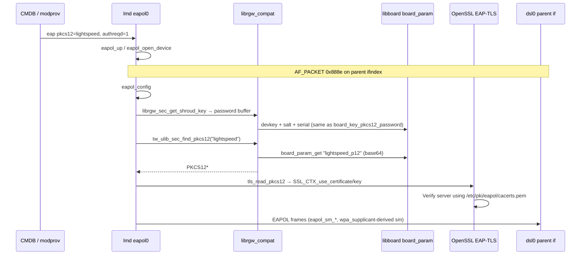

# EAPOL / 802.1X — `lightspeed_p12`, `device_p12`, and WAN authentication

Firmware slice: **11.5.1.532678** (ATT Lightspeed / 5268AC). Evidence: Ghidra **`/usr/bin/lmd`**, **`/usr/lib/librgw_compat.so`**, **`/usr/lib/libboard.so`**, CMDB XML in flash strings, **`att_unified_eapol-certs.pkgstream`**, NAND dump + **`paceflash dump-eapol-cert`**.

Related: [`paceflash.md`](paceflash.md) (offline extract/decrypt), [`libboard.md`](libboard.md) (`board_param_*`), [`board_params_nand.md`](board_params_nand.md) (factory `devkey` / `sn`), [`firmware.md`](firmware.md) (carrier pkg layout), [`httpd_endpoints.md`](httpd_endpoints.md) (`EAPOL_FAILED`).

---

## Summary

| Artifact | Role |
|----------|------|
| **`lightspeed_p12`** | **WAN 802.1X client identity** (EAP-TLS). Default CMDB param **`eap pkcs12` = `lightspeed`**. |
| **`device_p12`** | Second per-unit PKCS#12 blob in the same store; **not** selected for production EAPOL (only **`lightspeed`** in CMDB). Purpose likely provisioning / other TLS consumers (open RE). |
| **`att_unified_eapol-certs.pkgstream`** | **CA trust store only** (`/etc/pki/eapol/*-cacerts.pem` → `cacerts.pem`). Does **not** contain client PKCS#12. |
| **Password** | **`devkey` + fixed salt + `serial`** — same formula in **`board_key_pkcs12_password`** and **`librgw_sec_get_shroud_key`**. |

---

## Where the PKCS#12 blobs live (persistence)

### On-flash / offline

After **`nand_translate`** on **`tlpart`**, the logical byte stream contains **textual** entries (not only structured `paramtool` keys):

```text
lightspeed_p12=MIIRSQIBAzCC...   # base64 PKCS#12 (~5.9 KiB b64 for lab unit)
device_p12=MIISIQIBAzCC...       # separate blob (~6+ KiB b64)
```

Example offsets in one full-chip dump (`flash strings.txt`): **`lightspeed_p12`** @ `0x41F47FE`, **`device_p12`** @ `0x41F2FBE` (paired with `gw:trust_engcert=false` nearby in param region).

These sit in the **board parameter / manufacturing persistence** area of **`tlpart`** (extension **`.board_param`** appears in flash). They are **not** in empty **`opentla1`/`opentla2`** env slices on typical captures.

### In-memory runtime (`libboard`)

**`board_param_open`** reads a file-backed blob, validates length/CRC, and builds an in-RAM **`key=value`** store. **`param_get`** / **`board_param_get`** locate keys by ASCII prefix:

- Lookup key: **`lightspeed_p12`** or **`device_p12`**
- Value: **base64** PKCS#12 bytes (same as offline `name=<b64>` line)

**`paramtool -get`** can read other `gw:*` keys from the same store; the **`_p12`** entries are **not** exposed via `paramtool` strings in corpus — they are consumed by **`tw_ulib_sec_find_pkcs12`**.

---

## How blobs are obtained (provisioning)

| Phase | Mechanism |
|-------|-----------|
| **Manufacturing / ACS** | Per-gateway **client certificate** issued for **MAC + serial** (cert subject in decrypted PEM: **`CN=14:ED:BB:DF:ED:5C`**, **`serialNumber=00D09E-38161N043704`**). Backend writes **`lightspeed_p12=`** / **`device_p12=`** into the **board_param** partition (exact writer not in squashfs — likely **modem prov / CWMP / factory tool**). |
| **Firmware install** | **`att_unified_eapol-certs.pkgstream`** refreshes **trust anchors** only (see below). |
| **Lab / RE** | Recover from NAND: **`paceflash dump-eapol-cert`** → `output/lightspeed.p12`, `output/lightspeed_eapol.pem`, optional `output/device_p12` via **`--cert device`**. |

No **`paramtool -set lightspeed_p12`** usage appears in flash strings; treat flash patching as **high risk** (CRC/layout).

### Offline recovery (documented tooling)

```powershell
pip install -e ".[eapol]"
python -m paceflash dump-eapol-cert "PACE 5268AC S34ML01G1@TSOP48.BIN" `
  -o output/lightspeed_eapol.pem --p12 output/lightspeed.p12
python -m paceflash dump-eapol-cert "PACE …BIN" --cert device --p12 output/device.p12 --no-decrypt
```

Password (Ghidra **`board_key_pkcs12_password`** @ `0x00013edc`, `.rodata` format **`%s%s%s`**):

```text
password = <devkey> + "e289d70ad34e0683fe0152da271475d587fb12f1" + <serial>
```

- **`devkey`**: 16 hex chars from loader factory block (`devkey=…`, see [`board_params_nand.md`](board_params_nand.md)).
- **`serial`**: `sn=` from factory block (e.g. `38161N043704`).

Repo artifacts (lab unit): **`output/lightspeed_p12.b64`**, **`output/device_p12.b64`**, **`output/lightspeed.p12`**, **`output/lightspeed_eapol.pem`**.

---

## What `att_unified_eapol-certs.pkgstream` does (not client cert)

**Role:** `eapol-certs` in CMDB pkg table; **`pkgd`** extracts to **`eapol-certs/att_unified_eapol-certs`**.

| Delivered path | Purpose |
|----------------|---------|
| `/etc/pki/eapol/lightspeed-prod-cacerts.pem` | Production **802.1X CA** bundle |
| `/etc/pki/eapol/lightspeed-test-cacerts.pem` | Lab/test CA bundle |
| Install **script** | Selects prod vs test **`cacerts.pem`** via CMDB pkg lock **`lightspeed-test-802_1X`** vs **`lightspeed-prod-802_1X`** |

Script logic (extracted from pkgstream): sources **`/rwdata/config/lib.sh`**, **`get_lock_version "lightspeed-test-802_1X"`** — if lock active, copy **test** PEM; else copy **production** PEM to **`/etc/pki/eapol/cacerts.pem`**.

**Does not install** `lightspeed_p12` / `device_p12` — those must already be in **board_param** from manufacturing.

---

## 802.1X runtime architecture (`lmd`)

### CMDB / link-manager layout

From CMDB XML blobs in flash:

| CMDB object | `sysname` | Notes |
|-------------|-----------|--------|
| Bridge row | **`pm_bb_bridge`** | **`dsl0`** + **`eth4`** (WAN broadband path) |
| EAPOL module (type **26**) | **`eapol0`** (usrname) | Child of bridge; params include **`eap pkcs12` = `lightspeed`**, **`eap authreqd` = 1**, timers |
| DHCP on WAN | **`pm_bb_eapol`** | Child of bridge; **`dhcpc clientid` = `00D09E-<serial>`** |

Default EAPOL parameters (representative):

| Param | Value | Meaning |
|-------|-------|---------|
| **`eap pkcs12`** | **`lightspeed`** | Selects **`lightspeed_p12`** board_param key |
| **`eap authreqd`** | **`1`** | Authentication required |
| **`eap reauth interval`** | **`300`** | Re-auth period (seconds) |
| **`module bypass`** | **`0`** (prod) | **`1`** = bypass EAP (lab scripts: `modprov -setparam eapol0 "module bypass" 1`) |
| **`eap heldperiod` / `authperiod` / `startperiod`** | 60 / 30 / 30 | EAPOL state machine timers |

Pkg lock **`lightspeed-prod-802_1X`** in CMDB correlates with production CA path above.

### Code path (Ghidra)



| Step | Function | Detail |
|------|----------|--------|
| 1 | **`eapol_setcfg`** | Reads **`eap pkcs12`**, **`eap authreqd`**, module bypass, timers from module param map |
| 2 | **`eapol_open_device`** | Parent **`pm_bb_bridge`** → BB device; creates **`socket(PF_PACKET, 0x888e)`**; binds to **`eapol0`** ifname |
| 3 | **`eapol_config`** | Builds EAP identity string from interface MAC; sets **`ts.pem`** path if present; **`librgw_sec_get_shroud_key`** fills **EAP TLS password** buffer |
| 4 | **`tls_read_pkcs12`** | **`tw_ulib_sec_find_pkcs12(ctx, "lightspeed")`** → **`PKCS12_parse`** with password → install cert/key/extra CAs into **SSL_CTX** |
| 5 | **`eapol_sm_*`** | WPA supplicant **EAPOL state machine** (`eapol_sm.c`); **`eapol_sm_rx_eapol`** processes frames |

**`tw_ulib_sec_find_pkcs12`** (`librgw_compat` @ `0x000c3a1c`): opens board param DB, resolves **`{name}_p12`** (second argument is the string **`lightspeed`** from CMDB), base64-decodes into OpenSSL **`PKCS12`**.

**`librgw_sec_get_shroud_key`** (`0x000bf598`): derives the same **`devkey+salt+serial`** password string used for decryption (validates buffer size ≥ `strlen+0x29`).

### Trust vs identity

| Store | Content |
|-------|---------|
| **`/etc/pki/eapol/cacerts.pem`** | Operator/trust **CA** certs (from pkgstream) |
| **`board_param` `lightspeed_p12`** | **Client** cert + private key (per device) |
| **`board_param` `device_p12`** | Alternate client bundle (unused by default EAP param) |

---

## `device_p12` vs `lightspeed_p12`

| | **`lightspeed_p12`** | **`device_p12`** |
|--|-------------------|------------------|
| **Board key** | `lightspeed_p12=<b64>` | `device_p12=<b64>` (same `param_get` / `tw_ulib_sec_find_pkcs12` prefix rule: `{name}_p12`) |
| **CMDB `eap pkcs12`** | **`lightspeed`** (default everywhere in corpus) | Never set in corpus |
| **EAPOL (`lmd`)** | `eapol_setcfg` → `lm_pub_get_str(..., "eap pkcs12", buf@+0x3dc, 0x20)` → `tls_read_pkcs12` → `tw_ulib_sec_find_pkcs12(ctx, buf)` | Same code path if param were **`device`**; prod never does |
| **Other runtime** | — | **`libluacpe`**: Lua **`get_net_cert(name)`** (see below) |
| **Flash (lab dump)** | b64 ~5908 B → DER ~4429 B | b64 ~6196 B → DER ~4645 B (larger bundle) |
| **Decrypt password** | **`devkey+salt+serial`** | Identical formula |

Use **`paceflash dump-eapol-cert --cert device`** to extract/decrypt for subject/EE comparison vs **`lightspeed`**.

### `tw_ulib_sec_find_pkcs12` importers (squashfs symbol master)

Only **two** ELFs link this symbol:

| Binary | Role |
|--------|------|
| **`/usr/bin/lmd`** | WAN EAP-TLS: `tls_read_pkcs12` @ `0x0045cb60` → `PKCS12_parse` with shroud password |
| **`/usr/lib/libluacpe.so`** | TR-069 / CPE Lua: export PKCS#12 DER to scripts |

No **`cwmd`**, **`httpd`**, or other daemon imports it. **`ar_clnt_attr_set_pkcs12`** / **`ar_svc_attr_set_pkcs12`** exist in **`libarpc.so`** but have **no** recorded importers in the 532678 squashfs index (RPC TLS hook only stores pointers in a client attr struct @ `+0x34`).

### Lua path: `luacpe_tw_ulib_get_net_cert` (`libluacpe` @ `0x00016d60`)

Registered beside **`luacpe_tw_ulib_ssl_ctx_add_chain`** under **`luacpe_register_rgw_compat`**. Flow:

1. **`luaL_checklstring(L, 1)`** — logical cert name (**`lightspeed`**, **`device`**, …; not the `*_p12` suffix).
2. **`librgw_sec_get_shroud_key`** → password buffer (same **`devkey+salt+serial`** as EAPOL).
3. **`tw_ulib_sec_find_pkcs12(ctx, name)`** → `board_param` lookup **`{name}_p12`**, base64 decode, `d2i_PKCS12`.
4. **`BIO` + `i2d_PKCS12_bio`** → return **raw PKCS#12 DER** to Lua (`lua_pushlstring`).

So **`device_p12` is reachable from provisioning/CWMP Lua** without changing CMDB EAPOL params. No plaintext **`device`** / **`get_net_cert`** strings in **`flash strings.txt`** (name likely passed from ACS mapsets or compiled Lua).

**Not** the same as **`tw_ulib_rgc_get_pkcs12`** (`librgw_compat` @ `0x000bcc80`): that function walks **RGC/SQLite** paths (`cm_tran` + blob column `0x73`) and has **no** squashfs importers — legacy or unused on this image.

### `luacpe_tw_ulib_ssl_ctx_add_chain` (`0x000171fc`)

Lua helper: **`SSL_CTX*`** + table of extra **`X509*`** certs → **`SSL_CTX_ctrl(0xe, …)`** (extra chain certs). Uses **`tw_ulib_pushresult`** for table iteration; does **not** load PKCS#12 by itself.

---

## Operator-visible behavior

| Observation | Mechanism |
|-------------|-----------|
| WAN up after install | EAPOL success → DHCP **`pm_bb_eapol`** |
| **`EAPOL_FAILED`** web status | [`httpd_endpoints.md`](httpd_endpoints.md) → **`/xslt?PAGE=HURL18`** |
| Log: **`eapol0: unable to set default dscp 'CS0'`** | QoS hook failure; distinct from cert failure |
| Lab bypass | **`modprov -setparam eapol0 "module bypass" 1`** |
| Test RADIUS CAs | CMDB mapset lock **`lightspeed-test-802_1X`** → pkgscript copies **test** `cacerts.pem` |

---

## Security notes

- **Per-device binding:** PKCS#12 subject uses **Ethernet MAC** and **00D09E-serial**; password mixes **`devkey`** from factory block — offline NAND dump + factory block ⇒ full client key recovery (see [`paceflash.md`](paceflash.md), [`cmdb_security.md`](cmdb_security.md) class of secrets).
- **SHA-1** in pkgstream file digests for eapol-certs carrier (legacy 2SP).
- **Do not commit** decrypted PEM/P12 or passwords; **`--redact`** on `paceflash` JSON.

---

## Open RE

- Which manufacturing component **writes** `lightspeed_p12=` / `device_p12=` (CWMD? `modprov`? external ACS only).
- Exact **on-disk path** for `board_param_open` (GP-relative table in `libboard` not fully string-resolved).
- **Lua/CWMP** call sites that invoke **`get_net_cert("device")`** (bytecode / mapset scripts not in static strings).
- **X.509 purpose diff** after decrypting **`device_p12`** (EE CN/serial/EKU vs lightspeed — same MAC-bound Foxconn-style EE is plausible but unverified here).
- **`tw_ulib_rgc_get_pkcs12`** — whether any dynamic loader uses it on live units.

---

## Quick reference commands

```text
# On device (read-only sanity; syntax may vary)
paramtool -show                    # lists gw:* keys, not necessarily _p12
cmc -c get …                       # CMDB; look for pm_bb_bridge / eapol0 params

# Offline
python -m paceflash factory-params "PACE ….BIN"
python -m paceflash dump-eapol-cert "PACE ….BIN" --cert lightspeed
python -m lib2spy firmware_…/eapol_certs/att_unified_eapol-certs.pkgstream --extract ./tmp-eapol-ca
```
