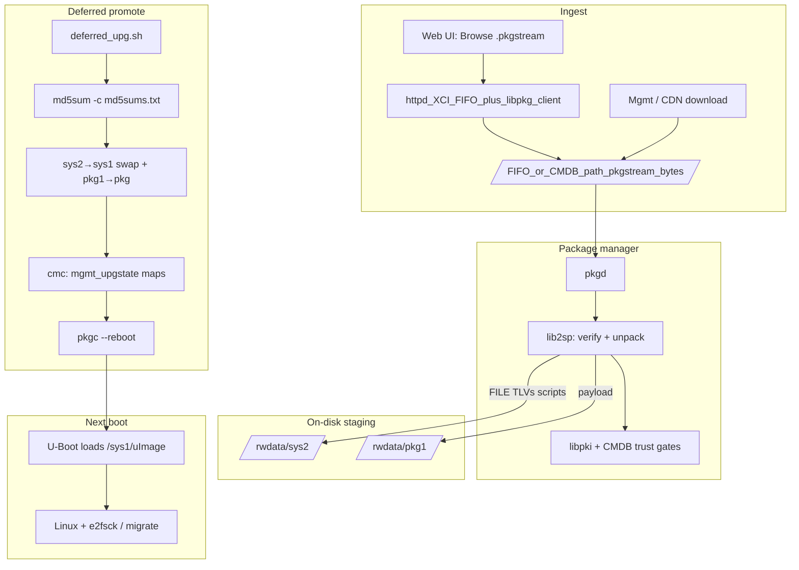
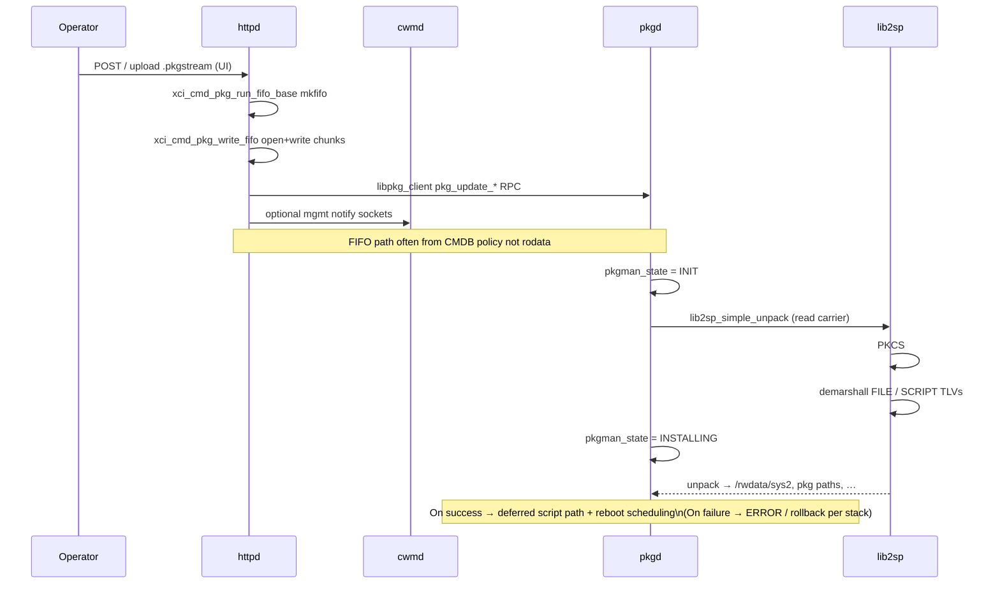
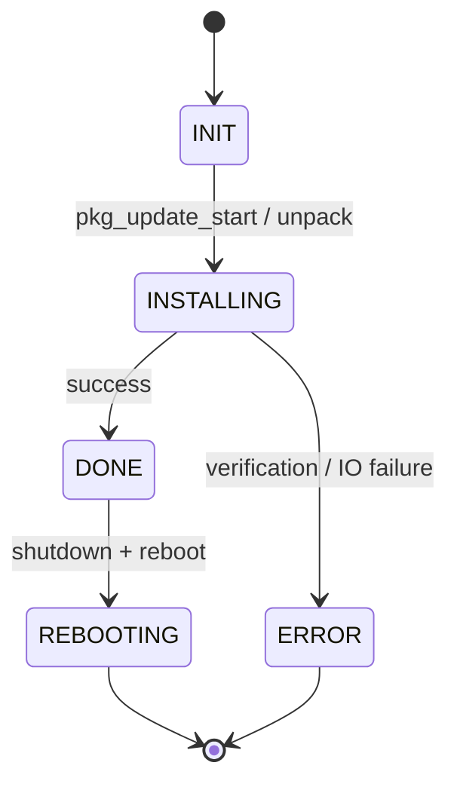
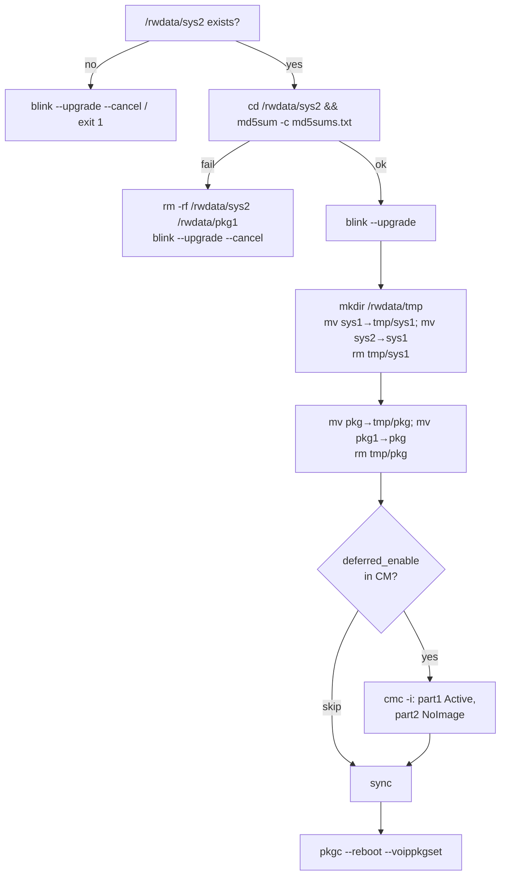
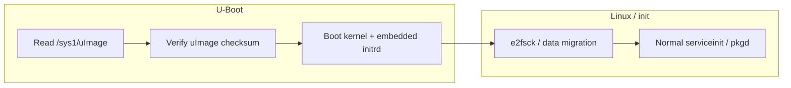

# Firmware upgrade process (5268AC / OpenTL `pkgstream`)

This document describes the **end-to-end software upgrade path** for the AT&T 5268-class gateway where the payload is a **`.pkgstream`** carrier. It ties together:

* Runtime services (**`httpd`**, **`cwmd`**, **`pkgd`**) and the **2SP** parser (**`lib2sp`**) — see [`pkgstream.md`](pkgstream.md).
* **Cryptographic and CMDB gating** — see [`pkgstream_security.md`](pkgstream_security.md).
* **Staging on `/rwdata`** and the **deferred reboot** handoff — scripts shipped inside the install carrier (e.g. `rwdata/tmp/sys2/deferred_upg.sh`).
* Captured console evidence — [`fwupgrade.txt`](fwupgrade.txt).

**Not covered in depth here:** exact TR-069 / remote-management download URLs (still **`pkgd` + `lib2sp`** once a local file or FIFO exists). **USB:** the device **automounts** mass storage under `/rwdata/<dev>`; there is **no** separate auto-scan script that applies firmware from the stick (upgrade is **operator-driven**, typically **web upload** of `.pkgstream` per UI copy in `UPGRADE1.xml`).

**Lab tooling:** [`acspy.md`](acspy.md) — offline **`python -m acspy discover`** (CMDB + [`pkgstreams`](../pkgstreams) catalog), optional Connection Request and minimal ACS HTTP stub for owned CPEs. CPE Inform identity from flash + Ghidra: [`cwmp_cpe_authentication.md`](cwmp_cpe_authentication.md) (`acspy identity` / `acspy inform`).

---

## 1. Actors and storage

| Actor | Role |
|--------|------|
| **Operator** | Selects `.pkgstream` in the local UI (“Browse…”) or upgrade is pushed via management (CDN → download). |
| **`httpd`** | Serves the UI; links **`libpkg_client.so`** / **`libpkg_common.so`** and implements **XCI FIFO writers** (`xci_cmd_pkg_write_fifo`, `pkg_write_fifo`, `mkfifo`) so uploaded **`.pkgstream`** bytes stream **in-process** to a named pipe; also issues **`pkg_update_*`** RPCs into **`pkgd`**. Listens on **`/tmp/httpd`** (defined string). |
| **`cwmd`** | Management / SOAP sidecar; also links **`libpkg_client`** and owns **`mgmt_upgstate`** / **`pkgclient_update`** strings; talks to **`pkgd`** over RPC (`connect to pkgd failed`, …) and references **`/tmp/cwmd`** + **`/tmp/httpd`**. |
| **`pkgd`** | Package daemon; **`libpkg_server`** entry for peers; uses **`lib2sp_simple_unpack`** from **`pkgman_extract_pkg`** with path from **CMDB**; exposes **`/tmp/pkgd`**, stages **`/tmp/pkgspool`**, drives install state (`pkg_util_set_pkgmgr_pkg_state`, …). |
| **`lib2sp` + `libpki`** | Parse **2SP** TLVs, verify **PKCS#7**, unpack files/scripts to absolute paths (see security doc for trust roots and **`trust_engcert`**). |
| **`pkgc`** | CLI to package manager; **`pkgc --reboot`** used after a successful deferred image promote. |
| **U-Boot** | Reads **`/sys1/uImage`** (and multi-file image components) from **OpenTL partition 5** (`/rwdata` UBIFS). |

**Key directories on `/rwdata` (rw rootfs):**

* **`/rwdata/sys1`** — **active** rootfs tree used for the next boot (kernel **`uImage`**, squashfs **`rootimage.img`**, **`ui.img`**, etc.).
* **`/rwdata/sys2`** — **staging** tree for the incoming image; validated here before swap.
* **`/rwdata/pkg`** / **`/rwdata/pkg1`** — package/carrier staging (installer may **`mv`** **`pkg1` → `pkg`** during promote — see `deferred_upg.sh`).
* **`.upgrade`** — sentinel seen on the UBIFS root listing during upgrade/recovery boots ([`fwupgrade.txt`](fwupgrade.txt)).

### 1.1 Evidence (Ghidra + ELF linkage, `10.5.3.527064` dissect)

The narrative below was previously inferred from UI XML, logs, and carrier scripts. The following is **grounded in the shipped ELFs** under  
`…/00D09E/10.5.3.527064-PROD/_5268.install.pkgstream.extracted/squashfs-root/usr/bin/` (same carrier tree used when importing **`httpd`** / **`cwmd`** into Ghidra) plus **`GET /search_strings`** / **`decompile_function`** on `http://127.0.0.1:8089`. Machine-readable notes: [`output/ghidra_httpd_upgrade_chain_evidence.json`](../output/ghidra_httpd_upgrade_chain_evidence.json).

| Question | Answer |
|----------|--------|
| Does **`httpd`** link **`libpkg_*`** directly? | **Yes.** `DT_NEEDED` includes **`libpkg_client.so.0`** and **`libpkg_common.so.0`** (pyelftools parse of `httpd`). Same for **`cwmd`**. **`pkgd`** links **`libpkg_server.so.0`**, **`libpkg_client.so.0`**, **`libpkg_common.so.0`**, and **`lib2sp.so.0`**. |
| How does the browser upload reach bytes **`pkgd`** consumes? | **`httpd`** exposes XCI commands **`xci_cmd_pkg_write_fifo`** / **`xci_cmd_pkg_run_fifo`** (strings + decompilation @ **`0x00468330`**): **`xci_cmd_pkg_run_fifo_base`** prepares a FIFO, the handler **`open64`**s the path from the XCI argument (typically **write-only** to the named pipe), then **`write()`**s POST body chunks from an internal queue until EOF — classic **in-process streaming** without `exec("pkgd")`. |
| Does **`httpd`** RPC **`pkgd`**? | **Yes, in parallel with the FIFO path.** Defined strings include **`pkg_update_1`** and **`pkg_update: transport error talking to pkgd: %s`**, i.e. **`libpkg_client`** ONC-style calls into **`pkgd`** for control/state (distinct from raw carrier bytes on the FIFO). |
| **`cwmd`** role | Strings **`connect to pkgd failed`**, **`rpc error talking to pkgd`**, **`unable to set mgmt_upgstate …`**, **`pkgclient_update`**, and **`/tmp/cwmd`** — management plane coordinates **`pkgd`** and CM **`mgmt_upgstate`** (matches [`fwupgrade.txt`](fwupgrade.txt) deferred-download narrative). |
| Where does **`lib2sp_simple_unpack`** run? | **`pkgd`**: thunk @ **`0x0042d970`**; **caller** **`pkgman_extract_pkg`** @ **`0x0041c7fc`**, which reads the **`.pkgstream` path** from CMDB table **`CMLEGACY_PKGS__NARGS`**, builds a **`lib2sp`** context, then calls **`lib2sp_simple_unpack(ctx, path)`** (decompilation excerpt). **`pkgd`** also references **`/tmp/pkgd`**, **`/tmp/pkgspool`**, and **`%s/deferred_upg.sh`**. |
| **`11.5.1.532678` carrier squash FILE anchors (`rootimage.img`)?** | **§6a** +[`reference/ghidra_upgrade_write_path_532678.md`](ghidra_upgrade_write_path_532678.md)+ machine dump[`output/lib2spy_532678_install_pkgstream.json`](../output/lib2spy_532678_install_pkgstream.json). |
| **`upgfifo` literal in `httpd` strings?** | **Not** in the **defined-strings** catalog for this **`10.5.3.527064`** `httpd` image. [`fwupgrade.txt`](fwupgrade.txt) on **`11.5.1.532678`** still shows **`file:///tmp/upgfifo`** at runtime — treat that as the **operator-visible** FIFO name from **CMDB / pkg policy**, not a compile-time constant in every build. |
| **`pkgc`** from **`httpd`**? | **`httpd`** contains many **`pkgclient_*`** symbols (substring **`pkgc`** hits those). **Deferred reboot** remains **`pkgc --reboot`** from **carrier shell scripts** ([§5](#5-deferred-promote-deferred_upgsh)), not the primary browser upload path. |

---

## 2. End-to-end flow (conceptual)

---

## 3. Sequence: local upgrade submission → install stream

The UI instructs the user to pick a **`.pkgstream`** file locally. **`httpd`** handles the upload **without shelling to `pkgd`**: XCI **`xci_cmd_pkg_write_fifo`** opens the FIFO path from the XCI argument and **`write()`**s the POST body from internal queues, while **`libpkg_client`** issues parallel **`pkg_update_*`** RPCs into **`pkgd`**. **`cwmd`** participates in **management / TR-064** flows (`mgmt_upgstate`, `pkgclient_update`) and its own **`pkgd`** RPC path. The **package** side ultimately consumes either that **FIFO byte stream** or a **filesystem path** resolved from **CMDB** (see [`fwupgrade.txt`](fwupgrade.txt) for a **`file:///tmp/upgfifo`** example on **`11.5.1.532678`**).

Log fragments matching **WAITING** + **`file:///tmp/upgfifo`** and **`INSTALLING`** appear in [`fwupgrade.txt`](fwupgrade.txt) (same file also shows **ERROR** paths useful for failure analysis).

---

## 4. State sketch: package manager

Observed **`pkg_util_set_pkgmgr_pkg_state`** transitions in [`fwupgrade.txt`](fwupgrade.txt):

**Deferred download** path (management-driven) uses CM **`mgmt_upgstate`** **`Status: Deferred`** until **`2spVMImkr`** reports **download successful**, then **`DONE` → `INIT` → `REBOOTING`** through shutdown of **`pkgd`**, **`httpd`**, **`cwmd`**, etc. ([`fwupgrade.txt`](fwupgrade.txt) head).

---

## 5. Deferred promote: `deferred_upg.sh`

After **`lib2sp`** lays down **`/rwdata/sys2`** with **`md5sums.txt`**, **`deferred_upg.sh`** (from the carrier TLV tree) performs integrity check, **LED blink**, **directory swap**, optional **CM map updates**, and **reboot**:

**Failure cleanup** uses **`deferred_cleanup.sh`**: remove **`/rwdata/sys2`** and **`/rwdata/pkg1`**, clear **`part2`** fields in **`mgmt_upgstate`** when **`deferred_enable`** is present.

Source: `work_tl_crc/pkgstream_corpus/.../tlv_extract/rwdata/tmp/sys2/deferred_upg.sh` (and companion **`deferred_cleanup.sh`**) from the **11.5.1.532678** install carrier dissect.

---

## 6. First boot after promote

U-Boot continues to load **`/sys1/uImage`** from the **OpenTL** UBIFS; after a successful swap, **`sys1`** is the **new** image. The log shows **“Upgrade Image present. Checking image integrity”**, **Legacy image** metadata, **checksum OK**, then normal Linux start; early userspace prints **“Upgrade in progress…”** while the new root is reconciled ([`fwupgrade.txt`](fwupgrade.txt)).

---

## 6a. 532678 SquashFS-bearing FILE TLV inventory (`lib2spy`)

**Carrier:** `firmware_11.5.1.532678/11.5.1.532678/install_package/att-5268-11.5.1.532678_prod_lightspeed-install.pkgstream`.

Machine-readable dump (**SHA-1 verified per FILE**, PKCS#7 signers): [`output/lib2spy_532678_install_pkgstream.json`](../output/lib2spy_532678_install_pkgstream.json) (`python -m lib2spy <pkgstream> --out-json …`).

**Staging targets (`verify.file_payload` excerpt):**

| Destination path | Payload offset | Bytes | Notes |
|------------------|----------------|-------|-------|
| `/rwdata/tmp/sys2/rootimage.img` | 43788 | 26775552 | Embedded **`squashfs`** magic span (**native carve:** **26771550 B**, **`SHA-256`**=`4331b829…` — trailer past strict **`bytes_used`** differs — see[`reference/ghidra_upgrade_write_path_532678.md`](ghidra_upgrade_write_path_532678.md)). |
| `/rwdata/tmp/sys2/ui.img` | 26819397 | 1380352 | Second squash carve (**1380332 B**) — lengths align within TLV framing. |
| `/rwdata/tmp/sys2/uImage` | 28199806 | 3740549 | Same offset as corpus **`uimage`** carve. |
| `/rwdata/config/lib.sh` | 13492 | 28420 | Config helper |
| `/rwdata/tmp/sys2/deferred_upg.sh` | *(JSON)* | *(JSON)* | Swap **`sys2→sys1`** ([§5](#5-deferred-promote-deferred_upgsh)) |

**`lib2spy` boundary:** verifies prefix + FILE digests + lists **`embedded_images`**; it **does not** emulate **`lib2sp_payload_data`** side effects — see[`opentl/pkgstream_format_lib2sp.md`](../opentl/pkgstream_format_lib2sp.md).

**Cross-ref:** Ghidra/MCP upgrade chain + kernel write anchors:[`reference/ghidra_upgrade_write_path_532678.md`](ghidra_upgrade_write_path_532678.md),[`reference/opentl_kernel_ghidra.md`](opentl_kernel_ghidra.md) §12.4.

---

## 7. Trust and format (pointers)

* **Byte layout of `.pkgstream` / TLV types** — [`pkgstream.md`](pkgstream.md).
* **Who is allowed to sign, `trust_engcert`, CMDB OIDs, probes** — [`pkgstream_security.md`](pkgstream_security.md).

---

## 8. Related artifacts

| Artifact | Notes |
|----------|------|
| [`fwupgrade.txt`](fwupgrade.txt) | Console transcript: **Deferred** download, **`.upgrade`**, U-Boot **`/sys1/uImage`**, **Upgrade in progress**, **`pkgman_state`**, **`file:///tmp/upgfifo`**. |
| [`output/ghidra_httpd_upgrade_chain_evidence.json`](../output/ghidra_httpd_upgrade_chain_evidence.json) | **`10.5.3.527064`** ELF `DT_NEEDED` + Ghidra string addresses for **`httpd`** / **`cwmd`** / **`pkgd`** upgrade path (companion to §1.1). |
| [`output/lib2spy_532678_install_pkgstream.json`](../output/lib2spy_532678_install_pkgstream.json) | **`11.5.1.532678`** **`lib2spy`** descriptive + verification JSON — FILE TLV offsets/digests for **`rootimage.img`** / **`ui.img`** / **`uImage`** (§6a). |
| [`reference/ghidra_upgrade_write_path_532678.md`](ghidra_upgrade_write_path_532678.md) | **`libpkg_client`/`lib2sp`** Ghidra checklist + kernel **`OPENTL`**/`squashfs` string anchors — meets[`opentl_kernel_ghidra.md`](opentl_kernel_ghidra.md) §12.4. |
| `deferred_upg.sh` / `deferred_cleanup.sh` | Shipped under **`rwdata/tmp/sys2/`** in TLV extract for **11.5.1.532678**. |
| `en/lang/UPGRADE1.xml` | UI strings: browse **`.pkgstream`** then **Upgrade**. |
