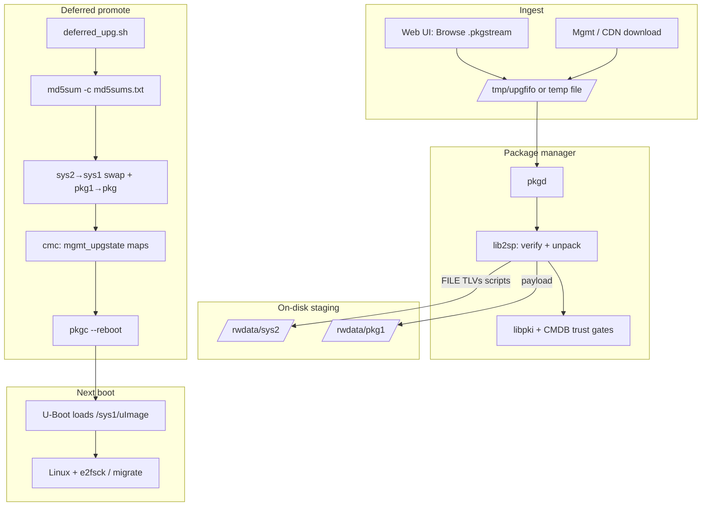
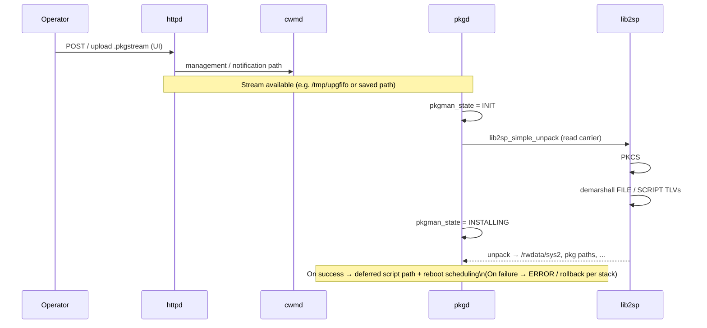
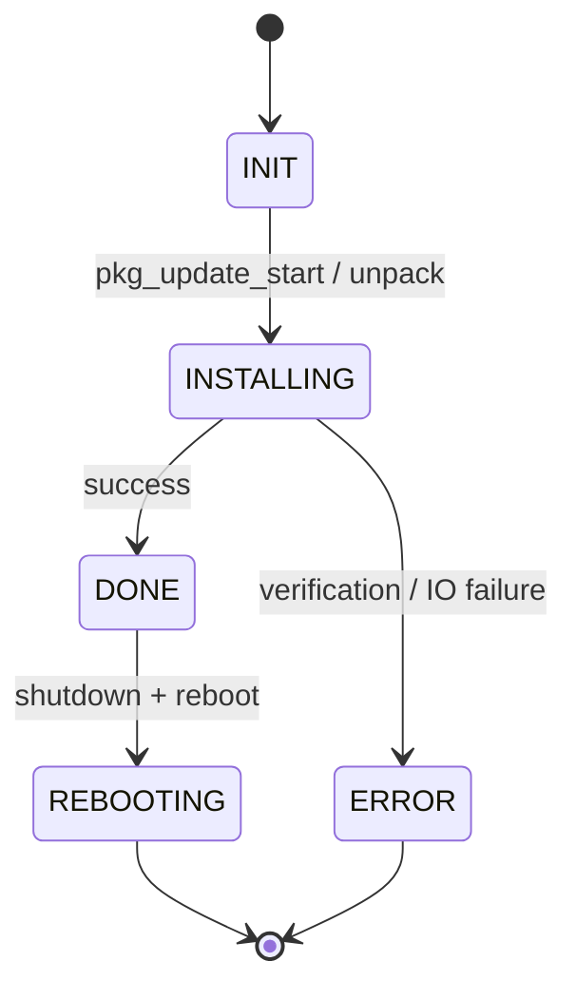
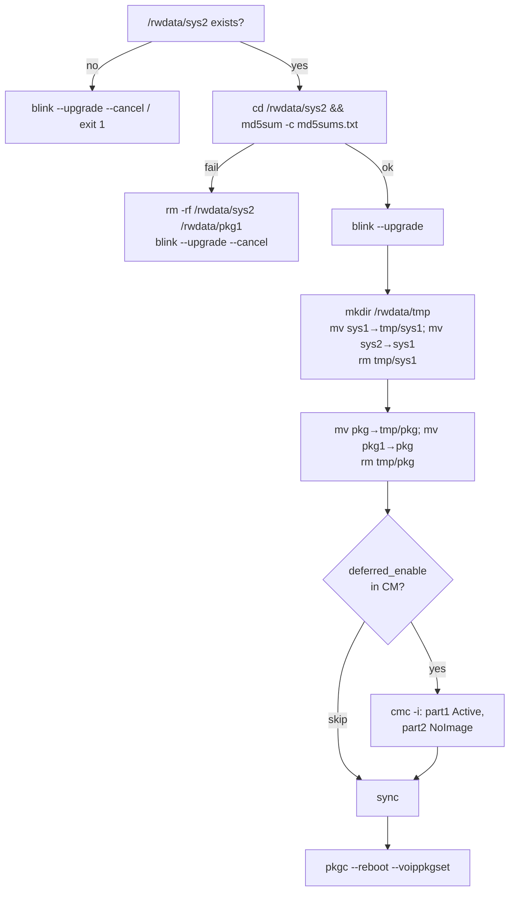
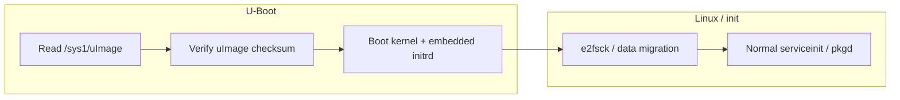

# Firmware upgrade process (5268AC / OpenTL `pkgstream`)

This document describes the **end-to-end software upgrade path** for the AT&T 5268-class gateway where the payload is a **`.pkgstream`** carrier. It ties together:

* Runtime services (**`httpd`**, **`cwmd`**, **`pkgd`**) and the **2SP** parser (**`lib2sp`**) — see [`pkgstream.md`](pkgstream.md).
* **Cryptographic and CMDB gating** — see [`pkgstream_security.md`](pkgstream_security.md).
* **Staging on `/rwdata`** and the **deferred reboot** handoff — scripts shipped inside the install carrier (e.g. `rwdata/tmp/sys2/deferred_upg.sh`).
* Captured console evidence — [`fwupgrade.txt`](fwupgrade.txt).

**Not covered in depth here:** exact TR-069 / remote-management download URLs (still **`pkgd` + `lib2sp`** once a local file or FIFO exists). **USB:** the device **automounts** mass storage under `/rwdata/<dev>`; there is **no** separate auto-scan script that applies firmware from the stick (upgrade is **operator-driven**, typically **web upload** of `.pkgstream` per UI copy in `UPGRADE1.xml`).

---

## 1. Actors and storage

| Actor | Role |
|--------|------|
| **Operator** | Selects `.pkgstream` in the local UI (“Browse…”) or upgrade is pushed via management (CDN → download). |
| **`httpd`** | Serves the UI; upgrade requests are handled in-process and coordinated with CM / peers (UNIX domain sockets under `/tmp`, e.g. `/tmp/httpd`, `/tmp/cwmd`). |
| **`cwmd`** | Management / SOAP sidecar; tracks **`mgmt_upgstate`**, download completion, redirect URL, etc. |
| **`pkgd`** | Package daemon; feeds the carrier bytes to **`lib2sp_simple_unpack`** and drives install state (`pkg_util_set_pkgmgr_pkg_state`, …). |
| **`lib2sp` + `libpki`** | Parse **2SP** TLVs, verify **PKCS#7**, unpack files/scripts to absolute paths (see security doc for trust roots and **`trust_engcert`**). |
| **`pkgc`** | CLI to package manager; **`pkgc --reboot`** used after a successful deferred image promote. |
| **U-Boot** | Reads **`/sys1/uImage`** (and multi-file image components) from **OpenTL partition 5** (`/rwdata` UBIFS). |

**Key directories on `/rwdata` (rw rootfs):**

* **`/rwdata/sys1`** — **active** rootfs tree used for the next boot (kernel **`uImage`**, squashfs **`rootimage.img`**, **`ui.img`**, etc.).
* **`/rwdata/sys2`** — **staging** tree for the incoming image; validated here before swap.
* **`/rwdata/pkg`** / **`/rwdata/pkg1`** — package/carrier staging (installer may **`mv`** **`pkg1` → `pkg`** during promote — see `deferred_upg.sh`).
* **`.upgrade`** — sentinel seen on the UBIFS root listing during upgrade/recovery boots ([`fwupgrade.txt`](fwupgrade.txt)).

---

## 2. End-to-end flow (conceptual)

---

## 3. Sequence: local upgrade submission → install stream

The UI instructs the user to pick a **`.pkgstream`** file locally; the handler-side detail is implemented in **`httpd`** / **`cwmd`**, but the **package** side ultimately consumes a **stream** (in one capture, **`file:///tmp/upgfifo`**) and steps through **INIT → INSTALLING** states.

Log fragments matching **WAITING** + **`file:///tmp/upgfifo`** and **`INSTALLING`** appear in [`fwupgrade.txt`](fwupgrade.txt) (same file also shows **ERROR** paths useful for failure analysis).

---

## 4. State sketch: package manager

Observed **`pkg_util_set_pkgmgr_pkg_state`** transitions in [`fwupgrade.txt`](fwupgrade.txt):

**Deferred download** path (management-driven) uses CM **`mgmt_upgstate`** **`Status: Deferred`** until **`2spVMImkr`** reports **download successful**, then **`DONE` → `INIT` → `REBOOTING`** through shutdown of **`pkgd`**, **`httpd`**, **`cwmd`**, etc. ([`fwupgrade.txt`](fwupgrade.txt) head).

---

## 5. Deferred promote: `deferred_upg.sh`

After **`lib2sp`** lays down **`/rwdata/sys2`** with **`md5sums.txt`**, **`deferred_upg.sh`** (from the carrier TLV tree) performs integrity check, **LED blink**, **directory swap**, optional **CM map updates**, and **reboot**:

**Failure cleanup** uses **`deferred_cleanup.sh`**: remove **`/rwdata/sys2`** and **`/rwdata/pkg1`**, clear **`part2`** fields in **`mgmt_upgstate`** when **`deferred_enable`** is present.

Source: `work_tl_crc/pkgstream_corpus/.../tlv_extract/rwdata/tmp/sys2/deferred_upg.sh` (and companion **`deferred_cleanup.sh`**) from the **11.5.1.532678** install carrier dissect.

---

## 6. First boot after promote

U-Boot continues to load **`/sys1/uImage`** from the **OpenTL** UBIFS; after a successful swap, **`sys1`** is the **new** image. The log shows **“Upgrade Image present. Checking image integrity”**, **Legacy image** metadata, **checksum OK**, then normal Linux start; early userspace prints **“Upgrade in progress…”** while the new root is reconciled ([`fwupgrade.txt`](fwupgrade.txt)).

---

## 7. Trust and format (pointers)

* **Byte layout of `.pkgstream` / TLV types** — [`pkgstream.md`](pkgstream.md).
* **Who is allowed to sign, `trust_engcert`, CMDB OIDs, probes** — [`pkgstream_security.md`](pkgstream_security.md).

---

## 8. Related artifacts

| Artifact | Notes |
|----------|------|
| [`fwupgrade.txt`](fwupgrade.txt) | Console transcript: **Deferred** download, **`.upgrade`**, U-Boot **`/sys1/uImage`**, **Upgrade in progress**, **`pkgman_state`**, **`file:///tmp/upgfifo`**. |
| `deferred_upg.sh` / `deferred_cleanup.sh` | Shipped under **`rwdata/tmp/sys2/`** in TLV extract for **11.5.1.532678**. |
| `en/lang/UPGRADE1.xml` | UI strings: browse **`.pkgstream`** then **Upgrade**. |
