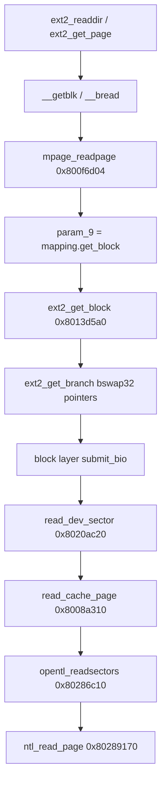

# Ghidra RE: ext2 vs CMDB (532678 kernel + libcm_server)

Programs: **`att-5268-11.5.1.532678_prod_lightspeed-install_uimage_0x01ae4b7e_ld0x80010000_ep0x80458130-kernel.elf`**, **`/usr/lib/libcm_server.so.0.0.0`**.

Method: MCP `decompile_function` / `search_strings` on live Ghidra (May 2026).

## Conclusion (evidence-based)

1. **The kernel uses stock Linux ext2 directory semantics** — no decrypt/hook layer in `ext2_readdir` / `ext2_get_page`.
2. **“Byte swap” in ext2 is `bswap32` on block numbers and `rec_len`**, not MIPS big-endian ext2 structs. Same code path serves root (`/`) and `sys1/`.
3. **CMDB is userspace over a directory (`dbdir`)**, loaded via `opendir` + libxml2 in `_cmdb_load` — not via a custom ext2 inode type.
4. **Kernel rodata has no `/cm`, `/rwdata/cm`, or `dbdir` strings** — mount paths are not kernel-special-cased for CM.
5. **Opaque `/cm` blocks on PACE dumps are consistent with invalid/non-ext2 directory payload**, which triggers the same **`zero length directory entry`** error string the kernel uses — not a separate cipher path.

---

## Kernel: `ext2_readdir` @ `0x8013a0d8`

Walks directory pages with **classic `ext2_dir_entry` layout**:

- `inode` at `*puVar10` with **32-bit bswap**:  
  `uVar12 >> 0x18 | uVar12 << 0x18 | (uVar12 & 0xff00) << 8 | (uVar12 & 0xff0000) >> 8`
- `rec_len` from `*(ushort *)(puVar10 + 1)` with **16-bit bswap**:  
  `(uVar2 & 0xff) << 8 | (uint)(uVar2 >> 8)`
- Name at `puVar10 + 2`, length at byte offset `+6` (v1 layout).
- Optional **ext2_dir_entry_2** when `s_feature_incompat` has **`0x2000000`**: `file_type` from byte `+7`.

On `rec_len == 0`:

```c
ext2_error(..., s_ext2_readdir_80476d60,
           s_zero_length_directory_entry_804e3d38, ...);
return (uint *)0xfffffffb;  /* -EIO */
```

Rodata @ `0x804e3d38`: **`"zero length directory entry"`** — exact Dissect/paceflash failure mode when the wrong block was read; after fixing inode/pointer decode, block **46417** still has no valid chain → same class of error.

**No** calls to crypto, no alternate dentry parser, no path checks for `cm`.

---

## Kernel: `ext2_get_page` @ `0x80139d70`

Validates directory blocks before mark page clean (`ext2_check_page`):

- Same bswap on `rec_len` and inode in dentry loop.
- On failure: `s_bad_entry_in_directory___lu______804e3c78` or `s_entry_in_directory___lu_spans_th_804e3cdc`.

Again: **validator for standard ext2**, not encryption.

---

## Kernel: block pointers — `ext2_get_inode` / `ext2_get_branch`

### `ext2_get_inode` @ `0x8013e4dc`

- `ext2_get_group_desc` → inode table block at GD offset **`+8`** (`bg_inode_table`, not `+0` bitmap).
- Index **`(inode - 1) % inodes_per_group`**, stride **`inode_size`** (128 when `s_inode_size==0` per `ext2_fill_super`).
- **`__bread(..., block = bswap32(*(gd+8)), offset = index * inode_size)`** (page-aligned via `puVar2[7] + …`).

### `ext2_get_branch` @ `0x8013cb50`

- Each indirect level: `__bread(..., bswap32(block_ptr), ...)`.

On a **little-endian** host, `bswap32` is a no-op for valid `__le32` pointers already `<= last_block`. Offline bugs were in **Python**, not a second on-disk format:

| Bug | Effect |
|-----|--------|
| GD inode table read from **`+0`** instead of **`+8`** | Wrong inode bytes for `cmlegacy.498` (6835) |
| Group index used **`(ino - first_ino)`** instead of **`(ino - 1)`** | Wrong slot in inode table |
| `_ext2_decode_block_ptr` trimmed in-range values with tag byte `0x01` in bits 16–23 (e.g. **107637** → **41973**) | `_ext2_sanitize_group_descriptors` corrupted `bg_inode_table` |
| Dissect path for `cat` on broken inode table | `NotADirectoryError` / short reads |

After GD/inode-table fixes: default **`read_ext2_regular_file`** / **`paceflash cat`** use **stock** kernel mapping in **`boardfs.ext2_dissect`** (no lag, no pointer-table skip, no ``ff ac`` indirect layout). **`paceflash cat --cmdb-recover`** and **`boardfs.cmdb_extent_walker`** implement **offline physical CMDB recovery** only.

### `ext2_block_to_path` @ `0x8013c9f0`

- **`file_blk < 0xc` (12)** → direct path `[file_blk]` (`i_block[0..11]`).
- **`file_blk >= 12`** → standard single/double/triple indirect with `path[0]` = `0xc` / `0xd` / `0xe` (indices **12 / 13 / 14**).
- Shifts use **`s_addr_per_block_bits`** (`log2(ptrs_per_block)`), **not** `s_log_block_size` — Python **`_ext2_block_to_path`** mirrors this.

### Root cause: ``cm/cmlegacy.498`` (inode **6835**, May 2026)

**Yes — the ``è`` / “binary prefix” symptom was offline extent mapping, not CMDB encryption or a non-XML on-disk format.** Ghidra confirms the **kernel never implements** a second read path for CMDB files; **`libcm_server`** uses **`xmlReadFile`** on plain XML ([`output/cmdb_ondisk_format.md`](../output/cmdb_ondisk_format.md)).

| Layer | What it does for file block **0** of inode **6835** |
|-------|--------------------------------------------------------|
| **On-disk payload** | **`<?xml version="1.0"…`** at ext2 block **109891** (~453 KiB through **`</ROOT></CM>`** at block **110334**) |
| **Inode metadata (stale)** | **`i_block[0..11]` → 109553..109565** (block **109553** is zeros; **109554+** is **mid-document** XML); **`i_block[12]` → 109822** (indirect); **`i_size = 397739`** (short of full footer) |
| **Stock kernel `ext2_get_block`** | **`ext2_block_to_path(0)` → direct slot 0 → `__bread` block 109553** — **does not** reach block **109891** (header is **not** in the inode tree) |
| **Broken offline lag (fixed)** | Formula **`i_blocks - 24 = 760`** shifted the start to block **108793** (high-entropy garbage) because lag was applied **without** a **`<?xml`** check at the shifted block |
| **`paceflash` default (May 2026 fix)** | Reject unvalidated lag; **`recover_cmdb_near_inode_extent`** scans **±512 blocks** around inode anchor phys range and reads **109891 → footer** |

**Ghidra anchors (532678 kernel, MCP May 2026):**

- **`ext2_get_block` @ `0x8013d5a0`**: **`ext2_block_to_path`** then **`ext2_get_branch`**; returned block number is **`bswap32`**’d into **`param_7[5]`** for **`__getblk`**. No CMDB-specific branches.
- **`ext2_block_to_path` @ `0x8013c9f0`**: **`file_blk < 0xc` (12)** → direct **`i_block[file_blk]`**; **`file_blk ≥ 12`** → singly/doubly/triply indirect via slots **`0xc` / `0xd` / `0xe`** (kernel indices **12 / 13 / 14**). Uses **`s_addr_per_block_bits`**, not `s_log_block_size`.
- **`ext2_get_branch` @ `0x8013cb50`**: each indirect level **`__bread(..., bswap32(block_ptr), ...)`** — straight pointer chase, no backward header scan.
- **`ext2_get_inode` @ `0x8013e4dc`**: inode table block from group descriptor **`+8`** (`bg_inode_table`), index **`(ino - 1) % inodes_per_group`**, stride **`inode_size`**.

**Kernel vs offline walker (not the same thing):**

| | Running kernel / true kernel-faithful read | **`boardfs.cmdb_extent_walker`** (PACE **`s_inode_size == 0`**) |
|--|-------------------------------------------|------------------------------------------------------------------|
| Direct slots | **12** (`i_block[0..11]`) | **13** on-disk (`i_block[0..12]`) before indirect at slot **13** |
| Indirect index | **`i_block[12]`** | **`i_block[13]`** (+ **`ff ac`** table-in-next-block quirk) |
| Pointer decode | **`bswap32(__le32)`** only | Tagged **`0x01xxxxxx`**, optional **lag**, sparse indirect fill |
| Stale inode / orphan XML | Reads **only** mapped blocks; **`i_size`** caps **`generic_file_read`** | **`recover_cmdb_near_inode_extent`** finds **`<?xml`** near anchors when inode tree misses header |
| Intended use | **Runtime** on mounted **`/dev/opentla4`** | **Offline** PACE dump when metadata lags payload (power-loss, **`e2fsck`** does not rewire inode **6835** → **109891**) |

On a **live** router after clean metadata, kernel **`read()`** and **`xmlReadFile`** should agree. On this **PACE capture**, default **`paceflash cat cm/cmlegacy.498`** must use the **walker + near-extent scan** — that is **not** claiming the kernel does the same; it is **recovering bytes the kernel inode no longer points at**.

### Kernel vs dump: inode **7323** / ``config/cmlegacy.203``

On the S34ML01G1 slice (NTL chain replay matches linear bytes for inode-table and CMDB blocks):

| Field | Value |
|-------|--------|
| `i_size` | **28603** |
| `i_block[0..11]` | **118686..118697** (mid-document XML) |
| `i_block[12]` | **118698** (kernel: singly-indirect block; first `__le32` is not a valid block → read fails past 12 KiB) |
| CMDB header on disk | **118652** (**34** blocks **before** `decode(i_block[0])`) — not reachable via stock **`ext2_get_block`** from this inode |

**Default `paceflash cat`** returns **28603** bytes starting with ``ame">default_ssid`` (kernel-faithful). **`paceflash cat --cmdb-recover`** walks the physical extent **118652..119131** (~490 KiB XML) via lag/bridge rules in **`boardfs.cmdb_extent_walker`** (not a kernel claim).

### PACE capture quirks (walker only — **not** in kernel)

Captured inodes often differ from kernel slot layout:

| On-disk `i_block[n]` | Walker role |
|----------------------|-------------|
| `0..12` | 13 direct data slots before indirect |
| `13` | Singly-indirect (`ff ac` may move `__le32[]` to **next** block) |
| Sparse gaps | Implicit contiguous phys blocks between non-consecutive indirect pointers |

Tagged ``0x01xxxxxx`` pointers, directory **`decode(i_block[0]) + i_blocks`**, in-band pointer-table pages, and footer probing live in **`cmdb_extent_walker`**.

### Offline repair vs kernel read

**`_ext2_sanitize_group_descriptors`** / **`_ext2_repair_block_ptr`** trim corrupt MSB-tagged GD/indirect values so Dissect can mount — **diverges** from **`ext2_get_branch`** (straight `bswap32`). Kernel-faithful reads use **`_ext2_le32_block`** only.

`0x800eaf54` in older notes is **`__bread`**, not the swap helper — swap is **inlined** at call sites.

### Journal, `e2fsck`, and power-loss (May 2026)

**Ext3 journal on `opentla4`?** The 532678 kernel ships **both** `ext2_fill_super` @ `0x80141d6c` and `ext3_fill_super` @ `0x801304b0` (JBD/`__ext3_journal_*`). On the S34ML01G1 assembled slice, the superblock has **`feature_compat = 0`** (no **`EXT3_FEATURE_COMPAT_HAS_JOURNAL`**), **`s_rev_level = 0`**, so **`opentla4` mounts as plain ext2** — no journal replay on read. Stale inode **7323** vs full XML on disk is **not** explained by “read the journal to find the real `i_block[0]`.”

**`e2fsck` at boot** (`fwupgrade.txt`): userspace **e2fsck 1.42.7** on `/dev/opentla4` after unclean unmount; log shows **bitmap / free-count / deleted-inode `dtime` fixes**, not journal recovery and **no** inode-7323 pointer rewrite. That matches **filesystem hygiene**, not reconstructing a CMDB file from orphan blocks.

**Power-loss mid-write** remains the best fit: payload at **118652..119131** (complete XML), inode still pointing at **118686** with **`i_size = 28603`**. NTL chain replay matches the slice for the inode-table block — capture is internally consistent; metadata lags data.

**If the live device returns full XML via stock `cat`:** compare inode **7323** after a normal boot (post-`e2fsck`) to the dump; confirm path is **`config/cmlegacy.203` on ext2** vs **`/rwdata/cm`** (CMDB `dbdir`). Offline: **`paceflash cat`** (kernel) vs **`paceflash cat --cmdb-recover`** (physical extent).

**Offline fsck audit (May 2026):** `python tools/ext2_fsck_audit.py` exports `output/ext2_fsck_audit/opentla4_chain_aware.ext2` and runs `dumpe2fs` / `e2fsck -n` / `debugfs stat <7323>` (WSL). Results on this dump:

| Check | Result |
|-------|--------|
| Journal | **None** (`dumpe2fs`: revision 0, features `(none)`) |
| `debugfs stat <7323>` | Size **28603**; blocks **(0–11):118686–118697**, indirect **118698** — matches kernel-faithful `paceflash cat` |
| `e2fsck -y` (copy) | Fixes bitmaps/orphans; **does not** move inode 7323 to block **118652** |
| Header block **118652** | XML present on disk; **not** in inode direct map |

Conclusion: the **full CMDB is on the volume** but **not wired through stock inode metadata**; that is a **metadata/orphan-extent** story, not a NAND or parser bug. Use **`paceflash cat --cmdb-recover`** for the full file offline.

---

## Kernel: `ext2_fill_super` @ `0x80141d6c`

- Superblock magic checked with **16-bit bswap** on `s_magic` (`0xEF53`).
- If superblock fields at `+0x54` / `+0x58` are **zero** (PACE product image behavior):
  - **`inode_size = 0x80` (128)**
  - **`s_first_ino` implied via `puVar5[0x17] = 0xb` (11)** in the zero-feature-flags branch
- Else reads **`inode_size` from superblock** (bswap u16 @ `+0x58`).

So the **running kernel assumes 128-byte inodes** when the on-disk sb says `inode_size==0`, while this capture also has **256-byte inode bodies** in the raw slice (e.g. `/cm` inode **6833** at volume offset `0x691d400`). That is an **image/layout mismatch**, not proof of kernel ext2 encryption.

---

## Kernel: CM paths

`search_strings` on kernel for `rwdata`, `/cm`, `dbdir`, `cmdb` → **no product path strings** (only unrelated `ForwDatagrams` noise).

CMDB mount path is **userspace** (runit `cmd --dbdir /rwdata/cm`, etc.).

---

## Userspace: `_cmdb_load` @ `0x1a15c` (`libcm_server.so.0.0.0`)

- **`param_1 + 0x12c`**: `dbdir` → **`opendir`**, **`readdir`**, **`stat`**.
- Regular files (`S_IFREG` / `0x8000`): **`xmlReadFile`** (libxml2), not ext2 decryption.
- **`_cmdb_oplist_setup` / `_cmdb_oplist_commit`**: journal around loads.
- **No** `encrypt` / `cipher` strings in libcm_server rodata (prior session grep).

CMDB on disk = **normal directory tree under `dbdir`**, typically on **UBIFS `/rwdata/cm`**, not ext2 `/cm`.

---

## Implications for PACE `/cm` opaque blocks

| Question | Ghidra answer |
|----------|----------------|
| Custom ext2 driver for `/cm`? | **No** — same `ext2_readdir` as `/sys1`. |
| Encrypted ext2 directories? | **No kernel support found**; opaque blocks → standard **invalid dentry** path. |
| Big-endian ext2? | **No** — bswap on **LE on-disk fields** (block #, `rec_len`, `s_magic`). |
| Wrong NAND page for one block only? | **Possible** for factory data, but **cannot explain** working **`sys1/`** + **`sysinit/`** on same assembled volume; kernel would use same `ext2_get_page` → `read_cache_page` → block layer. |
| CMDB tied to ext2 `/cm`? | **No** — `_cmdb_load` uses **`dbdir`**; upgrade scripts use **`/rwdata/*`** only. |

Recommended cross-check (not Ghidra): compare opentla4 **`/cm`** block **46417** bytes to a **pkgstream-carved ext2** or live `e2fsck` image from the same firmware version — if still non-dentry, label as **factory placeholder / unused slot** rather than encryption.

### Offline block compare (May 2026, `tools/compare_ext2_dir_blocks.py`)

Same assembly path as **`paceflash ls`**: `open_opentla4_ext2` + **`ntl_rw_chain_replay`**, **`sb_off=1024`**.

| Block | Role | SHA-256 (first 8) | Nonzero | Entropy | Dirents |
|-------|------|-------------------|---------|---------|---------|
| **46417** | `/cm` inode **6833** `i_block[0]` | `b99a7c66…` | 1005 / 1024 | **7.78** | **opaque** (no `.`/`..`) |
| **87449** | `sysinit` (dot scan) | `30a21fea…` | 18 / 1024 | **0.19** | `.`, `..`, **`etc`** |

**Interpretation:** Both blocks are read from the **same** 125 894 656-byte assembled volume. **`sysinit`** proves NTL/BBM + ext2 pointer decode work for that inode; **`/cm`** block is **high-entropy non-dentry payload** on the correct logical block — not a one-off NAND mapping bug for a single path.

---

## Kernel block I/O chain (ext2 → OpenTL)

Same path for every filesystem block number returned by **`ext2_get_block`** / **`ext2_get_branch`**:



- **`read_dev_sector`**: `read_cache_page(mapping->a_ops->readpage, sector_index)` — no ext2-specific transform.
- **`ntl_read_page`**: virt block → **`ntl_put_chain_in_array`** + **`ntl_find_phy`** + **`ntl_verify_read_phy_page`** + **`memcpy`**; unmapped → **`memset(0)`**.

There is **no** branch on inode number or path under **`/cm`** in this stack.

---

## PACE “lag” (`i_blocks - 24`) — kernel vs offline

The kernel **does not** implement lag. Full Ghidra notes, empirical table, and alternative hypotheses: **[`ghidra_ext2_pace_lag_investigation.md`](ghidra_ext2_pace_lag_investigation.md)**.

Short summary:

- **`ext2_new_blocks`** updates **`i_blocks`** as **512-byte sectors** (`inode_add_bytes`); lag formula mixes sectors with “24 = 2×12 direct” (kernel slot count).
- **`0x01` in bits 16–23 of `i_block[]`** is **not** a separate writer: for blocks **65536–131071**, `__le32` naturally has byte 2 == `0x01` (e.g. **118686** → `0x0001cf9e`). CMDB writes still go through **kernel ext2** after **`libcm_server`** `_cmdb_file_save` (`0x155c8`). See **[`ghidra_ext2_pace_lag_investigation.md`](ghidra_ext2_pace_lag_investigation.md)** § “no separate writer”.

---

## See also

- [`ghidra_ext2_pace_lag_investigation.md`](ghidra_ext2_pace_lag_investigation.md)
- [`pace_ext2_cm_directory.md`](pace_ext2_cm_directory.md)
- [`cm_cmdb.md`](cm_cmdb.md)
- [`output/cmdb_ondisk_format.md`](../output/cmdb_ondisk_format.md)
- [`firmware_upgrade_process.md`](firmware_upgrade_process.md)
