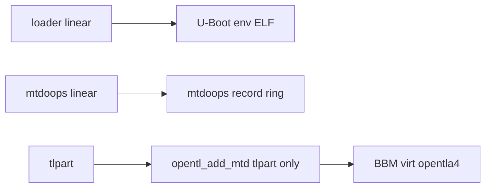

# Ghidra MCP — MTD `loader` / `mtdoops` / `tlpart` (532678 kernel + U-Boot carve)

**Programs (Ghidra MCP):**

| Program | Path on disk | Role |
|---------|--------------|------|
| `att-5268-11.5.1.532678_prod_lightspeed-install_uimage_0x01ae4b7e_ld0x80010000_ep0x80458130-kernel.elf` | `firmware_11.5.1.532678/.../pkgstream_carves/...-kernel.elf` | Linux 3.4.11-rt19 + OpenTL + mtdoops |
| `uboot_from_loader.elf` | `output/mtd_parts_probe/uboot_from_loader.elf` | U-Boot **1.3.3** MIPS BE ELF @ **loader+0x21000** |

Always pass **`program=`** on MCP calls when multiple binaries are open.

---

## MTD layout (logical 128 MiB data plane)

`mtdparts=mtd-0:524288(loader),1048576(mtdoops),-(tlpart)`

| Name | Offset | Size | Typical `mtd` | Consumer |
|------|--------|------|---------------|----------|
| **loader** | `0x0` | 512 KiB | mtd0 | U-Boot image + **env v1 @ 0** |
| **mtdoops** | `0x80000` | 1 MiB | mtd1 | **`mtdoops` kernel driver** (panic ring) |
| **tlpart** | `0x180000` | remainder | mtd2 | **OpenTL** only (`opentl_add_mtd`) |

**Offline:** build a `boardfs.flash_layout.FlashImage` on a **logical-plane** view (or raw dump when offsets match), then read `loader` / `mtdoops` partitions. See [`tools.md`](tools.md).



**Decision tree:** Need squash/rootimage in TL → **`tlpart` + BBM**. Need boot cmdline / env CRC → **`loader`**. Need crash history → **`mtdoops`**. Do **not** correlate pkgstream squash SHA against loader/mtdoops.

---

## Kernel — `opentl_add_mtd` @ `0x80286c30`

MCP decompile (532678 kernel):

1. **`mtd->type != 4` (NAND)** → return (no attach).
2. **`strcmp(mtd->name, "tlpart")`** @ rodata **`0x804f7194`** — **only** this partition name proceeds.
3. On match: `kmem_cache_alloc(0x80d0)`, page buffer `writesize`, **`opentl_dev_setup`**, **`ntl_mount`**, **`add_mtd_blktrans_dev`**.

**loader** and **mtdoops** MTD devices exist for U-Boot/cmdlinepart and mtdoops, but **OpenTL never mounts them**.

---

## Kernel — `mtdoops` driver

### Cmdline (fwupgrade ground truth)

From [`fwupgrade.txt`](../fwupgrade.txt) line 336:

```text
mtdoops.mtddev=mtdoops mtdoops.record_size=131072
mtdparts=mtd-0:524288(loader),1048576(mtdoops),-(tlpart)
```

- **`mtdoops.mtddev=mtdoops`** — bind by **partition name** (not numeric `mtd1`).
- **`record_size=131072`** (128 KiB), must be **≥ 4096** and **multiple of 4096**.

### `mtdoops_init` @ `0x80577908`

- **`DAT_805dc07c`** — `mtddev` string; empty → printk *mtd device must be supplied*.
- **`DAT_80552620`** — `record_size`; validates `>= 0x1000` and `(size & 0xfff) == 0`.
- **`simple_strtoul`** on `mtddev`: numeric **or** name (empty tail after parse → store number in **`DAT_805dc040`**).
- **`vmalloc(record_size)`** workspace; **`register_mtd_user`** → **`mtdoops_notify_add`**.

### `mtdoops_notify_add` @ `0x80281b14`

- **`strcmp(mtd->name, DAT_805dc07c)`** or **`mtd->index == DAT_805dc040`**.
- Partition must be **≤ 8 MiB** total; **erase size ≥ record_size**.
- Allocates **page-use bitmap** (`DAT_805dc074`), **`kmsg_dump_register(mtdoops_do_dump)`**.
- Scans **`size / record_size`** slots: reads **8 bytes** at each slot start via **`mtd->_read`**; **`0xffffffff`** → empty slot.
- Picks **next write index** from counter ordering (handles `0xc0000000` wrap semantics).
- Success: **`printk("Attached to MTD device %d")`**.

### `mtdoops_write` @ `0x8028132c`

- Record header: word at **`+0x40`**, second word **`0x5d005d00`** (`"]\0]\0"` style delimiter in decompiler view).
- Writes **`record_size`** bytes via **`mtd->_write`** or panic path.

### Upgrade scrub (userspace, not kernel)

**`mtdoops is mtd1; clearing old logs`** — from **`init`** in install **cpio-root** (e.g. lab `502082` pkgstream extract), not kernel ELF:

```sh
echo "$label is $mtd; clearing old logs"
```

Grep corpus: `gateway.c01.sbcglobal.net/firmware/.../cpio-root/init`.

### Module parameters (rodata)

| String | VA (approx) |
|--------|-------------|
| `mtdoops.mtddev` | `0x80487ae4` |
| `mtdoops.record_size` | `0x80487afb` |
| `mtdoops.dump_oops` | `0x80487ad0` |

(Data references only in Ghidra listing — use **`search_functions` `mtdoops*`** for code entry points.)

### `cmdlinepart`

- String **`cmdlinepart`** @ **`0x804f580c`**.
- **`get_partition_parser`** @ **`0x8027c6a4`** — walks parser list, **`strcmp`** on parser name.

---

## Kernel — PROM default vs product `mtdparts`

| String | VA | Xref |
|--------|-----|------|
| `mtdparts=mtd-0:393216(loader),-(ubipart) ubi.mtd=ubipart` | `0x804d4280` | **`prom_init`** |
| `U-boot mtdparts missing ?, using default %s` | `0x804d41e8` | PROM fallback |

**Product Pace layout** (`524288/1048576/tlpart`) comes from **U-Boot BCMNAND OOB discovery** + kernel **cmdlinepart**, not PROM defaults.

---

## U-Boot carve — `uboot_from_loader.elf`

Extracted from **`PACE 5268AC S34ML01G1@TSOP48.BIN`** → `output/mtd_parts_probe/loader.bin` → ELF @ **+0x21000** (389120 B).

**Ghidra:** `image_base` **`0x8f800000`**, auto-analysis may report **0 functions** (reloc/PIE); use **byte search** + file offsets below.

### Key strings (file offset → VA ≈ `0x8f800000 + offset`)

| File offset | String | Notes |
|-------------|--------|--------|
| `0x37500` | `U-Boot` | Version banner region |
| `0x39584` | `BCMNAND` | NAND driver messages |
| `0x39834` | `OOB scan` | Spare signature scan (partition discovery) |
| `0x4030c` | `mtdparts` | Partition table strings |
| `0x413cc` | `Fixed up MTD` | Fallback to `524288(loader),1048576(mtdoops),-(tlpart)` |
| (many) | `BootCode` | Spare **vendor marker** in early erase blocks ([`opentl.md`](opentl.md) §6.1) |

**MCP:** `search_byte_patterns` `42 6f 6f 74 43 6f 64 65` finds **BootCode** at **`0x8f800788`** + stride ~**0x840** (spare template pattern).

**Import:** `import_file` `D:/electronics/5268ac/output/mtd_parts_probe/uboot_from_loader.elf`, folder `/Firmware/uboot_carve`.

---

## Offline tooling

- **`python -m paceflash ls --probe-loader-env --probe-mtdoops`** — [`paceflash/mtd_partition_probes.py`](../paceflash/mtd_partition_probes.py); JSON **`mtd_partition_probes`**.
- **Carve:** use `boardfs.flash_layout.build_partitions_from_mtdparts(...)` and `FlashImage.extract_partition(...)` with `mtd-0:524288(loader),1048576(mtdoops),-(tlpart)`.

---

## Related notes

- [`opentl_kernel_ghidra.md`](opentl_kernel_ghidra.md) — `ntl_mount`, BBM, writes
- [`opentl.md`](opentl.md) — U-Boot OOB / `BootCode` vs OpenTL spare chains
- [`printk_anchor_fwupgrade_ghidra.md`](printk_anchor_fwupgrade_ghidra.md) — cmdlinepart printk lines
- [`mcp_kernel_gap_matrix.md`](mcp_kernel_gap_matrix.md) — parity gaps + probe row
