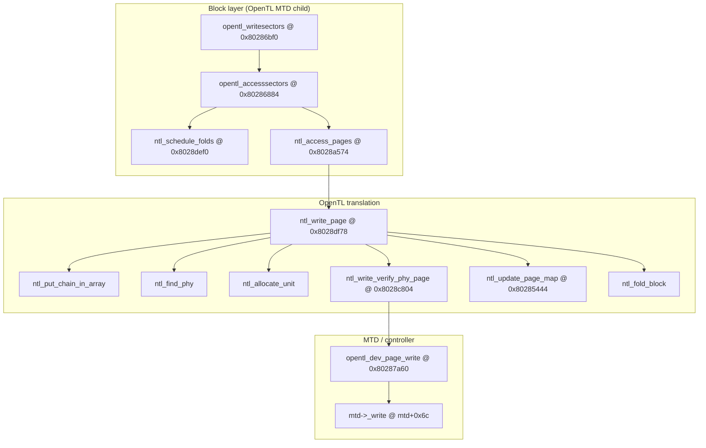

# Ghidra MCP snapshot — NAND write path & page-map cache (532678 kernel ELF)

**Program:** `att-5268-11.5.1.532678_prod_lightspeed-install_uimage_0x01ae4b7e_ld0x80010000_ep0x80458130-kernel.elf` (MIPS BE, image base `0x80010000`).

**Method:** `user-ghidra` MCP — `list_open_programs`, `search_functions`, `get_function_callees`, `get_xrefs_to`, `decompile_function` (2026-05-15).

**Companion prose:** [opentl_kernel_ghidra.md](opentl_kernel_ghidra.md) §3 (MTD glue), §4 (`ntl_access_pages`), §7.6–§7.12 (write / verify / page map / fold). Userspace staging → kernel: [ghidra_upgrade_write_path_532678.md](ghidra_upgrade_write_path_532678.md), [firmware_upgrade_process.md](firmware_upgrade_process.md) §6a. **Userspace FILE install uses POSIX `write(2)`** (`lib2sp_write_file` → `write` PLT) — MCP evidence: [ghidra_mcp_lib2sp_11_5_1_532678/README.md](ghidra_mcp_lib2sp_11_5_1_532678/README.md).

**Offline read fix (no write emulator):** Carrier strict-squash + FILE-payload SHA fingerprints are matched inside **`bbm_virt` / `linear_tlpart`** TL views via **`paceflash.upgrade_correlation`** (CLI **`--lib2spy-json`**), anchoring dissect/carve superblock offsets and auto-triggering spare-chain virt when linear alone matches — see [mcp_kernel_gap_matrix.md](mcp_kernel_gap_matrix.md) upgrade row.

---

## Call graph (write half)

**Important ordering:** The **logical** virt→phys work (**`ntl_write_page`** and friends) runs **before** the **physical program**. **`ntl_write_verify_phy_page`** (**§7.9**) calls **`(*(code **)(ctx + 0x54))(ctx, …)`**, which **`opentl_dev_setup`** wired to **`opentl_dev_page_write`**. **`opentl_dev_page_write`** then invokes **`(**(code **)(mtd + 0x6c))(mtd, …)`** — i.e. the NAND driver’s **`mtd->_write`**. There is **one nested chain**, not two independent stacks.

---

## `ntl_access_pages` — read vs write vs delete dispatch

**EA:** `0x8028a574`.

From **`decompile_function`**:

- **`param_6 == NULL`** — **`ntl_read_page`** loop ( **`param_7`** = buffer).
- **`param_6 == (void *)1`** — **`ntl_write_page(..., last_byte)`** where **`last_byte = (param_5 < 9) ? 1 : 0`** ( **`true`** for short multi-page batches).
- **`param_6 == (void *)2`** — **`ntl_delete_page`**.

**Note:** **`opentl_writesectors`** passes **`2`** into **`opentl_accesssectors`** as the **sector-level operation code**; that routine **`ntl_schedule_folds`** then calls **`ntl_access_pages`** with the **`ntl_*`** op discriminator above (**write path uses `param_6 == 1`** inside **`ntl_access_pages`**).

---

## MCP callee tables (`get_function_callees`)

| Symbol | EA | Callees (kernel names @ EA where useful) |
|--------|-----|------------------------------------------|
| **`ntl_write_page`** | **`0x8028df78`** | `memcpy`, `ntl_allocate_unit`, `ntl_find_phy`, `ntl_fold_block`, `ntl_free_block_if_notbad`, `ntl_log_all`, `ntl_prepare_wspare`, `ntl_put_chain_in_array`, `ntl_read_verify_phy_spare`, `ntl_update_page_map`, `ntl_write_verify_phy_page`, `ntl_write_verify_phy_spare`, `panic`, `printk`, `tl_add_chain` |
| **`ntl_write_verify_phy_page`** | **`0x8028c804`** | `memcmp`, `memset`, `ntl_compute_spare_xsum`, `ntl_ecc_read`, `ntl_ecc_write`, `ntl_xsum_read`, `panic`, `printk` |
| **`ntl_build_page_map`** | **`0x80284a20`** | `ntl_read_verify_phy_spare`, `panic`, `printk` |
| **`ntl_lookup_page_map`** | **`0x80285248`** | `printk` |
| **`ntl_schedule_folds`** | **`0x8028def0`** | `ntl_fold_block` |
| **`ntl_access_pages`** | **`0x8028a574`** | `memset`, `ntl_delete_page`, `ntl_read_page`, `ntl_write_page`, `panic`, `printk` |
| **`opentl_writesectors`** | **`0x80286bf0`** | `opentl_accesssectors` |
| **`opentl_accesssectors`** | **`0x80286884`** | `memcpy`, `ntl_access_pages`, `ntl_schedule_folds`, `printk` |
| **`ntl_invalidate_page_map`** | **`0x80285700`** | `printk` |

---

## MCP cross-references (`get_xrefs_to`) — selected

| Target | EA | Callers / notes |
|--------|-----|-----------------|
| **`ntl_write_page`** | **`0x8028df78`** | **`ntl_access_pages`** @ **`0x8028a808`**, **`0x8028a838`**; rodata **`0x8049d470`** |
| **`ntl_write_verify_phy_page`** | **`0x8028c804`** | **`ntl_write_page`** @ **`0x8028e288`**, **`0x8028e42c`**; **`tl_fold_chain`** @ **`0x8028da84`**; rodata **`0x8049d444`** |
| **`ntl_build_page_map`** | **`0x80284a20`** | **`ntl_find_phy`** @ **`0x80289040`** |
| **`ntl_lookup_page_map`** | **`0x80285248`** | **`ntl_find_phy`** @ **`0x80289004`**, **`0x80289064`** |
| **`ntl_schedule_folds`** | **`0x8028def0`** | **`opentl_accesssectors`** @ **`0x802868cc`** |
| **`ntl_access_pages`** | **`0x8028a574`** | **`opentl_accesssectors`** (multiple sites), **`ntl_mount`**, **`ntl_load_stat_table`**, **`process_map`**, **`ntl_flush_table`**, … |
| **`ntl_update_page_map`** | **`0x80285444`** | **`ntl_delete_page`** @ **`0x8028cf4c`**; **`ntl_write_page`** @ **`0x8028e4fc`**, **`0x8028e620`** |
| **`ntl_invalidate_page_map`** | **`0x80285700`** | **`tl_fold_chain`** @ **`0x8028dc08`**, **`0x8028dd4c`**; **`ntl_erase_unit`** @ **`0x8028d1a4`** |
| **`opentl_writesectors`** | **`0x80286bf0`** | Pointer tables **`0x80553b50`**, **`0x8049d384`** (indirect registration) |
| **`opentl_accesssectors`** | **`0x80286884`** | **`opentl_writesectors`** @ **`0x80286bfc`**, **`opentl_readsectors`** @ **`0x80286c1c`** |

---

## `opentl_dev_setup` / `opentl_dev_page_write` — hook vs `mtd->_write`

### `opentl_dev_setup` @ `0x802881c0`

Installs **function pointers on the OpenTL private blob `param_1`** ( **`mtd_priv`** in §3 prose):

| Offset | Hook |
|--------|------|
| **`+0x50`** | **`opentl_dev_page_read`** |
| **`+0x54`** | **`opentl_dev_page_write`** |
| **`+0x58`** | **`opentl_dev_spare_read`** |
| **`+0x5c`** | **`opentl_dev_spare_write`** |
| **`+0x60`** | **`opentl_dev_erase`** |

### `opentl_dev_page_write` @ `0x80287a60`

- **`param_3`** is the **OpenTL context**; **`iVar4 = param_3[0x12]`** is the **underlying `struct mtd_info *`**.
- Programs **`local_48 = 2`** ( **`mode`** field in the **`mtd_write_req`**-shaped local ), masks linear **`block/page`** coordinates using **`param_3[6]`**, **`param_3[7]`**, **`*(mtd+0x14)`** ( **`mtd->size - 1`** mask in decompilation).
- **Physical I/O:** **`(**(code **)(iVar4 + 0x6c))(iVar4, local_34, 0, uVar3, &local_48)`** — i.e. **`mtd->_write`** at **`mtd + 0x6c`**, gated on **`MTD_WRITEABLE`** (**`*(mtd+4) & 0x400`**) and non-null **`_write`**.

**Closure:** **`ntl_write_verify_phy_page`** uses **`ctx + 0x54`** → **`opentl_dev_page_write`** → **`mtd->_write`** — consistent with [opentl_kernel_ghidra.md](opentl_kernel_ghidra.md) §7.9 table row “Write | **`(*(code **)(ctx+0x54))(ctx, …)`**”.

---

## `ntl_write_page` — virt→phys hints from decompilation

- **`ntl_find_phy(..., param_6 = 1, …)`** appears on the write path ( **`param_6`** position matches **`…, 1, 0,`** in the **`ntl_find_phy`** call site — contrast **`ntl_delete_page`** §7.7 prose with **`param_6 = 0`**).
- When **`ntl_find_phy`** returns **`local_248 == 0xffffffff`**, the path allocates via **`ntl_allocate_unit`** ( **`ntl_write_page`** spare-first vs data-first branches).
- After successful **`ntl_write_verify_phy_page`**, updates **`puVar12`** ( **8-byte virt entry** ), increments generation byte at **`virt_entry + 5`**, **`tl_add_chain`**, and **`ntl_update_page_map`** when the **`puVar12[1] & 1`** mirror path demands map refresh — aligns §7.12 **invalidate/build** story (**`ntl_invalidate_page_map`** from **`tl_fold_chain`** / **`ntl_erase_unit`** xrefs above).

---

## Two caching layers (layout relevance)

1. **Linux VFS page cache** — **`read_dev_sector`** → **`read_cache_page`** ([mcp_kernel_gap_matrix.md](mcp_kernel_gap_matrix.md) **`read_dev_sector`** row). Affects **disklabel** / **`opentla*`** reads through the block layer; **orthogonal** to parsing static **`tlpart`** dumps.

2. **OpenTL RAM page-map cache** — **`ntl_lookup_page_map`** / **`ntl_build_page_map`** / **`ntl_invalidate_page_map`** (**§7.12**, remap **`0x14f38`–`0x14f50`** region). Governs **which physical page answers a virt page index** at runtime after maps warm; **fold** and **erase** invalidate via **`ntl_invalidate_page_map`**.

---

## Python / offline gap

Same as [mcp_kernel_gap_matrix.md](mcp_kernel_gap_matrix.md): **no `ntl_write_page` emulator** — documented BBM/read parity only; this MCP snapshot is evidence for **future** write emulation or TSOP correlation, not a **`paceflash`** change by itself.
