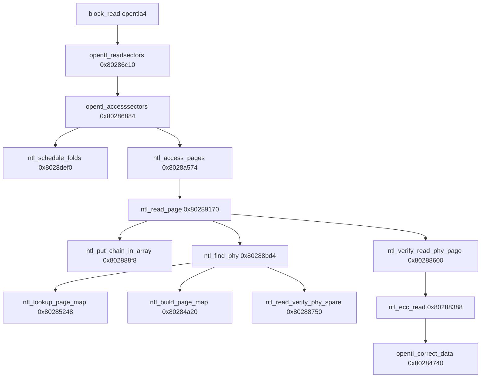

# Ghidra MCP: NTL mode-2 read path for `opentla4` (ptype 17)

**Program:** `att-5268-11.5.1.532678_prod_lightspeed-install_uimage_0x01ae4b7e_ld0x80010000_ep0x80458130-kernel.elf` (MIPS BE, image base `0x80010000`).

**Scope:** Reverse-engineering and offline porting for **`/dev/opentla4`** — the **read/write** OpenTL child slice (`ptype == 17`) that holds **`ext2`** with embedded **`rootimage.img`** / **`ui.img`** SquashFS files. This is **not** the same problem as listing partition-level `hsqs` on a BBM-assembled stream.

**Python:** [`opentl/ntl_rw.py`](../opentl/ntl_rw.py), [`opentl/opentla4_volume.py`](../opentl/opentla4_volume.py), [`boardfs/tl_chain.py`](../boardfs/tl_chain.py), [`boardfs/ext2_dissect.py`](../boardfs/ext2_dissect.py), [`boardfs/ext2_path.py`](../boardfs/ext2_path.py), [`paceflash/opentla4_extract.py`](../paceflash/opentla4_extract.py), [`paceflash/shell.py`](../paceflash/shell.py), [`opentl/spare_layout.py`](../opentl/spare_layout.py), [`opentl/spare_chain_replay.py`](../opentl/spare_chain_replay.py). Shims: [`paceflash/ntl_adapter.py`](../paceflash/ntl_adapter.py) → **`boardfs.tl_chain`**.

**Companion:** [opentl_kernel_ghidra.md](opentl_kernel_ghidra.md) §7, [ghidra_opentla4_disk_layout_mcp.md](ghidra_opentla4_disk_layout_mcp.md), [ghidra_boardfs_bbm_readpath.md](ghidra_boardfs_bbm_readpath.md), [mcp_kernel_gap_matrix.md](mcp_kernel_gap_matrix.md), [paceflash.md](paceflash.md).

---

## 1. Executive summary

| Layer | What firmware expects | Offline port (May 2026) | Remaining gap |
|-------|----------------------|-------------------------|---------------|
| **VFS** | `ext2` on `/dev/opentla4` | **`boardfs.assemble_opentla4_volume`** + **`dissect.extfs`**; PACE dump mounts at **`sb=1024`**, **`read_model=ntl_rw_chain_replay`** | Some large files (**`sys1/ui.img`**) fail indirect reads (assembled map still incomplete for those blocks) |
| **OpenTL driver** | `opentl_rw` + **NTL mode 2** | **`opentl/ntl_rw.py`**: per-page `find_phy`, verify parity, ECC helpers | **Page-map cache** rarely enabled (`page_map_hits=0` on PACE — few mirror-flag chains) |
| **SquashFS payload** | File **`/rwdata/sys1/rootimage.img`** loop-mounted | **`cat sys1/rootimage.img`** in **`paceflash shell`** or **`ext2_file_extract`** — **not** partition-level **`hsqs`** grep | See [ghidra_squashfs_flash_read_gap_mcp.md](ghidra_squashfs_flash_read_gap_mcp.md) |
| **BBM replay** | `*(remap+8)` tail phys + byte **+5** chain length | `kernel_replay_v1` + chain-aware virt scan (auto in **`paceflash`** / **`boardfs.bootstrap`**) | Wrong **virt→phys** still yields zeros or missing indirect blocks |

**Userspace source of truth** (initramfs, not kernel strings):

```text
rwdata_spec=/dev/opentla4
rwdata_fstype=ext2
mount /dev/opentla4 /rwdata
mount -oloop /rwdata/sys1/rootimage.img /newroot
```

Kernel exposes **`opentla4`** via **`mtd_blktrans`** + OpenTL partition base arithmetic — see [ghidra_opentla4_disk_layout_mcp.md](ghidra_opentla4_disk_layout_mcp.md) §2.

---

## 2. Ghidra read stack (source of truth)



### 2.1 `ntl_read_page` @ `0x80289170` (MCP decompile)

Control flow after **`ntl_put_chain_in_array`** fills **`auStack_22c`**:

1. **`iVar4 = 0`**
2. **`while (ntl_find_phy(..., iVar4++, chain, &local_234), local_234 != 0xffffffff)`**
3. **`ntl_verify_read_phy_page(..., local_234, page_in_block, bounce)`**
4. On success: **`memcpy(out, bounce, page_size)`** and return
5. On exhaustion: **`memset(out, 0, page_size)`** (hole semantics for caller)

**Verify return value:** ``ntl_verify_read_phy_page`` **always returns 0** after a successful NAND read when mapped state is not ``0xff`` — it **printk**s on checksum/ECC failure but still leaves the bounce buffer intact (Ghidra @ ``0x80288600``, May 2026). Offline must **not** treat ECC mismatch as a hard reject.

**8-byte virt entry** at **`*(remap+8) + vblk×8`** ([`ghidra_boardfs_bbm_readpath.md`](ghidra_boardfs_bbm_readpath.md) disassembly): unmapped when `*entry == 0xffffffff` or byte at `+5 == 0`.

### 2.2 `ntl_put_chain_in_array` @ `0x802888f8` — mode 2 only

When **`*(remap_root) == 2`** (rw bad-block mode), the kernel walks **physical chains** by reading **page-0 spare** on each hop:

| Field (large page) | Spare bytes | Role |
|--------------------|-------------|------|
| Next phys | `9–10`, `16–17` (extended to 32-bit) | Chain link (`0xffffffff` terminator) |
| Virt id | `11–12`, `18–19` | Must match `param_4` in `ntl_find_phy` |
| Page-in-block | `0xd` | Logical page index within erase unit |
| Status / chain | `4`, `8` | `ntl_map_page_state`, mirror flag (`8 & 4`) |
| Checksum | `0xf` | `ntl_compute_spare_xsum` |

**Python:** [`opentl/spare_chain_replay.py`](../opentl/spare_chain_replay.py) — `next_phys_from_spare_chain_step`, `iter_mode2_phys_chain_from_oob` (default **spare page 0** for chain build, per kernel).

**Offline note:** `*(remap+8)[vblk]` dword0 is the **current** phys erase block (tail after GC), not the historical chain head. **`ntl_put_chain_in_array`** walks forward from that anchor via page-0 ``next_pblk``; hop count comes from **virt entry byte +5** (see [`opentl/virt_slot.py`](../opentl/virt_slot.py)). **`ntl_read_page`** tries **`ntl_find_phy`** with increasing index along [`iter_ntl_read_page_phy_candidates`](../opentl/spare_chain_replay.py).

### 2.3 `ntl_find_phy` @ `0x80288bd4` — page-map fast path

When **`*(char*)(chain_array + 5) == 0x04`** on first search (`param_7 == 0`):

1. **`ntl_lookup_page_map(vblk, vpage, out, 0)`**
2. If return **`2`** (miss): **`ntl_build_page_map(vblk, chain, chain_len)`**
3. Re-lookup; use cached **(pblk, chain_idx)** instead of scanning every hop’s spare for every page

**`ntl_build_page_map`** (MCP @ `0x80284a20`) walks the phys chain, **`ntl_read_verify_phy_spare`** each hop, skips spare status `0xff` / `0xb6`, records valid pages in:

- **`node[(vpage+6)*8]`** → phys u32
- **`node[(vpage+6)*8+4]`** → chain index u16
- **`node[(vpage>>5)+6]`** → presence bitmap

**LRU freelists** at **`remap+0x14f38` / `0x14f44`** and hash buckets at **`remap+(vblk&0xf)*0xc+0x14f50`** are **RAM-only** — offline read-only port can use a simplified `dict[vblk, VblkPageMap]` without tailq integrity checks.

### 2.4 `ntl_verify_read_phy_page` @ `0x80288600` — ECC gate

After **`(*(ctx+0x50))(ctx, pblk)`** reads page into **`param_6`**:

1. **`meta = param_6 + page_size`** (spare lives **after** 2048 B in bounce buffer)
2. **`ntl_map_page_state(spare[4])`**
3. If state valid and trailer byte at **`ctx+0x24`** is `0xff`: **`ntl_xsum_read`** (optional **`ntl_ecc_read`** when state **`== 0x24`**)
4. On xsum/ECC failure: **`printk`**, then fall through to **`return 0`** — **bounce buffer is still valid read data** (Ghidra @ `0x80288600`, May 2026)

**Offline implication:** build **`bounce = page_data + spare64`**. Do **not** treat ECC mismatch as read failure; track **`ecc_failures`** in JSON telemetry only. [`opentl/ntl_rw._verify_read_phy_page`](../opentl/ntl_rw.py) matches this.

### 2.5 `ntl_ecc_read` @ `0x80288388` + `opentl_correct_data` @ `0x80284740`

**Iteration count:** `page_size >> 9` → **4 slices** for 2048-byte pages.

Per slice:

- **`opentl_calculate_ecc`** on lower/upper 512 B regions (`param_4` and `param_4+0x100`)
- Compare against stored ECC bytes at **`pbVar3 = param_4 + page_size`** (layout differs for 512 vs 2048 — see [opentl_kernel_ghidra.md](opentl_kernel_ghidra.md) §7.2)
- **`opentl_correct_data`** — Hamming weight **12** on 24-bit syndrome → single-byte correction in page buffer; return **`1`** if corrected

**`opentl_calculate_ecc` @ `0x80284358`:** eight **`get_word`** lanes per 32 B step, folded into 3-byte syndrome (BCM/OpenTL convention). Ported in [`opentl/ntl_ecc.py`](../opentl/ntl_ecc.py).

**`opentl_correct_data` @ `0x80284740`:** passes **calculated** and **stored** 3-byte syndromes (`abStack_30` / `&local_38` in `ntl_ecc_read`) — not page bytes. Python must use `opentl_correct_data(page, calc, stored)`.

**`ntl_map_page_state` @ `0x802882a4`:** Hamming vote on spare status byte → `{0x00, 0x24, 0xb6, 0xff}`. **Ported** in [`opentl/spare_layout.py`](../opentl/spare_layout.py) as `map_page_state`.

**`ntl_compute_spare_xsum` / `ntl_xsum_read`:** **Ported** in [`opentl/spare_layout.py`](../opentl/spare_layout.py) (`compute_spare_xsum`, `xsum_matches`, `spare_read_verify_ok`).

---

## 3. Why BBM-only assembly fails on `opentla4`

| Observation | Raw `tlpart` linear window | BBM / chain-aware virt stream | NTL-rw assembly |
|-------------|--------------------------|-----------------------------|-----------------|
| Mountable ext2 (`dissect`) | No mountable SB found in 125 MiB slice scan | Same | Same on full slice (~120 MiB) |
| `0x53EF` substring hits | Many (false positives) | Same | Same — **not** the same as mountable ext2 |
| `tl_slice_squashfs` / `hsqs` grep | Misleading **true** on slice bytes | Misleading | **Do not use** — squash lives in **`sys1/rootimage.img`** inside ext2 |
| Product **`s_magic` @ `0x438`** (slice-relative) | `0x954f` (wrong) at linear offset | Zeros / wrong via primary map | **`53ef`** after page-map + `spare[0xd]==64` page skew (May 2026); dissect mount may still need full slice |

**PACE `S34ML01G1@TSOP48.BIN` (May 2026, `inline-2112` + `kernel_replay_v1`):**

| Check | Result |
|-------|--------|
| **`unresolved_vpages`** (512 KiB smoke + full slice) | **0** — kernel **memset** parity (holes + exhausted `find_phy` → zero page, not `None`) |
| **`ecc_failures`** (full slice telemetry) | ~56k — pages still returned with raw bounce bytes (like kernel after ECC printk) |
| **BBM `virt_to_phys_block[1]`** | phys **155** — page-0 empty; payload on other ppages same erase block; spare **`[0xd]=64`** on all tagged pages (mirror page index field — see `find_phy` when `flags==4`) |
| **Integration test** | `PACE_FLASH_INTEGRATION=1 pytest tests/test_opentla4_532678_mount.py` → `unresolved_vpages=0`, **`ext2_sb=1024`** (Dissect via `boardfs/ext2_dissect.py`) |

**Do not** treat linear-MTD **`0x53EF`** offsets (e.g. slice+`31783424`) as ground-truth ext2; validate with **`ext2_slice_has_mountable_root`** / Dissect on **NTL-assembled** bytes only.

---

## 4. Phase 1 — shipped Python (2026-05)

| Component | Location | Behavior |
|-----------|----------|----------|
| NTL assembly | [`opentl/ntl_rw.py`](../opentl/ntl_rw.py) | `assemble_ntl_rw_slice`, BBM tail anchor, `find_phy` candidate order |
| Extract planes | [`paceflash/opentla4_extract.py`](../paceflash/opentla4_extract.py) | Order: **NTL-rw** → raw MTD `tlpart` → BBM virt → linear scan |
| Spare xsum | [`opentl/spare_layout.py`](../opentl/spare_layout.py) | `map_page_state`, `spare_page_accept_for_read` |
| Chain replay | [`opentl/spare_chain_replay.py`](../opentl/spare_chain_replay.py) | Mode-2 `next_phys`, `iter_ntl_read_page_phy_candidates` |
| Virt slot metadata | [`opentl/virt_slot.py`](../opentl/virt_slot.py) | Inferred chain length from spare (kernel byte @+5 when table missing) |
| BBM anchor order | [`opentl/ntl_rw.py`](../opentl/ntl_rw.py) | `virt_to_phys_block[vblk]` before spare-only `build_chain_head_cache` |
| Chain-aware extract (legacy) | [`opentl/open_tl.py`](../opentl/open_tl.py) | `extract_virtual_disk_bytes_chain_aware` — prefer **`assemble_ntl_rw_slice`** for ptype 17 |
| OOB session fix | [`paceflash/bbm_scan.py`](../paceflash/bbm_scan.py) | Sync spare to `reg._flat_oob_cache` + inner session |
| Squash / ext2 | [`paceflash/opentla4_extract.py`](../paceflash/opentla4_extract.py), [`paceflash/ext2_file_extract.py`](../paceflash/ext2_file_extract.py) | Mount ext2 on NTL bytes; extract **`sys1/rootimage.img`** — not slice-level `hsqs` |
| Squash probe guard | [`boardfs/squashfs_probe.py`](../boardfs/squashfs_probe.py) | `AssembledBlockDev`: do not treat offset-0 `hsqs` as partition squash |
| Inventory | [`paceflash/inventory.py`](../paceflash/inventory.py) | `extract_opentla4_filesystem`; `ntl_assembly` in JSON |

**JSON (`ntl_assembly`):** `unresolved_vpages` (expect **0** after hole-memset parity), `chain_lengths`, `ecc_failures`, `ecc_corrections`, `spare_xsum_failures`, `page_map_hits`, `page_state_histogram`, `chain_walk_calls`.

**Tests:** [`tests/test_opentl_ntl_rw.py`](../tests/test_opentl_ntl_rw.py), [`tests/test_ntl_verify_parity.py`](../tests/test_ntl_verify_parity.py), [`tests/test_ntl_ecc.py`](../tests/test_ntl_ecc.py), [`tests/test_virt_slot.py`](../tests/test_virt_slot.py); integration: [`tests/test_opentla4_532678_mount.py`](../tests/test_opentla4_532678_mount.py) (`PACE_FLASH_INTEGRATION=1`).

---

## 5. Phase 2 — shipped (page map + ECC parity)

| Work item | Kernel anchor | Module |
|-----------|---------------|--------|
| `ntl_build_page_map` / `ntl_lookup_page_map` | `0x80284a20`, `0x80285248` | `opentl/ntl_page_map.py` |
| `ntl_ecc_read` / `opentl_correct_data` | `0x80288388`, `0x80284740`, `0x80284358` | `opentl/ntl_ecc.py` |
| `ntl_verify_read_phy_page` | `0x80288600` | `opentl/ntl_rw._verify_read_phy_page` |
| Chain flag `0x04` page-map gate | `ntl_find_phy` @ `0x80288bd4` | `chain_page_map_fast_path` |
| vblk head cache | `ntl_mount` spare walk | `build_chain_head_cache` in `opentl/ntl_rw.py` |
| Per-vblk page cache | — | `_ensure_vblk_pages` in `opentl/ntl_rw.py` |
| Lazy chain page table | kernel on-demand `ntl_read_page` | `LazyChainAwareVirtNandPageTable` in `opentl/virt_page_table.py` |
| No full virt stream on chain-apply | — | `apply_chain_aware_flat_oob` returns `b""`; `paceflash/bbm_scan` skips 128 MiB memcpy |

**Performance (May 2026):** Do **not** call `build_virt_nand_page_table_chain_aware` on production paths — it walks ~62k spare chains up front. Use `assemble_ntl_rw_slice` / `boardfs.assemble_opentla4_ntl_bytes` with `max_assemble_bytes` for bounded probes.

**Success criteria (mount):** `python -m paceflash ls --flash "PACE 5268AC S34ML01G1@TSOP48.BIN" --json` → `opentla4_extract.read_model=ntl_rw_chain_replay`, `ext2_superblock_offset=1024`, `root_ls` with **`sys1`**, embedded squash probe on **`sys1/rootimage.img`** with **`hsqs`** at file offset 0.

**Success criteria (vpage resolution, achieved May 2026):** `ntl_assembly.unresolved_vpages=0` on 512 KiB smoke and full-slice assembly; use **`ecc_failures`** for media quality, not missing pages.

---

## 6. MCP session notes (symbols decompiled)

| Symbol | Address | MCP tool | Date |
|--------|---------|----------|------|
| `opentl_accesssectors` | `0x80286884` | `decompile_function` | 2026-05 |
| `ntl_read_page` | `0x80289170` | `decompile_function` | 2026-05 |
| `ntl_put_chain_in_array` | `0x802888f8` | `decompile_function` | 2026-05 |
| `ntl_find_phy` | `0x80288bd4` | `decompile_function` | 2026-05 |
| `ntl_build_page_map` | `0x80284a20` | `decompile_function` | 2026-05 |
| `ntl_lookup_page_map` | `0x80285248` | `decompile_function` | 2026-05 |
| `ntl_verify_read_phy_page` | `0x80288600` | `decompile_function` | 2026-05 |
| `ntl_ecc_read` | `0x80288388` | `decompile_function` | 2026-05 |
| `opentl_correct_data` | `0x80284740` | `decompile_function` | 2026-05 |
| `opentl_calculate_ecc` | `0x80284358` | `decompile_function` | 2026-05 |
| `ntl_map_page_state` | `0x802882a4` | `decompile_function` | 2026-05 |
| `ntl_compute_spare_xsum` | `0x80288560` | `decompile_function` | prior |
| `ntl_xsum_read` | `0x802885d0` | `decompile_function` | prior |

---

## 7. Python `#region kernel:` index (this effort)

| EA | Symbol | Python |
|----|--------|--------|
| `0x802888f8` | `ntl_put_chain_in_array` | `opentl/spare_chain_replay.py` |
| `0x80289170` | `ntl_read_page` | `opentl/ntl_rw.py`, `opentl/open_tl.py`, `opentl/bbm_chain.py` |
| `0x802882a4` | `ntl_map_page_state` | `opentl/spare_layout.py` |
| `0x80288560` | `ntl_compute_spare_xsum` | `opentl/spare_layout.py` |
| `0x802885d0` | `ntl_xsum_read` | `opentl/spare_layout.py` (via `xsum_matches`) |
| — | `assemble_opentla4_volume` | `opentl/opentla4_volume.py`; facaded by **`boardfs.tl_chain`** |

Full inventory: [kernel_python_regions.md](kernel_python_regions.md).

---

## 8. Validation commands

```powershell
# Ext2 path listing (default — quiet)
python -m paceflash --flash "PACE 5268AC S34ML01G1@TSOP48.BIN" ls
python -m paceflash --flash "PACE 5268AC S34ML01G1@TSOP48.BIN" ls sys1

# Interactive shell (one load)
python -m paceflash --flash "PACE 5268AC S34ML01G1@TSOP48.BIN" shell
# paceflash:/sys1$ cat rootimage.img > C:\tmp\rootimage.img

# Full inventory
python -m paceflash --flash "PACE 5268AC S34ML01G1@TSOP48.BIN" ls --debug --json 2>$null

# Unit tests
python -m pytest tests/test_opentl_ntl_rw.py tests/test_ntl_ecc.py tests/test_opentla4_extract.py tests/test_ext2_path.py tests/test_opentla4_volume.py -q
$env:PACE_FLASH_INTEGRATION = "1"
python -m pytest tests/test_opentla4_532678_mount.py -q --timeout=300
```

---

## 9. Related strings (no `opentla4` in kernel rodata)

Partition names come from **disklabel** + **`mtd_blktrans`** (`snprintf` / `CBLKMAP`), not a grep-friendly **`opentla4`** literal. See [ghidra_tldisk_partition.md](ghidra_tldisk_partition.md) for **`opentla1`…`opentla4`** slice geometry on class captures.

---

## 10. Phase 3 — status (May 2026)

- [x] Mountable ext2 at **`1024`** on PACE `S34ML01G1@TSOP48.BIN` via **`ntl_rw_chain_replay`** + Dissect normalize/sanitize
- [x] List **`/`** and **`sys1/`**; read **`sys1/rootimage.img`** (~21 MiB squash) via **`paceflash cat`** / shell
- [ ] **`sys1/ui.img`** full read (indirect block EOF — likely missing virt pages in assembly)
- [ ] **`page_map_hits` > 0** on PACE when mirror-flag chains exist — validate `ntl_lookup_page_map` bitmap semantics
- [ ] **`kernel_replay_v1`**: persist virt entry **byte @+5** (chain length) in `BlockMapBuild` when mount table is available

## 11. Open MCP follow-ups (low priority)

1. **`opentl_dev_page_read`** — confirm bounce layout (`ctx+0x50` vs `ctx+0x58`) for ECC syndrome offsets on failing phys pages.
2. Label **`ctx+0x24`** ushort (trailer index for xsum/ECC gate) in OpenTL context struct.
