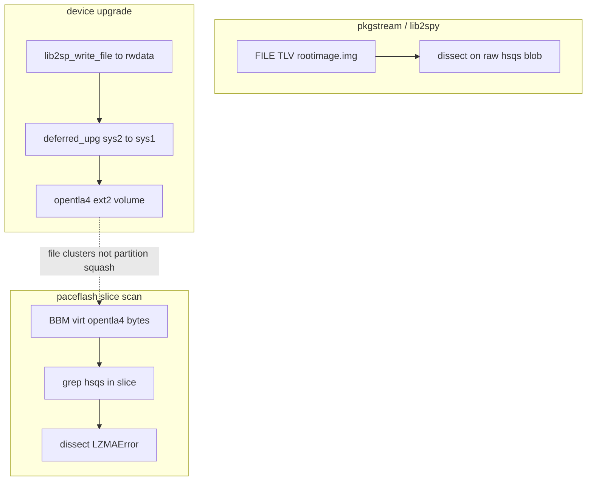

# Ghidra MCP — SquashFS on flash vs pkgstream (read-path gap)

**Programs:** `att-5268-11.5.1.532678_prod_lightspeed-install_uimage_0x01ae4b7e_ld0x80010000_ep0x80458130-kernel.elf` (MIPS BE), `lib2sp.so.0.0.0`.

Always pass **`program=`** on MCP calls when multiple binaries are open.

---

## Short answer

| Question | Answer |
|----------|--------|
| Does **loader** decompress SquashFS onto NAND? | **No.** U-Boot gunzip applies to **uImage** members only. |
| Does **OpenTL** compress squash at the NAND layer? | **No.** `ntl_write_page` → `opentl_dev_page_write` → `mtd->_write` programs **2048-byte pages** + spare/BBM. |
| Why does **lib2spy/dissect** work on pkgstream? | FILE TLV payload = **same raw bytes** `lib2sp_write_file` writes to `/rwdata/tmp/sys2/rootimage.img`. |
| Why does **paceflash** often fail on `opentla4`? | Runtime stores squash as a **file inside ext2** on the TL disk; paceflash was grepping **`hsqs` in whole-slice BBM bytes** (ext2 metadata, false positives, wrong alignment). **Additional gap:** rw volume needs **NTL mode-2** per-page chain replay, not BBM-only virt assembly — [ghidra_ntl_rw_opentla4_mcp.md](ghidra_ntl_rw_opentla4_mcp.md). |

---

## Data flow (runtime vs offline mistake)



Ground truth: [`firmware_upgrade_process.md`](firmware_upgrade_process.md) §5–6, [`fwupgrade.txt`](../fwupgrade.txt) (`e2fsck` on `/dev/opentla4`).

---

## lib2sp (MCP) — FILE path is raw write, not squash re-encode

**`lib2sp_do_payload_tlv`** @ `0x0001e79c` (532678 `lib2sp.so.0.0.0`):

- TLV types **`0x1` / `0x3` / `0x2f`** → `demarshall_2sp_file` → `lib2sp_open_file` → **`lib2sp_write_file`** @ PLT `0x000368d0`.
- Payload copied with **`memcpy`** into staging buffer, then flushed via **`lib2sp_write_file`** — **no** squash-specific codec.

**Bzip2** (`lib2sp_allow_compression`, `BZ2_bzDecompress*`) is for **pkgstream transport framing**, not for recompressing `rootimage.img` before flash.

**`search_strings`:** no `nandwrite` / `mtd_debug` in lib2sp/pkgd/libpkg_client.

---

## Kernel — squashfs is VFS block-device read, xz at mount time

| Symbol | EA | Role |
|--------|-----|------|
| **`squashfs_fill_super`** | `0x8019e2c8` | Reads superblock; magic `0x73717368` (`hsqs`); **`squashfs_lookup_decompressor`** for **xz/lzo/…** |
| Unsupported compressor | `0x804e96e0` | `"Filesystem uses \"%s\" compression. This is not supported"` |
| **`squashfs_read_data`** | `0x804e91a8` | Block read failures printk |

Compression is **inside the SquashFS file format**, decoded when the kernel **mounts** a block device — **not** when programming NAND.

---

## Kernel — OpenTL read path (same BBM as write)

| Symbol | EA | Role |
|--------|-----|------|
| **`opentl_accesssectors`** | `0x80286884` | Sector I/O: `virt_page = sector_index / sector_size + *(ushort*)(ctx+0xec+0x1c)` |
| **`ntl_access_pages`** | `0x8028a574` | Dispatches read (`param_6==NULL`) vs write (`param_6==1`) |
| **`ntl_read_page`** | `0x80289170` | `ntl_put_chain_in_array` → **`ntl_find_phy`** loop → `ntl_verify_read_phy_page` → `memcpy` page |
| **`ntl_find_phy`** | `0x80289004` | Spare-chain walk; **`ntl_lookup_page_map`** / **`ntl_build_page_map`** short-circuit (RAM cache) |

**Offline gap:** Python [`opentl/virt_page_table.py`](../opentl/virt_page_table.py) replays **primary** virt→phys table from spare; **page-map cache** on read is **not** fully emulated ([`mcp_kernel_gap_matrix.md`](mcp_kernel_gap_matrix.md) §7.12).

**Sector vs NAND page:** **512-byte** sectors on `opentla*` block devices; **2048-byte** NAND pages inside OpenTL — standard for this platform, not a pkgstream vs flash format difference.

---

## What paceflash should do (implemented)

1. **`paceflash/opentla4_extract.py`** — assemble BBM **`opentla4`** bytes, mount ext2 (superblock @ 0 or scan), extract **`sys1/rootimage.img`** / **`sys2/rootimage.img`**; auto **chain-aware** when linear ext2 mounts but virt slice does not ([`paceflash/bbm_scan.py`](../paceflash/bbm_scan.py), [`opentl/tl_chain_heuristic.py`](../opentl/tl_chain_heuristic.py)).
2. **CLI:** `--dump-opentla4-ext2 PATH` (raw ext2 partition image), `--extract-ext2-dir DIR` (files + `manifest.json`); JSON **`opentla4_extract`** block on `paceflash ls --json`.
3. **`read_model`** in JSON: `tl_slice_raw_hsqs` vs `ext2_file_extract` vs `carrier_file` (pkgstream only).
4. **Squash dissect** — prefer **ext2 file** / correlation hint; tag partition **`LZMAError`** as `misaligned_or_not_squashfs` when ext2 root exists.
5. Warn when **ext2 file matches** carrier but **bbm_virt slice scan** does not.

```powershell
python -m paceflash ls --flash "PACE 5268AC S34ML01G1@TSOP48.BIN" `
  --lib2spy-json output/lib2spy_532678_install_pkgstream.json `
  --extract-ext2-dir output/opentla4_files `
  --dump-opentla4-ext2 output/opentla4.ext2 `
  --json
```

---

## Related notes

- [`ghidra_upgrade_write_path_532678.md`](ghidra_upgrade_write_path_532678.md) — write path + FILE SHA nuance
- [`ghidra_opentla4_disk_layout_mcp.md`](ghidra_opentla4_disk_layout_mcp.md) — three coordinate spaces
- [`ghidra_nand_layout_write_path_mcp.md`](ghidra_nand_layout_write_path_mcp.md) — `ntl_write_page` chain
- [`paceflash/opentla4_extract.py`](../paceflash/opentla4_extract.py) — opentla4 ext2 assembly + file export
- [`paceflash/ext2_file_extract.py`](../paceflash/ext2_file_extract.py) — per-path file read helpers
- [`paceflash/upgrade_correlation.py`](../paceflash/upgrade_correlation.py) — SHA fingerprint correlation
