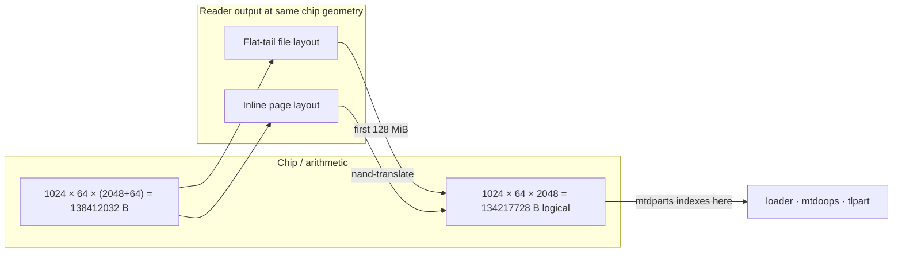

# Hardware and NAND

Notes on the **5268AC-class** platform, **raw NAND / MTD** partitioning cues, and **Broadcom** NAND controller references.

## Product context

Consumer DSL/ONT + LAN/Wi‑Fi gateway; vendor trees often use **Buildroot**-style userspace and **Broadcom** SoC support packages.

## Flash, MTD, and partition layout

### Linux MTD model

On these devices, **raw NAND** is exposed through the kernel **MTD** subsystem. Partitions are usually **software-defined** (no PC-style MBR); common mechanisms include **kernel command-line partitioning** (`mtdparts=`) with **`CONFIG_MTD_CMDLINE_PARTS`**. Overview: [How To Use MTD (Timesys LinuxLink)](https://linuxlink.timesys.com/docs/wiki/engineering/HOWTO_Use_MTD), [Partition MTD on the Command Line](https://linuxlink.timesys.com/docs/wiki/engineering/HOWTO_Partition_MTD_on_the_Command_Line).

### Observed patterns (5268AC-class dumps)

From strings embedded in flash / logs (and tools in this repo), typical elements include:

| Element | Role |
|--------|------|
| **`mtdparts=mtd-0:…`** | Logical partitions on the first raw NAND MTD (`mtd-0`): e.g. **loader**, **mtdoops**, **tlpart** (remainder). |
| **`cmdlinepart`** | Kernel message: “N cmdlinepart partitions found on MTD device mtd-0” — confirms **command-line** partition table application. |
| **Printk ranges** | Lines like `0x........-0x........ : "name"` map **partition name → byte range** on the chip (useful when validating a full `.BIN` carve). |
| **`tlpart` / `tldisk` / `parse_bsd`** | Vendor “TL” disk layout **inside** the large MTD slice: further sub-partitions beyond the generic `mtdparts` map. |

Geometry for filesystem tools (erase block size, page, OOB) should follow NAND parameters from [How To Find NAND Parameters](https://linuxlink.timesys.com/docs/wiki/engineering/HOWTO_Find_NAND_Parameters) (and chip datasheets such as parts in the **S34ML** family referenced on dumps).

Layout **inside** **`tlpart`** (OpenTL) is covered in **[issue.md](issue.md)**; carving commands are in **[tools.md](tools.md)**.

## Boot log: hardware and NAND (`fwupgrade.txt`)

The file **`fwupgrade.txt`** is a single **captive serial capture**. Excerpts below are **observed there**, not guaranteed on every build.

### Hardware / silicon (correlates with flash tools and `signals-scan`)

- **U-Boot:** `CPU: Broadcom BCM63268 v8.0`; `BOARD: Pace Broadcom BCM63168D0`; `DRAM: 256 MB`; `Board Id : 260-2173300`; external switch probe **`BCM53125`**.
- **Linux:** `Linux version 3.4.11-rt19`; `CPU revision is: 0002a080 (Broadcom BMIPS4350)`; **`chipId 0x631680D0`** from Broadcom chip-info init.

### NAND geometry and part naming

- Repeated **`BCMNAND: size=128MB, block=128KB, page=2048B, spare=64`** in U-Boot and kernel; **`BRCM NAND flash device: nand0, id 0x01f1`**; **1024 good blocks** in-band with full-scan-style layout.
- Bootloader prints **`Nand Part Name: Spansion SO30ML01GP LP`** while TSOP captures are often labeled **S34ML01G** class—same **~128 MiB / ML01G-scale** role, different OEM string.

**Full-chip file size vs “logical” data (OOB arithmetic):** one TSOP dump in this repo is **`138412032`** bytes. That equals:

```text
1024 blocks × 64 pages × (2048 B data + 64 B spare) = 138,412,032 B  ← file on disk
1024 blocks × 64 pages ×  2048 B data              = 134,217,728 B  ← pure data plane (128 MiB)
                                                      ─────────────
                                                      =   4,194,304 B  ← OOB envelope (4 MiB)
```

So **`mtdparts`** byte offsets apply to the **134,217,728 B** **logical data** stream. If the **reader** wrote **`138412032`** bytes as **inline 2048+64**, those offsets do **not** match raw file positions until you **de-interleave** (**`nand-translate`**, **`carve --nand-data-mode auto`**) — same total length as **flat-tail**, so **size alone** does not pick the packing; see **[issue.md](issue.md)** (**Dump layout** + diagram).



For stack trace (MTD → OpenTL → installer paths), see **[firmware.md](firmware.md)** (Boot / upgrade trace).

## BCMNAND vs. mainline `brcmnand` (kernel driver research)

Console and string artifacts often show the prefix **`BCMNAND:`** (e.g. `BCMNAND: Init done`, or geometry lines such as size/block/page/spare).

- **Upstream Linux** implements Broadcom’s NAND controller as the **raw NAND** driver **`brcmnand`**, under the MTD tree (e.g. `drivers/mtd/nand/raw/brcmnand/` in current mainline layouts). It is **open source (GPL)** and maintained with the kernel; see also [LWN coverage of brcmnand updates](https://lwn.net/Articles/963373/) and [device-tree bindings (`brcm,brcmnand`)](https://www.kernel.org/doc/devicetree/bindings/mtd/brcm/brcm%2Cnand.yaml).
- The exact **`printk` format** (`BCMNAND:` vs. another `pr_fmt`) can differ between **mainline** and **vendor/BSP forks** shipped on retail gateways; functionally both refer to the same class of **Broadcom NAND controller + raw NAND chip(s)**.
- **Useful “parameters” clues:**
  - **Boot/command line:** `mtdparts`, `mtdids`, `mtdoops.mtddev`, `mtdoops.record_size`, and sometimes **`ubi.mtd=`** — these describe **logical layout and rootfs type**, not the controller Registers.
  - **Module/driver:** Mainline **`brcmnand`** exposes parameters such as **`wp_on`** (write-protect behaviour; security against glitches vs. rewriting — see upstream `brcmnand` module documentation in-kernel).
  - **Device tree:** Board-specific NAND timing, ECC, and WP (**`brcm,wp-not-connected`**, etc.) live in DTS/DTB, not necessarily in plaintext in a flash dump.
  - **`BCMNAND:` geometry lines** (`size`, `block`, `page`, `spare`): **chip discovery**, helpful next to datasheet-backed parameters for UBIFS/JFFS2/mtd-utils tooling.
