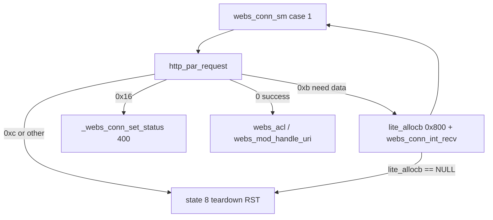

# httpd URI length limits (Ghidra MCP trace, 11.5.1.532678)

Program: `/usr/bin/httpd` in Ghidra (`/usr/bin/httpd`, image base `0x00400000`).

Live fuzz on **172.16.0.1** (`tools/httpd_uri_len_sweep.py`, `Host: <target>` + `Connection: close`):

| Path `A` count after `/` | Path in wire (`/` + A…) | Request-line bytes | Total request | HTTP result |
|--------------------------|-------------------------|--------------------|---------------|-------------|
| ≤ **10185** | ≤ **10186** | ≤ **10201** (`0x27d9`) | ≤ **10240** (`0x2800`) | **400 Bad Request** |
| ≥ **10186** | ≥ **10187** | ≥ **10202** (`0x27da`) | ≥ **10241** | **TCP RST** (no body) |

Sweep format: `GET /{A*N} HTTP/1.0\r\n` + `Host: …\r\n` + `Connection: close\r\n\r\n` (see `tools/httpd_uri_len_sweep.py`).

**Health check:** `curl http://172.16.0.1/` → **200** before and after a full sweep — **httpd stays up**; RST is per-connection teardown.

Captured: `output/httpdfuzz_runs/172_16_0_1_uri_cliff.json` (10185 → 400, 10186 → RST).

**Verified 2026-05-24** (step-1 sweep on `172.16.0.1`): cliff is **exactly** at total request **10241** bytes, not path length alone.

| N (`A` count) | Total bytes (default sweep) | Result |
|---------------|----------------------------|--------|
| 10180–10185 | 10235–**10240** | **400** |
| 10186–10190 | **10241**–10245 | **RST** |

**Control (request line only):** `GET /{A*N} HTTP/1.0\r\n\r\n` — **400** at **N=10222** (total **10240**), **RST** at **N=10223** (total **10241**). Same mbuf geometry; path `malloc` size differs by 37 bytes at the RST boundary.

**Rule:** `total_request > 5 × 0x800` → needs 6th `lite_allocb` → **RST** if alloc fails; `total_request == 10240` → 5th mbuf link → `lite_msgdsize > 0x2000` → **`0x16`** → **400**.

Fine sweep log: `output/httpdfuzz_runs/172_16_0_1_uri_cliff_step1.json`.

---

## Architecture (receive → parse → handle)



---

## 1. `webs_conn_sm` read loop (case 1) @ `0x00433a7c`

### Assembly-confirmed call @ `0x00433b7c` (Ghidra pass 2026-05-24)

The decompiler **`while (iVar2 = http_par_request(param_1, iVar2), …)`** is misleading: **`$v0` (return)** and **`$a1` (mbuf arg)** are different registers. **`0xb`** is only compared against **`$v0`**, never passed as **`$a1`**.

| EA | Instruction | Role |
|----|-------------|------|
| `0x00433b6c` | `move $s1, $zero` | First `http_par_request` arg2 = **NULL** (no mbuf to link) |
| `0x00433b70` | `addiu $s2, $zero, 0xb` | **`$s2`** = constant **11** for `bne $v0, $s2` only |
| `0x00433b74` | loop top | |
| `0x00433b7c` | `bal 0x415158` | **`http_par_request`** |
| `0x00433b80` | `move $a1, $s1` | delay slot: **`a1` = mbuf to link** |
| `0x00433b84` | `beqz $v0, …` | parse complete → exit loop |
| `0x00433b8c` | `bne $v0, $s2, …` | **`v0 != 0xb`** → error dispatch (400 / RST) |
| `0x00433b94` | `lw $s1, 0xd0($s0)` | need data: **`s1` = chain head** |
| `0x00433bbc`–`0x00433bc8` | `bal lite_allocb(0x800)` ; `move $s1, $v0` | tail full: **`s1` = new mbuf** |
| `0x00433bf0`–`0x00433c10` | `webs_conn_int_recv` | recv into **`$s1`** tail |
| `0x00433cb0` | `j 0x433b74` | loop; delay slot updates **`0xc($s1)`** write ptr |

```c
$s1 = NULL;
$s2 = 0xb;   /* compare-only, not an argument */
for (;;) {
    http_par_request(conn, $s1);          /* 0x00433b7c, a0=s0, a1=s1 */
    if ($v0 == 0) break;                  /* parse done */
    if ($v0 != $s2) { …400/RST…; }       /* not NEED_MORE */

    $s1 = *(conn + 0xd0);                 /* 0x00433b94 */
    if (no writable space in tail mbuf)
        $s1 = lite_allocb(0x800);         /* 0x00433bc0; NULL → RST */
    webs_conn_int_recv(conn, into $s1);
    /* j 0x00433b74 */
}
```

| `$v0` return | Handler | Client-visible |
|--------------|---------|----------------|
| **`0`** | Leave loop → ACL / URI | (normal) |
| **`0xb`** | `lw $s1,0xd0` / maybe `lite_allocb` + recv → `j 0x433b74` | (keep reading) |
| **`0x16`** | Error dispatch → `LAB_00433cd8` | **400** |
| **`0xc`** (etc.) | `uVar3 = 8` → `LAB_00436410` | **RST** |
| **`lite_allocb` fail** | `j 0x435c5c` @ `0x00433be8` | **RST** |

**`http_par_request(conn, param_2)`** when **`param_2 != 0`**: `lite_linkb(chain, param_2)` then **`lite_msgdsize > 0x2000`** check. First call uses **`param_2 == 0`** (assign first mbuf without link). Each **`0xb`** iteration passes either the **new `lite_allocb` mbuf** or re-loads **`conn+0xd0`** before recv when extending the tail in place.

---

## 2. Per-chunk receive: `lite_allocb(0x800)`

- Each cell: `lite_allocb(0x800)` @ `0x00419f60` → data window **0x800 (2048)** bytes per mbuf.
- **Five** full mbufs hold **5 × 2048 = 10240 (`0x2800`)** bytes — exactly the total size of the longest **400** case in the sweep.
- The shortest **RST** case needs **10241** bytes → a **sixth** mbuf (one more byte than five cells can hold).

---

## 3. Total lite message cap: `lite_msgdsize > 0x2000` → `0x16` → 400

**`http_par_request`** @ `0x00415158`, when linking `param_2` (new mbuf):

```c
lite_linkb(chain, param_2);
if (0x2000 < lite_msgdsize(conn+0xd0)) {
    syslog(3, "http_par_request: system looked ahead %d bytes ...", 0x2000);
    lite_freemsg(conn+0xd0);
    conn+0xd0 = 0;
    return 0x16;
}
```

- Compare: **`0x2000 < size`** (strict) @ `0x0041523c`–`0x00415260`.
- **8192 bytes** in the chain is still allowed; **8193+** triggers **`0x16`** on the next link.
- First assignment `conn+0xd0 = param_2` when the chain was empty **skips** this check (only subsequent **links** are capped).

This is the best match for **10185 → 400**: after five recvs (**10240** bytes), the next `http_par_request` links mbuf #5, `lite_msgdsize` becomes **10240**, and the function returns **`0x16`** before later states run.

---

## 4. URI path heap copy — `malloc(path+1)` (state 4)

Parser state **`conn+0x174 == 4`**: request-URI token after `GET` and `/`.

```c
iVar14 = lite_par_locate(conn+0xd0, " ?\r\n\t", &uStack_868);
if (iVar14 == 0xff) return 0xb;          // delimiter not in buffer yet

if (uStack_868 == 0) {
    free(conn+0xe0);
    p = malloc(2);                       // "/" only
} else {
    free(conn+0xe0);
    p = malloc(uStack_868 + 1);        // path bytes + NUL
    lite_par_copyout(p, conn+0xd0, uStack_868);
    p[uStack_868] = '\0';
}
if (p == NULL) return 0xc;
```

| Field | Meaning |
|-------|---------|
| **`uStack_868`** | Length of URI path **after** `/`, up to but not including space, `?`, CR, LF, or tab (`lite_par_locate` @ `0x0041a848`) |
| **`conn+0xe0`** | Heap copy of path (used by `rewrite_mod_handle_uri`, `hurl_mod_handle_uri`, etc.) |
| **`malloc` size** | For sweep `GET /AAA…`: **`N + 1`** bytes when **`N`** is the `A` run length (10185 → **10186** bytes requested, 10186 → **10187**) |

**`lite_par_locate`** walks the mbuf chain (`param_1+4` next pointers); it does not allocate. It returns **`0xff`** until the delimiter is present in the accumulated buffer.

### When does `malloc(path+1)` run for the cliff cases?

| Bytes in chain | N (path `A`s) | Request-line complete? | Link triggers `0x16`? | `malloc(N+1)` |
|----------------|---------------|--------------------------|------------------------|---------------|
| 10240 | 10185 | Yes (line 10201) | **Yes** (10240 > 8192) on 5th link | **Usually no** — link returns **`0x16`** first |
| 10240 | 10186 | Yes (line 10202) | **Yes** on 5th link | Same — **unless** 5th call uses `param_2 == 0` only |
| 10241 | 10186 | Full request | After 6th link (10241 > 8192) | May run on an earlier `param_2 == 0` parse pass |

So **`malloc(path+1)` is not the primary explanation for 10185 → 400** ( **`0x16`** wins on the 5th mbuf link). For **10186 → RST**, static order on the 5th link also predicts **400**, but live behavior is **RST** — see §6.

### Other `return 0xc` sites in `http_par_request` (same SM handling → RST)

| State / site | `malloc` | When hit on long `GET` |
|--------------|----------|-------------------------|
| **4** (empty path) | `malloc(2)` | Unlikely for `GET /A…` |
| **4** (normal path) | `malloc(uStack_868 + 1)` | **~10187 B** for N=10186 |
| **10** (HTTP version token) | `malloc(uStack_868 + 1)` | Small (e.g. `HTTP/1.0`) |
| **14** (duplicate header merge) | `malloc(old+new+3)` or `malloc(val+1)` | Possible on duplicate `Host` / `Connection` |

**`0xc` is not wired to `errno`** — it only means “parser failed”; **`webs_conn_sm` maps every non-`0x16` error to state 8**.

---

## 5. Cliff narrative: total **10240** (400) vs **10241** (RST)

### Confirmed on live CPE (not path-length magic)

| Sweep | Last **400** | First **RST** | Total @ 400 | Total @ RST |
|-------|--------------|---------------|-------------|-------------|
| Default (`Host` + `Connection: close`) | N=**10185** | N=**10186** | **10240** (`0x2800`) | **10241** |
| Line only (`GET … HTTP/1.0\r\n\r\n`) | N=**10222** | N=**10223** | **10240** | **10241** |

Difference at RST boundary: **37 bytes** of headers — same **`lite_allocb`** / **`0x2000`** behavior. The default sweep’s **N=10186** RST is because **headers push total over 10240**, not because **`malloc(10187)`** has a unique threshold.

### Total **10240** = 5 × **2048** → **400**

1. Five `recv` cycles fill five mbufs (**10240** bytes) — the full default sweep request for N=10185 fits exactly in five cells (`total % 2048 == 0`).
2. Next `http_par_request(conn, new_mbuf)` **links** mbuf #5 → `lite_msgdsize == 10240` → **`0x2000 < 10240`** → return **`0x16`** (path `malloc` usually does not run).
3. **`webs_conn_sm`** → **`_webs_conn_set_status(400)`** @ `LAB_00433cd8`.

### Total **10241** → **RST**

1. After five recvs: **10240** bytes in chain — **one byte** of the request still missing.
2. `http_par_request` → **`0xb`**.
3. **`lite_allocb(0x800)`** for mbuf #6 → **NULL** on live box → **`LAB_00435c5c`** → state **8** → **RST** (**httpd** stays up).

### `malloc(path+1)` at the default sweep cliff

| N | `malloc` size (path token) | Total request |
|---|---------------------------|---------------|
| 10185 | **10186** | 10240 → **400** (`0x16`, not `0xc`) |
| 10186 | **10187** | 10241 → **RST** (6th mbuf, before reliable path `malloc`) |

A **`malloc(10187)`** failure would also return **`0xc`** → RST, but the **line-only control** shows RST tracks **10241 total bytes** while path `malloc` at that total would be **`malloc(10224)`** — so the observed cliff is **mbuf #6 / `lite_allocb`**, not URI heap copy size.

### Failure summary

| Failure | Return | HTTP | When |
|---------|--------|------|------|
| `lite_msgdsize > 0x2000` on link | **`0x16`** | **400** | Total **== 10240** after 5th link |
| `lite_allocb(0x800)` in SM | → state **8** | **RST** | Total **≥ 10241** (need 6th cell) |
| `malloc(uStack_868+1)` in state 4 | **`0xc`** | **RST** | Long path if parse passes link cap (e.g. huge line-only URI) |

---

## 6. On-device verification

**Done (2026-05-24):** step-1 sweep + line-only control — see table in §5 and `output/httpdfuzz_runs/172_16_0_1_uri_cliff_step1.json`.

```bash
# Re-run fine step (prints total bytes per row)
python tools/httpd_uri_len_sweep.py --host 172.16.0.1 --min 10180 --max 10190 --step 1 --delay 0.2

# While fuzzing one connection:
logread -f &
# optional if httpd built with symbols: attach and break on malloc / lite_allocb failure
```

Breakpoints (when debugging stripped binary, use offsets from this build):

| Goal | Address |
|------|---------|
| `0x16` / 8192 cap | `0x00415260` (after `0x0041523c`) |
| Path `malloc` | `0x00415158` state 4 / `PTR_malloc` call in path block |
| SM `lite_allocb` | ~`0x00433bc0` |
| SM `400` | `0x00433cd8` |
| SM error state 8 | `0x00436410` / `0x00435c5c` |

---

## 7. `rewrite_mod_handle_uri` (separate from cliff)

@ `0x0041b2a0`: prefix match from `rewrite_conf.xml`, then `malloc` + `snprintf` for rewritten path. **4 KiB** `/setup/…` paths return **200** on the live box — not the 10186 RST.

---

## 8. Exploit / BOV assessment

| Question | Answer |
|----------|--------|
| Stack BOV at cliff? | **No evidence** — mbuf cap, `0x2000` gate, and heap `malloc` / `lite_allocb` failures match behavior. |
| Heap overflow in URI `malloc`? | `lite_par_copyout` is bounded by **`uStack_868`** if the lite chain is consistent. |
| Useful fuzz pivot? | **400** = **`0x16`**; **RST** = **`0xc`**, **`lite_allocb` fail**, or recv error (`code_r0x00435f14`). |
| ROP | `output/httpd_rop_hotspots_att532678.json`; URI path does not reach **`_write_user_rules`** without auth. |

---

## 9. FW6 authenticated fuzz (reference)

| Item | Value |
|------|--------|
| XSLT page | **`C_3_3_POST`** |
| Handler | `xci_cmd_fw6_set_user_rules` @ `0x00451d60` → `_write_user_rules` @ `0x0045040c` |
| `map_copy_str` cap | **0x50** per field; `sprintf` → **`auStack_103c[4100]`** |

---

## Key EAs (532678)

| Symbol | EA |
|--------|-----|
| `http_par_request` | `0x00415158` |
| `lite_par_locate` | `0x0041a848` |
| `lite_msgdsize > 0x2000` → `0x16` | `0x0041523c`–`0x00415260` |
| `webs_conn_sm` | `0x00433a7c` |
| `http_par_request` call from SM | `0x00433b7c` |
| `lite_allocb(0x800)` in SM | ~`0x00433bc0` |
| `0x16` → **400** | `0x00433cd8` |
| `lite_allocb` fail → state 8 | `0x00435c5c` |
| `rewrite_mod_handle_uri` | `0x0041b2a0` |
| `lite_allocb` | `0x00419f60` |
| `lite_msgdsize` | `0x0041a208` |
