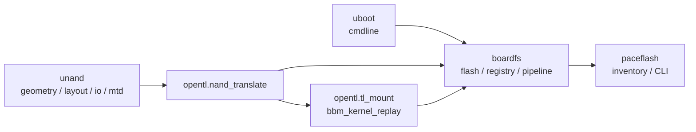

# Layer stack: `unand` → `uboot` → `opentl` → `boardfs` → `paceflash`

Single map for how Pace-class NAND dumps, bootargs/`mtdparts`, OpenTL BBM/mount replay, MTD registry, and inventory tooling connect. Use this when jumping between Python modules and Ghidra MCP targets.

## Data flow



- **Physical → logical:** Callers pass an explicit packing (`RawDumpLayout` / translate mode). `unand.io.normalize_to_logical` streams main + optional flat spare; `opentl.nand_translate` wraps that for carved pipelines and manifests. Use `python -m unand layout-detect` only as an **offline report**, not a silent default.
- **MTD layout:** `uboot.cmdline` extracts `mtdparts=` tokens; `boardfs.flash` builds `FlashImage` against logical reference size (`unand.geometry`).
- **BBM / virtual `tlpart`:** `opentl.tl_mount` + **`opentl.bbm_chain`** / **`opentl.registry_hooks`** implement spare-chain replay; **`boardfs`** applies chain-aware scans on **`FsRegistry`** (`boardfs.tl_chain` facades).
- **Full-chip inventory:** **`boardfs.temporary_registry_from_physical_nand`** (`opentl.nand_bootstrap` + flash) → **`paceflash.inventory.build_inventory`**.
- **`opentla4` / ext2:** **`opentl.opentla4_volume`** assembles NTL/linear/BBM bytes; **`boardfs.ext2_dissect`** + **`boardfs.ext2_path`** mount and path I/O; **`paceflash`** CLI/shell and **`paceflash.opentla4_extract`** for inventory and embedded squash — see [ghidra_ntl_rw_opentla4_mcp.md](ghidra_ntl_rw_opentla4_mcp.md). Verified on PACE dump: **`ext2_superblock_offset=1024`**, **`read_model=ntl_rw_chain_replay`**.

## Package map (MCP hints)

| Package / layer | Primary modules | Upstream deps | Kernel / Ghidra anchor doc | Example MCP action |
|-----------------|-----------------|---------------|---------------------------|---------------------|
| `unand` | `geometry`, `layout`, `io`, `mtd` | Issue docs, printk layouts | [opentl_kernel_ghidra.md](opentl_kernel_ghidra.md) (context) | Trace `NandGeometry` fields vs kernel printk strings |
| `uboot` | `cmdline.py` | U-Boot env / Linux `bootargs` | kernel_adjacent in code | N/A — compare token split to `/proc/cmdline` |
| `opentl` | `driver`, `bbm_chain`, `opentla4_volume`, `ntl_rw`, `nand_bootstrap`, `registry_hooks` | `unand` | [opentl_kernel_ghidra.md](opentl_kernel_ghidra.md), [ghidra_boardfs_bbm_readpath.md](ghidra_boardfs_bbm_readpath.md) | `ntl_read_page` @ `0x80289170` |
| `boardfs` | `flash`, `registry`, `bootstrap`, `ext2_dissect`, `tl_chain` | `uboot`, `opentl` | [ghidra_boardfs_bbm_readpath.md](ghidra_boardfs_bbm_readpath.md), [ghidra_tldisk_partition.md](ghidra_tldisk_partition.md) | TL disklabel on `FsRegistry` |
| `paceflash` | `cli`, `shell`, `flash_session`, `inventory`, `opentla4_extract`, `ext2_file_extract`, `upgrade_correlation` | **`boardfs` only** (no direct `opentl` imports) | [ghidra_ntl_rw_opentla4_mcp.md](ghidra_ntl_rw_opentla4_mcp.md), [paceflash.md](paceflash.md) | `paceflash ls`, `paceflash shell`, `paceflash cat` |

## Grep recipe (agent folding anchors)

List every instrumented kernel or kernel-adjacent region marker (module-level markers start at column 0; some method bodies use indented `# region` inside functions — match both with `-U` or a looser pattern):

```bash
rg '# region kernel' D:/electronics/5268ac --glob '*.py'
```

Pair check (every `# region` should have a matching `# endregion` in the same file):

```bash
rg '# region' D:/electronics/5268ac --glob '*.py'
rg '# endregion' D:/electronics/5268ac --glob '*.py'
```

## Related docs

- **[boardfs.md](boardfs.md)** — Layers table (A–D) and BBM vs linear `mtdparts` behavior. This document adds the **full vertical stack** (`unand` → `paceflash`) and stable `# region` grep hooks; the Layers table remains the concise module breakdown.
- **[kernel_offline_contract.md](kernel_offline_contract.md)** — One-page table: explicit NAND layout, kernel-only BBM sources, logical-plane MTD tooling.
- **[ghidra_boardfs_bbm_readpath.md](ghidra_boardfs_bbm_readpath.md)** — Replay-only policy: in-tree Python follows **kernel-shaped** BBM when a `BlockMapBuild` is attached; dense fixed-offset heuristics inside `tlpart.bin` are out of scope until `ntl_mount` replay exists.
