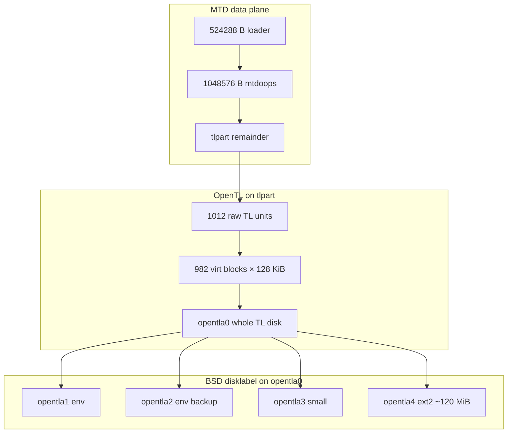
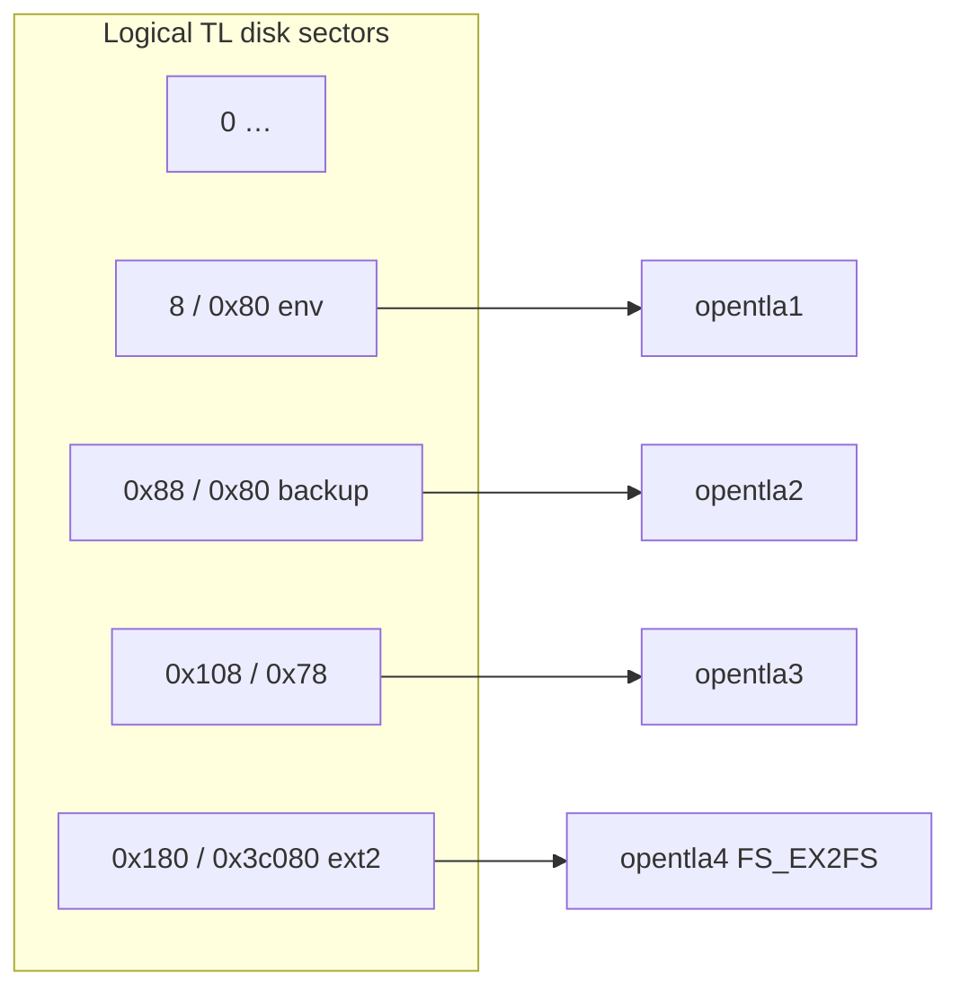
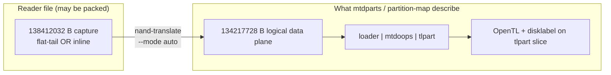

# OpenTL structure (5268AC-class Pace gateways)

This document consolidates **what is established** about Broadcom/Pace **OpenTL** on **`tlpart`**, how it relates to **U-Boot** and **Linux**, what remains **unknown or only partially modeled**, and **strings to grep** when choosing binaries for reverse engineering.

Long-form strategy, NAND math, and tooling notes live in **[issue.md](issue.md)**; carrier bundles and kernel context in **[firmware.md](firmware.md)**; command-line tools in **[tools.md](tools.md)**.

**Python layout:** ``import opentl`` loads only :mod:`opentl.driver` (BBM, :class:`~opentl.open_tl.OpenTL`, virt read helpers) — not :mod:`opentl.nand_pipeline` or :mod:`opentl.tl_mount`. For translate + BBM + extract orchestration use ``from opentl.nand_pipeline import NandPipeline, nand``; for tl-mount inference ``from opentl.tl_mount import …``.

---

## 1. What OpenTL is (in this firmware)

**OpenTL** is a vendor block layer that sits on top of the **`tlpart`** MTD slice. It:

- Presents **TL “virtual” erase-block units** over raw NAND (with **bad-block** and **stats** bookkeeping).
- Exposes a **disk-like** volume (**`opentla0`**) that carries a **BSD-style disklabel**.
- The label splits **`opentla0`** into **`opentla1` … `opentla4`** (env slices + a large **ext2**-typed region).

**OpenTL is not a single mystery filesystem that replaces everything.** Runtime evidence mixes:

- **TL sector/block translation** (512-byte sectors, CHS-style geometry, remap).
- **Normal filesystems on top** — in particular **ext2/3/4** on **`/dev/opentla4`**, and (in **U-Boot only**) an alternate path using **UFS** load commands when **`tl checkfstype`** reports the matching type.

Offline dumps of raw **`tlpart.bin`** remain hard because **logical filesystem blocks** may not be one contiguous range in the file without recovering the **virtual→physical** erase-block map. In the Linux driver, an unmapped virt slot uses **`phys_unit == 0xffffffff`** with a cleared validity byte — the page buffer is **zero-filled** and **no NAND read** is issued; offline, **`opentl.open_tl.extract_virtual_disk_bytes`** mirrors that (**`opentl/tl_mount`** may emit the same sentinel for spare-inference gaps). For **`opentla4` / ptype 17**, use **`opentl/ntl_rw.py`**: **`ntl_verify_read_phy_page`** logs ECC/xsum failures but still returns bounce data (Ghidra @ `0x80288600`); track **`ecc_failures`** in assembly telemetry — see [ghidra_ntl_rw_opentla4_mcp.md](ghidra_ntl_rw_opentla4_mcp.md). Virt entry chain length: [`opentl/virt_slot.py`](../opentl/virt_slot.py).

**Kernel `drivers/mtd/opentl` (Linux):** How **512-byte sectors** attach to **2048-byte** NAND pages, software ECC, **`tlpart`** attach, and **`mtd_priv`** hooks (**`opentl_dev_page_read`** … **`opentl_dev_setup`**) is summarized in **[opentl_kernel_ghidra.md](opentl_kernel_ghidra.md) §3.1** (symbol table + simulation notes). Constants **`KERNEL_*`** in **`opentl/open_tl.py`** align that layer with offline tools.

**`opentla4` (rw / ext2):** Kernel **ptype 17** uses **NTL mode-2** spare-linked chains for reads — documented in **[ghidra_ntl_rw_opentla4_mcp.md](ghidra_ntl_rw_opentla4_mcp.md)** with offline port in **`opentl/ntl_rw.py`**.

---

## 2. Boot-time stack (condensed)

```
BCMNAND → MTD (tlpart) → OpenTL driver → opentla0 (982 virtual blocks, ~251132 sectors × 512 B)
       → parse_bsd / disklabel → opentla1 (env), opentla2 (env backup), opentla3 (small), opentla4 (ext2 ~120 MiB)
```

**U-Boot** registers the TL device as **`opentl`** and uses **MMC-style** `dev:part` syntax (e.g. **`opentl 0:5`**). That **partition index** is the **whole-disk / container** view used by **`ext2load`** / **`ufsload`**, aligned with the large slice that backs **`/dev/opentla4`** in Linux.

**Linux** uses **`tldisk_partition`**, **`parse_bsd`**, and device names **`opentla0` … `opentla4`** (see dmesg strings in **[flash strings.txt](flash%20strings.txt)**).

**Kernel evidence (virt slice vs NAND):** **[ghidra_opentla4_disk_layout_mcp.md](ghidra_opentla4_disk_layout_mcp.md)** — MCP decompilation of **`opentl_accesssectors`** / **`opentl_ioctl` (`CBLKMAP`)** / **`process_map`** shows how **`opentla4`** sector **`0`** maps through **`ctx+0xec`** **page base** into the **same** OpenTL BBM as **`opentla0`**, not a separate MTD child.

### 2.1 Diagrams — NAND → OpenTL → **`opentla*`**

End-to-end reference (**logical** MTD byte ranges from **`fwupgrade.txt`** / **`mtdparts`** — illustrative; full-chip **`.BIN`** files may need **`nand-translate`** first — §6):



Sector numbering (**512 B** sectors on the TL disk) matches **`parse_bsd`** printks — table in §4.



Early **kernel PROM** path (**`prom_init`**) that seeds **default `mtdparts=` / UBI** strings is documented separately — **[`prom_init_ghidra.md`](prom_init_ghidra.md)** — it runs **before** **`opentl_add_mtd`** but influences the command line **`mtdparts=`** ultimately consumed here.

---

## 3. Physical model (from boot trace + strings)

| Concept | Status | Notes |
|--------|--------|--------|
| **TL unit = one NAND erase block** | Strong | U-Boot **`nflaattach`**: 64 pages × 2048 B = **128 KiB** per unit; **4** × 512 B sectors per page → **256** sectors/unit. |
| **Raw vs virtual block count** | Strong | ~**1012** raw TL units in **`tlpart`**; **~30** reserved for bad-block handling; **1** stats block → **~982** virtual blocks exposed. |
| **Capacity line** | Strong | **`cap=0x0003D4FC` (251132)** sectors and **`nand_geom: cap=… cyl=… nhead=… nsectors=…`** in U-Boot; kernel prints **`tldisk_partition: cap: 0x0003D4FC (251132)`**. |
| **BSD disklabel on `opentla0`** | Strong | Kernel **`parse_bsd`** lines list four partitions; types **`0x1d`** (env), **`0x1c`**, **`0x11`** (BSD **FS_EX2FS** = ext family). |
| **`opentla4` = ext2** | Strong | **`e2fsck /dev/opentla4`** in captured logs; directory listings include **`sys1`**, **`pkg`**, **`config`**, etc. |
| **Virt→phys remap table** | Partial | Kernel **tail stats** window + magic triple documented (**[`opentl_stats_block_layout.md`](opentl_stats_block_layout.md)**); full per-virt map needs **`ntl_mount`** / **`*(remap+8)`** replay (**`opentl.bbm_kernel_replay`**, stub). **`binwalker tl-bbm`** invokes that replay only (no legacy identity CLI). |

---

## 4. Disklabel entries (typical 5268 capture)

Sector numbers are **512-byte sectors** on the TL disk. (See **[issue.md](issue.md)** for the full table and **`fwupgrade.txt`** line references.)

| Slice | Start / size (sectors, hex) | Type | Role |
|-------|------------------------------|------|------|
| **1** | **`8` / `80`** | **`0x1d`** | Primary **U-Boot env** (CRC fingerprint **`972f0f3`** in env dumps for that build) |
| **2** | **`88` / `80`** | **`0x1d`** | Backup env |
| **3** | **`108` / `78`** | **`0x1c`** | Small slice, purpose not fully documented |
| **4** | **`180` / `3c080`** | **`0x11`** | Large **ext2** volume → **`/dev/opentla4`** |

**U-Boot partition 5** (`opentl 0:5`) is the **whole-disk** style entry used to read **`/sys1/uImage`** etc., overlapping the same logical extent as the big ext2 slice.

---

## 5. High-level **on-disk / on-volume** layout

### 5.1 Under OpenTL (logical TL disk)

- **Disklabel** at the start of **`opentla0`** (parsed by **`parse_bsd`**).
- **Env** regions on **`opentla1` / `opentla2`** (duplicate **`bootcmd=`**, CRC in header).
- **Stats / bad-block metadata** in dedicated erase-block(s) — **format not fully reversed** (see §7).

### 5.2 Inside **`opentla4`** (ext2)

Observed / inferred directories and roles:

- **`/sys1`**, **`/sys2`**, **`/sys3`** — **A/B/C-style boot banks** (kernels + initrds in U-Boot paths below).
- **`/pkg`**, **`/config`**, **`/cm`**, **`/tmp`**, **`lost+found`**, **`.upgrade`** — operational / upgrade layout (from listings cited in **[issue.md](issue.md)**).

**Offline (May 2026):** Full PACE NAND dump → **`python -m paceflash --flash "…BIN" ls`** / **`shell`** lists the same tree after NTL assembly + Dissect ext2 at **`1024`**. Embedded **`sys1/rootimage.img`** reads as SquashFS; **`sys1/ui.img`** may truncate — **[paceflash.md](paceflash.md)**, **[ghidra_ntl_rw_opentla4_mcp.md](ghidra_ntl_rw_opentla4_mcp.md)**.

### 5.3 U-Boot **`bootcmd`** filesystem branch

Default **`bootcmd`** (verbatim substrings appear multiple times in **[flash strings.txt](flash%20strings.txt)** — e.g. around **`65700h`** and duplicated **`41E08C5h` / `41F10C5h`**):

1. **`if tl checkfstype 5 7`** → **`ufsls`** / **`ufsload`** on **`opentl 0:5`**.
2. Else **`if tl checkfstype 5 11`** → **`ext2ls`** / **`ext2load`** on **`opentl 0:5`**.
3. Else **`echo Invalid File system`**.

**Interpretation:** **`7`** and **`11`** are **vendor fstype IDs** paired with UFS vs ext2 command families — not necessarily portable Linux magic numbers.

**Paths tried in order** (same for UFS and ext2 branches):

| Order | Path | Script label |
|-------|------|----------------|
| 1 | **`/sys1/uImage`**, **`/sys1/initrd`** | Upgrade slot |
| 2 | **`/sys2/uImage`**, **`/sys2/initrd`** | Main boot |
| 3 | **`/sys3/uImage`**, **`/sys3/initrd`** | Aux boot |

**Load addresses:** kernel **`0x80800000`**, initrd **`0x80bfffc0`**; boot via **`bootm`** with **`imi`** checks.

**Note:** Some units may ship or migrate between **UFS** and **ext2** presentations of the same *role* (partition 5); Linux runtime paths still center on **ext2** on **`opentla4`**.

---

## 6. Relationship to full-chip dumps

Runtime **`mtdparts`** and OpenTL both reason about **logical NAND data** bytes (**loader → mtdoops → `tlpart`**). A **TSOP reader file** may record the same **chip** contents as **`138412032` B** either **flat-tail** or **inline 2048+64** — normalize first (**`nand-translate --mode auto`**) so offline slices match those offsets.



- Full dumps are often **`138412032`** bytes (data + OOB envelope **count**); **`mtdparts`** / **`partition-map`** use **logical** offsets into the **128 MiB data** plane **after** stripping inline spare or skipping a flat spare tail. For **`tl-mount`**, omit **`--nand-logical-offset`** to infer the skip from **file size** (**134217728** B nand-translate plane → **0x180000**; **1012×128KiB** tlpart → **0**), or pass an explicit offset when byte **0** of the open file is not what that rule assumes. **`tl-extract`** still takes an explicit offset (default **0**). See **[tools.md](tools.md)** (**`tl-mount`** row).
- **PACE `…TSOP48.BIN`** in this repo verifies **inline** packing; reference carves live under **`output/carved_flash/carve_deinterleaved/`** on **`flash_logical_deinterleaved.bin`**. Legacy **`PACE … TSOP48_carve/`** offsets assume raw linear layout and can drift — see **[issue.md](issue.md)** (**Legacy vs deinterleaved carves**).
- Tie-break and weak tests (**ELF**, **`hsqs mod 2112`**) are summarized in **[issue.md](issue.md)** (**Dump layout**); they complement but do not replace **`nand-translate`** for **`138412032` B** class files.

### 6.1 U-Boot **`OOB[%d/%d]`** / **`OOB scan:`** (BCMNAND — not in Linux kernel ELF)

**Ghidra:** The **`att-5268-…_ghidra_m00_kernel.elf`** image does **not** contain these format strings; searches like **`OOB scan:`** belong in **U-Boot / BCMNAND**, not the kernel project you have open for **`opentl_*`**. In **[flash strings.txt](flash%20strings.txt)** they sit next to other **`BCMNAND:`** messages (e.g. around **`5A894h`** **`OOB[%d/%d]`**, **`5A8A4h`** **`OOB scan: Found pattern mismatch at %d/%d`**).

**What the boot log means** (see **[fwupgrade.txt](fwupgrade.txt)** after **`BCMNAND: … page=2048B, spare=64`**):

| Line | Meaning |
|------|---------|
| **`OOB[1/131072]…`** | Debug dump of the **first 16 bytes** of OOB read at probe **#1**; second number is **byte offset** in the raw NAND map (**131072 = 128 KiB** = one erase block). |
| **`OOB[2/262144]` … `OOB[3/393216]`** | Same at **256 KiB** and **384 KiB** — multiples of **128 KiB**. |
| **`OOB[4/524288]`** | Probe at **512 KiB**: spare bytes are **all `0xFF`** → **erased** block (no programmed vendor marker). |
| **`OOB scan: Found pattern mismatch at 4/524288`** | The scanner compares **several** OOB snapshots against an **expected spare signature** (see below). Sample **#4** at offset **524288** **fails** the pattern test (**first arg = step index**, **second = offset** matching the printk format **`%d/%d`**). |
| **`Fixed up MTD partition to mtdparts=mtd-0:524288(loader),1048576(mtdoops),-(tlpart)`** | When inference from OOB layout is ambiguous or fails, U-Boot **falls back** to this **fixed tri-partition** layout: **512 KiB** loader, **1 MiB** `mtdoops`, **remainder** **`tlpart`** (same line appears on the Linux command line later in **`fwupgrade.txt`**). |

**Pattern clue:** In lines **213–215**, the **last eight** nibbles printed decode to ASCII **`42 6f 6f 74 43 6f 64 65`** → **`BootCode`** — a **vendor/boot marker** in spare for early blocks. At **512 KiB** that marker is **absent** (erased OOB), so the **“table”** here is not OpenTL’s remap chain; it is **BCMNAND partition discovery** deciding where **`loader` / `mtdoops` / `tlpart`** start. For **OpenTL BBM** analysis, treat this as **geometry confirmation** (128 KiB alignment, **64-byte spare**) and **mtdparts boundaries**, not as **`ntl_*`** spare-chain semantics.

---

## 7. What still needs reverse engineering

| Topic | Why it matters |
|-------|----------------|
| **Stats block binary layout** | **Partially closed (kernel):** magic triple, `remap[0x5432]` byte-length formula, virtual tail placement, flush policy — see **[`opentl_stats_block_layout.md`](opentl_stats_block_layout.md)** + [`opentl/stats_block.py`](../opentl/stats_block.py). **Still open:** full semantic decode of counters inside the arena and U-Boot-only **TL_debug** strings. |
| **Bad-block map layout (30 “bb” slots)** | Needed for correct **virtual → physical** erase-block translation when extracting **`opentla4`** from **`tlpart.bin`**. |
| **`tl checkfstype` implementation** | Defines exact meaning of **`7`** vs **`11`** and any other codes; bounds when UFS vs ext2 paths run. |
| **UFS-on-partition-5 behavior** | If UFS is still used on some builds, **UFS superblock** location and TL mapping for that mode need documentation. |
| **`opentla3` (type `0x1c`)** | Small partition; purpose unclear from strings alone. |
| **Env CRC algorithm / field layout** | **`CRC=972f0f3`** is a stable fingerprint per build (see **`fwupgrade.txt`** / serial logs); confirm against bytes at the known env partition offset in the dump rather than blind full-image string scans. **Bounded** parse in [`uboot/env.py`](../uboot/env.py): `parse_uboot_env_v1` (CRC + NUL-split pairs, then `get_mtdparts_token` / `get_mtdparts_token_from_env_blob` from [`uboot/cmdline.py`](../uboot/cmdline.py)) and `read_uboot_env_v1_file` for a fixed file slice. **`binwalker partition-map`** / **`carve`** call [`binwalker/extract/flash_layout.py`](../binwalker/extract/flash_layout.py) **`try_mtdparts_from_uboot_env`** first (logical reads via **`unand.layout.read_logical_plane_interval`**) to recover real **`mtdparts`** before **`mtd-scan`**. |
| **`opentl_map.c` translation** | Filename appears in U-Boot strings — likely central to **sector → NAND page** mapping. |

---

## 8. Strings for binary identification (grep / Ghidra)

Use these to find **U-Boot**, **kernel**, or **shared** objects that implement OpenTL. Addresses below are **string offsets inside [flash strings.txt](flash%20strings.txt)** for the PACE **TSOP48** dump that produced that file (anchors move per image).

### 8.1 U-Boot — OpenTL core / NAND geometry

```
OOB[%d/%d]
OOB scan: Found pattern mismatch at %d/%d
OOB scan: bad OOB size.
OOB scan: bad params..:
OPENTL: add_mtd for %s
OPENTL: Found new opentl%c
OPENTL: unmounted
OPENTL: Invoked for a MTD device(%p):%d %s
OPENTL: could not mount device
OPENTL: access page=%d:%d to %d:%d ptr=%p
OPENTL: bad delete sectors %d
OPENTL: tl_malloc failure
nflaattach: pages per unit=%d shift=%d sectors_per_page=%x
TL_debug: before mount mediasize=%d size=%d partiton %d to %d spares=%d
nand_geom: cap=%d cyl=%d nhead=%d nsectors=%d
geometry wasted %d sectors
Adjusting virtual blocks %d to account for %d bb blocks
Adjusting virtual blocks %d to account for %d stat blocks
resetting stats
opentl_sectors: %d:%d-->%d:%d(%d,%d,%d) op=%d
opentl_dev_page_read: bk=%d page=%d addr=%llu len=%d sts=%x
opentl_dev_page_write: bk=%d page=%d addr=%llu len=%d sts=%x
opentl_dev_erase: bk=%d sts=%x addr=%llu
opentl_correct_data:
opentl_map.c
```

### 8.2 U-Boot — **`tldisk` / `tl` command / env**

```
tl    - opentl sub-system
tl checkfstype - partnum fstype check fstype
checkfstype
tldisk primary, %d:%d
tldisk backup, %d:%d
tldisk env part info: %s CRC=%x/%x env_size=%d
tldisk part[%d], %d:%d blocksize=%d
 ** tldisk_part_read() read error **
 ** tldisk_part_write() write error **
*** tldisk, Warning - bad CRC, using default environment
opentl
tldisk
```

### 8.3 U-Boot — boot paths (filesystem commands)

```
bootcmd=if tl checkfstype 5 7; then
ufsls opentl 0:5
ufsload opentl 0:5 0x80800000 /sys1/uImage
if tl checkfstype 5 11; then
ext2ls opentl 0:5
ext2load opentl 0:5 0x80800000 /sys1/uImage
/sys2/uImage
/sys3/uImage
/sys1/initrd
/sys2/initrd
/sys3/initrd
Invalid File system
Upgrade Image present
Boot Image present
Aux Boot Image present
Invalid upgrade Image
Valid kernel Found
Valid initrdimage
```

### 8.4 Linux kernel — TL disk / partition parsing

```
tldisk_partition: going to enumerate
tldisk_partition: cap: 0x0003D4FC (251132)
parse_bsd: tldisk header...
parse_bsd: adding tldisk partition at
* parse_bsd: Partition 8/80 1d/0
* parse_bsd: Partition 88/80 1d/0
* parse_bsd: Partition 108/78 1c/0
* parse_bsd: Partition 180/3c080 11/0
opentla: opentla0: <tldisk: opentla1 opentla2 opentla3 opentla4 >
```

### 8.5 Userspace / upgrade logs (correlation only)

Log snippets in **[flash strings.txt](flash%20strings.txt)** reference **`/rwdata/tmp/sys2/...`** (e.g. **`uImage`**, **`rootimage.img`**). These help correlate **runtime upgrade** behavior with **`sys2`** naming; they are not a substitute for decoding TL block mapping.

### 8.6 Hex / binary search hints

- **Disklabel tuples** (little-endian): e.g. **`08 00 00 00 80 00 00 00 1d 00 00 00`** for start **`8`**, length **`0x80`**, type **`0x1d`** (verify against your dump).
- **Env CRC word**: **`972f0f3`** as listed in env dumps — try **LE/BE u32** search in **`tlpart`**.
- **Ext2**: **`0xEF53`** superblock magic at offset **`0x438`** within the **assembled** ext2 image (not necessarily at a trivial offset in raw **`tlpart`**).

---

## 9. Related artifacts in this repo

- **[prom_init_ghidra.md](prom_init_ghidra.md)** — BCM63xx **`prom_init`** (**`0x80565588`**): embedded default **`mtdparts=`**, **`kerSysEarlyFlashInit`**, **`printk`** branches, Ghidra merge notes; call graph vs **`setup_arch`**.
- **[opentl_kernel_ghidra.md](opentl_kernel_ghidra.md)** — Linux **`drivers/mtd/opentl`** Ghidra notes: **`FUN_80286884`** / **`FUN_8028a574`** / **`FUN_80289170`** / **`FUN_802888f8`** / **`FUN_80288600`**, **8-byte virt→phys table**, spare-chain vs RAM-chain modes, field offsets, **`tl-bbm`** implications.
- **[opentl_stats_block_layout.md](opentl_stats_block_layout.md)** — stats arena (`remap[0x5432]`), magic triple, virtual tail placement, flush cadence; Python **`opentl/stats_block.py`**.
- **[issue.md](issue.md)** — MTD vs OpenTL issue statement, BBM/stats arithmetic, disklabel table, strategy, RE breadcrumbs.
- **`PACE … TSOP48_carve/carve_summary.md`** — carved **`uImage`** / PEM clusters consistent with multiple **`sys*`** banks.
- **`mtd_parts/tlpart.bin.md`** — binwalk-oriented notes on **`tlpart`** slice.
- **`fwupgrade.txt`** (referenced from **[firmware.md](firmware.md)**) — line-accurate boot trace for U-Boot + kernel printk.

---

*Last updated from repo notes and `flash strings.txt` grep (May 2026). §2.1 Mermaid diagrams + `prom_init` cross-link added May 2026.*
