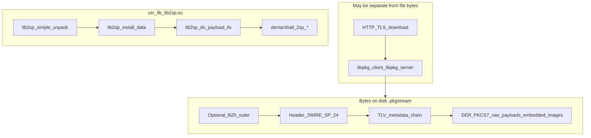
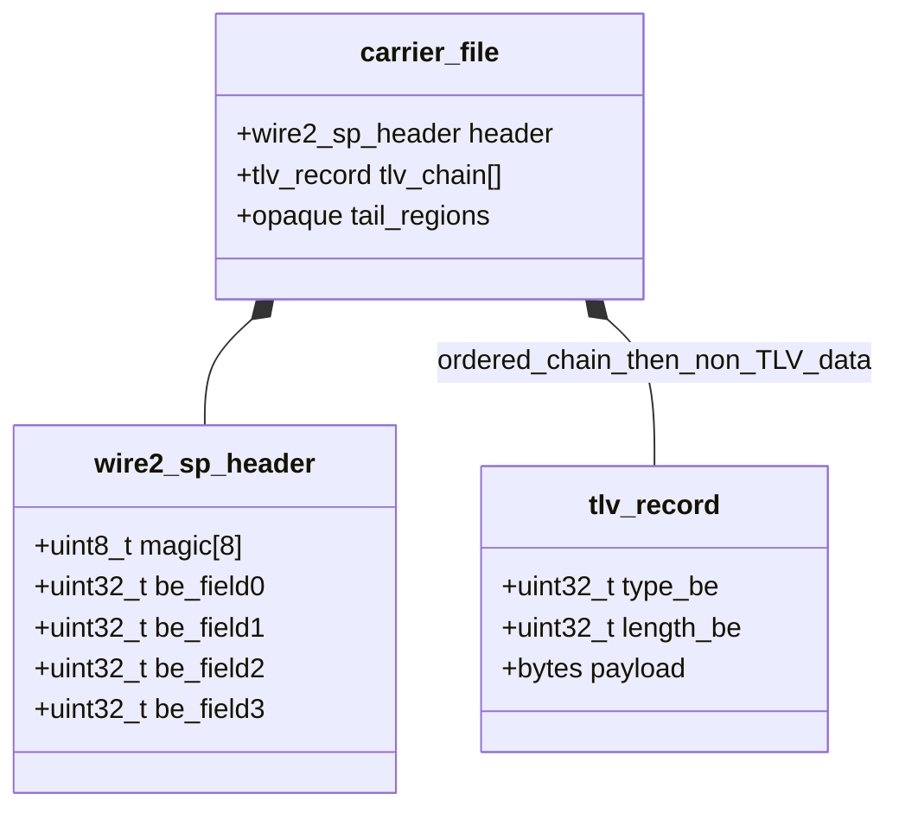
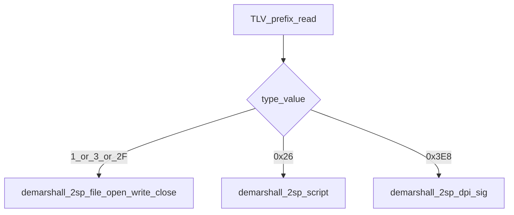
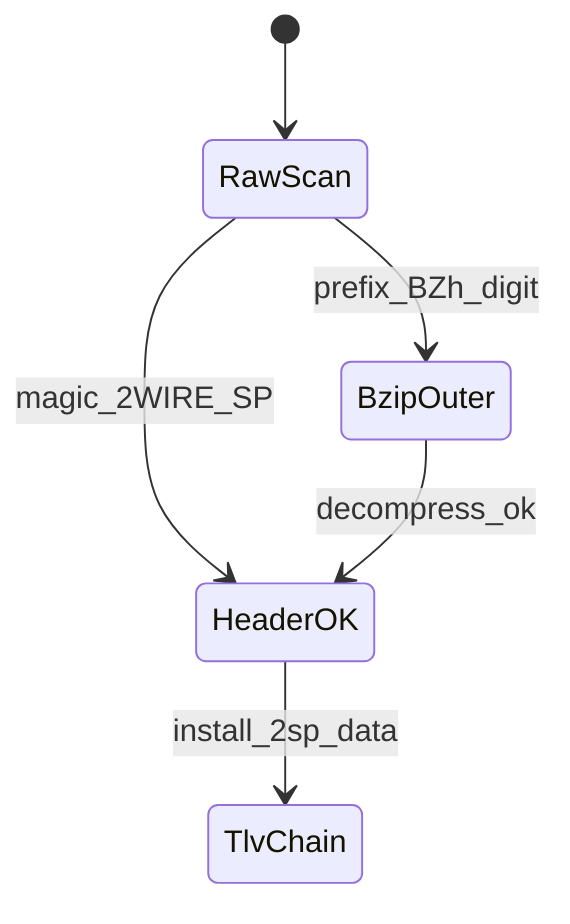
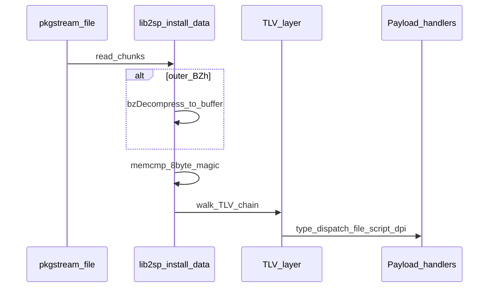
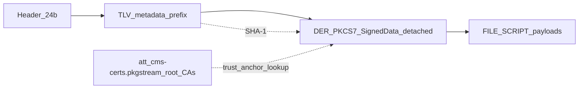
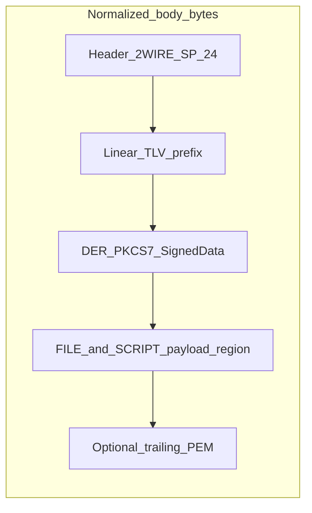
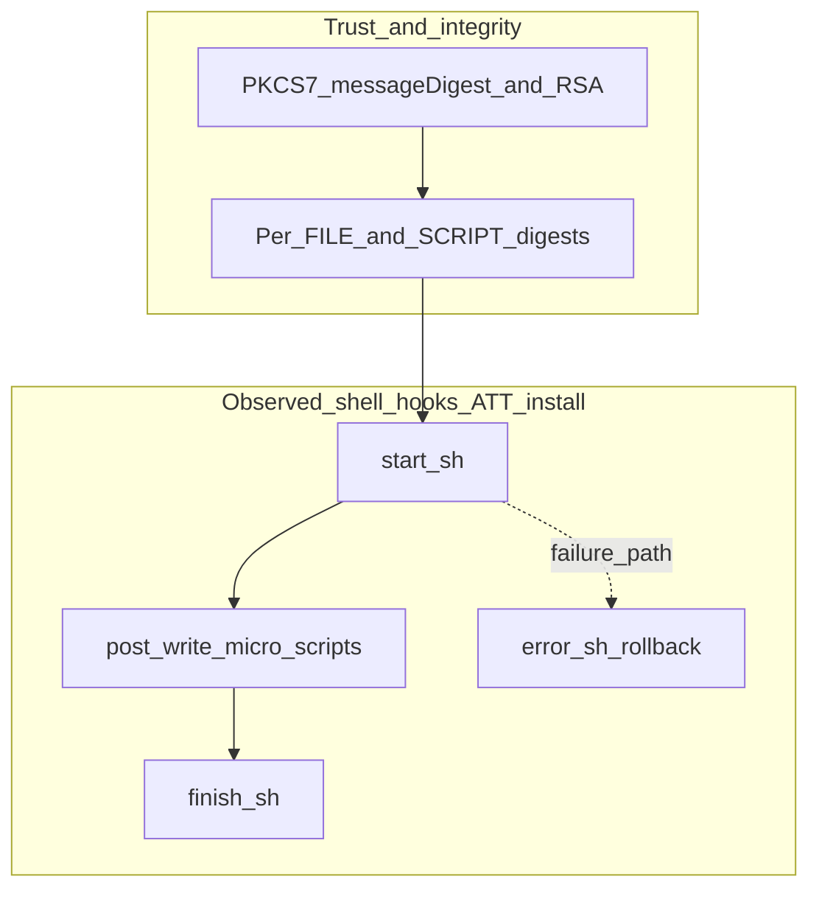

# Carrier `.pkgstream` format (2WIRE / LIB2SP)

This document describes the **on-disk byte layout** of ATT / 2Wire-style **`.pkgstream`** install carriers used with the gateway **pkg** stack. It is grounded in reverse engineering **`/usr/lib/lib2sp.so`** (and consumers such as **`/usr/bin/pkgd`**) in the Ghidra project **`5268ac`**, plus validation against a shipped file and Binwalk `file_map` JSON.

**Scope:** **`lib2sp`** parses the **2SP byte stream** (header, TLV metadata, optional **bzip2** wrapper, payload TLVs). **HTTP/TLS**, **CMS/package orchestration**, and **`libpkg_*`** RPC layers sit **above** the raw file when downloading from the CDN; they do not alter the **local file bytes** once saved as `.pkgstream`.

**Runtime deep dive** (prefix walk vs payload region, FILE/SCRIPT extraction semantics, CONFIG vs RUN TLVs, shell-script orchestration, SquashFS as bytes vs host mount): **[§10](#10-lib2sp-runtime-tlvs-payloads-scripts-and-squashfs)**.

---

## 1. Relationship diagram



---

## 2. Ghidra cross-reference index

Paths are **project paths** in Ghidra **`5268ac`** (imported rootfs layout). **ELF image base** for `lib2sp.so` is **`0x00010000`** (MIPS32 BE); addresses below are **program-relative** as shown in the listing.

### 2.1 `lib2sp.so` — parsing and TLV marshalling

| Symbol | Typical address | Role |
|--------|-----------------|------|
| `demarshall_2sp_header` | `0x00014814` | Read 24-byte outer header (8-byte magic + 4× BE `uint32`) |
| `marshall_2sp_header` | `0x00015688` | Write header |
| `marshall_2sp_tlv` | `0x00015740` | Write TLV prefix: BE `uint32` type + BE `uint32` length |
| `demarshall_2sp_file` | `0x000149d8` | Parse FILE TLV body (nested offsets, path @ +100) |
| `marshall_2sp_file` | `0x000157c0` | Serialize FILE TLV body |
| `demarshall_2sp_script` | (see exports) | Script TLV (`0x26`) |
| `demarshall_2sp_dpi_sig` | `0x000148d0` | DPI signature TLV (`0x3E8`) |
| `lib2sp_simple_unpack` | `0x0001cf70` | `open` + `read` chunks → `lib2sp_install_data` |
| `lib2sp_simple_unpack_data` | `0x0001d1a4` | In-memory buffer → `lib2sp_install_data` |
| `lib2sp_install_data` | `0x00020ae0` | Main parser: header detection, optional **bzip2**, TLV dispatch |
| `lib2sp_install_2sp_data` | `0x0001f60c` | Inner state machine over decompressed/normalized buffer |
| `lib2sp_do_payload_tlv` | `0x0001e79c` | Branch on TLV **type** (file/script/DPI) |
| `lib2sp_internal_check_data` | `0x0001e104` | Verify/hashing path over payload TLVs |
| `lib2sp_iter_next` | `0x0001d610` | Advance TLV iterator within bounded buffer |

### 2.2 Consumer binary

| Binary | Notes |
|--------|------|
| `/usr/bin/pkgd` | Imports **`lib2sp_simple_unpack`**, **`lib2sp_set_stream_url`**, **`lib2sp_get_desc`**, **`lib2sp_vfy_get_opaque`**, **`lib2sp_get_buffer_hint`**, and related **`lib2sp_*`** symbols — orchestrates install over RPC/stream; **local file path** still feeds **`lib2sp_simple_unpack`** |

### 2.3 Repository implementation xrefs

| Artifact | Purpose |
|----------|---------|
| [lib2spy/native_pkgstream.py](lib2spy/native_pkgstream.py) | Header/TLV helpers, optional `BZh` unwrap, **`scan_embedded_images`** (SquashFS / uImage) |
| [opentl/pkgstream_format_lib2sp.md](opentl/pkgstream_format_lib2sp.md) | Short summary |
| [lib2spy/pkgstream_corpus.py](lib2spy/pkgstream_corpus.py) | `extract_pkgstream_slices` (Binwalk JSON) vs `extract_pkgstream_slices_native` |

---

## 3. Data structures (wire layout)

### 3.1 Outer header (24 bytes)

All multi-byte integers **big-endian** on the wire.

```c
struct wire2_sp_header {
    uint8_t  magic[8];      /* Often ASCII "2WIRE_SP" */
    uint32_t be_field0;   /* BE — semantics product-specific */
    uint32_t be_field1;   /* BE */
    uint32_t be_field2;   /* BE */
    uint32_t be_field3;   /* BE */
};
```

**Ghidra:** `demarshall_2sp_header` requires **`param_2 > 0x17`** (24 bytes). It **`memcpy`**s 8 bytes, then **`nu_ngeth32`** fills four words at **`param_3+8` … `param_3+0x14`**.

### 3.2 TLV prefix (8 bytes)

```c
struct tlv_prefix_be {
    uint32_t type_be;     /* big-endian */
    uint32_t length_be;   /* payload byte length */
    /* uint8_t payload[length] follows immediately */
};
```

**Ghidra:** `marshall_2sp_tlv` writes **`type`** and **`length`** when **`param_2 > 7`**.

### 3.3 Class diagram (logical composition)



### 3.4 Example (ATT 5268 lightspeed install)

See [firmware.md](firmware.md) for paths. Hex at **file offset 0**:

| File offset | Hex | Field |
|-------------|-----|-------|
| `0x00`–`0x07` | `32 57 49 52 45 5f 53 50` | `"2WIRE_SP"` |
| `0x08`–`0x0B` | `00 00 00 01` | `be_field0` |
| `0x0C`–`0x0F` | `00 00 00 01` | `be_field1` |
| `0x10`–`0x13` | `00 01 51 30` | `be_field2` |
| `0x14`–`0x17` | `01 E9 BA 61` | `be_field3` |

First TLV at **`0x18`**: type **`0x0000002e`**, length **`3`**, payload ASCII **`run`** (sample-specific metadata).

---

## 4. TLV chain layout

The **metadata prefix** is often a **contiguous** sequence of TLVs starting at offset **`0x18`**. After that, the byte stream may switch to **DER/PKCS#7** (`30 82 …`) or large opaque regions; a naive TLV walk **stops** when lengths no longer align (see native parser).

```mermaid
blockDiagram
  direction LR
  H["Header_24b"]
  T1["TLV_type_len_8"]
  P1["Payload_N1"]
  T2["TLV_type_len_8"]
  P2["Payload_N2"]
  H --> T1 --> P1 --> T2 --> P2
```

---

## 5. TLV types (payload dispatch)

For how the **linear TLV prefix** connects to the **PKCS#7 envelope**, the **file-payload byte region**, prefix-only types such as **`0x2E` / `0x07`**, and how **SCRIPT** bodies relate to on-device install order, see **[§10](#10-lib2sp-runtime-tlvs-payloads-scripts-and-squashfs)**.

**Ghidra:** `lib2sp_do_payload_tlv` switches on TLV **type**.

| `type` (hex) | Decimal | Handler / notes |
|--------------|---------|------------------|
| `0x01`, `0x03` | 1, 3 | **`demarshall_2sp_file`** |
| `0x26` | 38 | **`demarshall_2sp_script`** |
| `0x2F` | 47 | **`demarshall_2sp_file`** (variant) |
| `0x3E8` | 1000 | **`demarshall_2sp_dpi_sig`** |



### 5.1 FILE TLV body (conceptual)

**Ghidra:** `marshall_2sp_file` uses **`param_3[1] == 100`**: path bytes land at **byte offset 100** from the start of the FILE record; payload bytes follow **`path_len + 100`**. **`demarshall_2sp_file`** reads a matrix of **big-endian** integers first; when **`length`** is large enough it also reads **64-bit** fields (timestamps/sizes).

```text
[ BE header fields ][ optional extended BE fields ][ path @ +100 ][ file @ +100+path_len ]
```

---

## 6. Compression

### 6.1 Outer bzip2

Prefix **`BZh`** + digit **`1`–`9`** triggers **`BZ2_bzDecompressInit`** / **`BZ2_bzDecompress`** in **`lib2sp_install_data`**; decompressed stream should contain **`2WIRE_SP`** when this wrapper is used.



### 6.2 Inner bzip2

Runtime errors reference **bzip2** failures on **member** streams; carving **SquashFS/uImage** may still use **magic scan** after outer decompress only.

---

## 7. Embedded SquashFS and uImage

| Artifact | Detection | Length |
|----------|-----------|--------|
| SquashFS LE | **`hsqs`** | LE **`bytes_used`** at superblock **+40** |
| Legacy uImage | BE **`0x27051956`** | **`64 + ih_size`**, **`ih_size`** at header **+12** BE |

Offsets match Binwalk **`file_map`** for the 5268 sample when using [lib2spy/native_pkgstream.py](lib2spy/native_pkgstream.py) **`scan_embedded_images`**.

**Mount vs carve:** `lib2sp` does not attach these blobs as kernel filesystems by itself; see **[§10](#10-lib2sp-runtime-tlvs-payloads-scripts-and-squashfs)** (subsection *SquashFS, uImage, embedded blobs, and mount*) for how embedded SquashFS relates to **FILE** payloads, **magic scans**, and host **`unsquashfs`** / corpus tooling ([`tools.md`](tools.md) § *Pkgstream slices*).

---

## 8. End-to-end timeline



---

## 9. Integrity model

The pkgstream format pushes integrity onto **three distinct cryptographic layers** plus a transport-corruption layer for the embedded uImage:

1. **Detached PKCS#7 / CMS `SignedData`** sitting immediately after the TLV prefix — the cryptographic gate that authenticates the entire metadata manifest (header + TLV chain).
2. **Per-FILE / per-SCRIPT TLV digests** (predominantly SHA-1, also MD5 / SHA-256) — bind each file payload back to the signed manifest.
3. **U-Boot `ih_hcrc` / `ih_dcrc`** on the embedded uImage — corruption-only, runs at install + boot, not used by `lib2sp`.

The reverse-engineered control flow lives in `lib2sp_internal_check_data` (`0x0001E104`) and the FILE / SCRIPT demarshallers; the algorithm is reimplemented (with full negative-path coverage) in [`lib2spy/pkgstream_verify.py`](lib2spy/pkgstream_verify.py) and exposed via the [`lib2spy.pkgstream`](lib2spy/pkgstream.py) CLI (`python -m lib2spy …`). Findings here are ground-truthed against the live ATT 5268 install pkgstream — see §9.8 for the test corpus.

> **Older / unused path:** the **`0x3E8` DPI signature TLV** (`demarshall_2sp_dpi_sig`, `0x000148D0`) is documented in `lib2sp.so` but **does not appear** in any of the 5268 samples we have. It is a legacy in-band integrity scheme superseded by the PKCS#7 envelope below. The verifier still flags its presence (`legacy_dpi_sig_present` in the report) for older firmware drops.

### 9.1 Layer-by-layer summary

| Layer | Integrity primitive | Verified by | Strength |
|-------|---------------------|-------------|----------|
| 24-byte 2WIRE_SP header (§3.1) | **none directly** — but bytes feed the PKCS#7 SHA-1 | `lib2sp_internal_check_data` (transitively) | cryptographic via §9.3 |
| TLV metadata prefix (§4) | **none directly** — bytes feed the PKCS#7 SHA-1 | `lib2sp_internal_check_data` (transitively) | cryptographic via §9.3 |
| Optional outer **bzip2** wrapper (§6.1) | bzip2 per-block CRC32 + stream-final CRC32 | `BZ2_bzDecompress` | transport corruption only |
| **PKCS#7 / CMS `SignedData`** (detached) covering `body[0..pkcs7_offset)` (§9.3) | RSA-PKCS#1 v1.5 over SHA-1 of the prefix; `messageDigest` attribute pinned in `authenticatedAttributes` | `lib2sp_internal_check_data` + cert chain from `att_cms-certs.pkgstream` | **cryptographic — this is the gate** |
| Per-**FILE** TLV (`0x01` / `0x03` / `0x2F`, §5.1) | algorithm tag + digest of file payload bytes (SHA-1 / MD5 / SHA-256) | `lib2sp_internal_check_data` + `verify_hash_alg` | cryptographic (transitive on §9.3) |
| Per-**SCRIPT** TLV (`0x26`) | algorithm tag + digest of script payload bytes | `lib2sp_internal_check_data` + `verify_hash_alg` | cryptographic (transitive on §9.3) |
| Legacy DPI signature TLV (`0x3E8`) | hash digest comparison (no asymmetric crypto in this code path) | `lib2sp_internal_check_data` (older flow) | **not present** in 5268 firmware |
| Embedded **uImage** (§7) | U-Boot `ih_hcrc` (header) + `ih_dcrc` (data) CRC32 | **U-Boot**, not `lib2sp` | corruption-only |
| Embedded **SquashFS** (§7) | xz block CRCs only | kernel SquashFS driver | corruption-only |

### 9.2 What `lib2sp_internal_check_data` actually does

Decompiled at `0x0001E104` — three-argument streaming hash accumulator (no asymmetric crypto inside this function itself):

```c
int lib2sp_internal_check_data(opaque_state_t *st, const uint8_t *buf, size_t n);
```

Per call it advances a hash context (initialized once per stream) by `n` bytes, then on the final call compares the resulting digest against the expected value supplied by either:

* the **PKCS#7 envelope** (then-active path — the SHA-1 input is the `body[0..pkcs7_offset)` slice, and the comparison is against the `messageDigest` PKCS#9 attribute inside the SignedData's `authenticatedAttributes`), **or**
* a **per-FILE / per-SCRIPT TLV** (the digest stored at `+hash_offset` inside the TLV body), **or**
* the legacy DPI sig TLV (`0x3E8`, unused in current firmware).

`verify_hash_alg` (`0x0001D800`) maps the algorithm tag to digest length:

| Wire `hash_alg` | Algorithm | Digest length |
|------------------|-----------|---------------|
| `1`              | SHA-1     | 20 |
| `2`              | MD5       | 16 |
| `3`              | SHA-256   | 32 |

The library hash primitives come from the system `libcrypto`/equivalent — `lib2sp.so` itself only orchestrates the streaming.

### 9.3 PKCS#7 / CMS `SignedData` (the gate)

In the 5268 install pkgstream the PKCS#7 envelope sits at `body[5419..13492]` (8073 bytes), **immediately after** the TLV prefix and **before** any FILE / SCRIPT payloads. It is detached: the signed content is the on-disk byte slice `body[0..5419)`, **not** any bytes carried inside the PKCS#7 itself.

Concrete shape on this build:

| Field | Value |
|-------|-------|
| ContentInfo OID | `1.2.840.113549.1.7.2` (`signedData`) |
| `SignerInfos` | **3** — one short-key engineering test signer + two production signers |
| `digestAlgorithms` | SHA-1 (`1.3.14.3.2.26`) for all three |
| `signatureAlgorithms` | RSA encryption (`1.2.840.113549.1.1.1`), PKCS#1 v1.5 padding |
| `authenticatedAttributes` per signer | includes `messageDigest` (PKCS#9 OID `1.2.840.113549.1.9.4`) — **20-byte SHA-1 of `body[0..5419)`** |
| Signed bytes (per signer) | DER of the `SET OF Attribute` form of `authenticatedAttributes` (canonical SET, tag `0x31`, **not** the wire `[0]`-tagged form) |
| Cert set | **6** X.509 certificates: 3 signing leafs + the 3 intermediates (`Gateway Test CA - V1` for the eng signer; `Gateway Intermediate CA - V1` for the two prod signers). Chains to roots in `att_cms-certs.pkgstream`. |
| Trailing PEM | none in this build (sometimes appended in older drops; verifier reports them via `trailing_pem_offsets`) |

Concrete prefix SHA-1 for the live sample: **`1b4764ca685542c64b4e80c198e03db691b242b4`** — appears verbatim in all three signers' `messageDigest` attributes.



Verification path (must all pass):

1. SHA-1 of `body[0..pkcs7_offset)` == every signer's `messageDigest` attribute.
2. For each `SignerInfo`: locate the matching X.509 cert (by `issuerAndSerialNumber`), then verify RSA-PKCS#1 v1.5 of the `encryptedDigest` over the SHA-1 of the canonical SET-OF-Attribute DER.
3. (Out of scope here: chain validation against `att_cms-certs.pkgstream`-installed roots.)

### 9.4 Per-FILE / per-SCRIPT TLV digests

Once the PKCS#7 envelope authenticates the metadata prefix, every `FILE` (`0x01` / `0x03` / `0x2F`) and `SCRIPT` (`0x26`) TLV inside that prefix is itself authenticated, including its declared **algorithm tag**, **digest**, **payload offset**, and **payload size**. The installer then walks each TLV and checks the digest against the actual payload bytes.

The TLV body layout (reverse-engineered from `demarshall_2sp_file` `0x000149D8` and `demarshall_2sp_script` `0x000154D8`) is **big-endian** and **wire-contiguous** — note the C struct has a 4-byte alignment hole at `+0x24` that does *not* exist on the wire:

| TLV | Field offset (wire) | Type | Purpose |
|-----|---------------------|------|---------|
| FILE | `+0x00` | u32 | flags / version (always 0 observed) |
| FILE | `+0x04` | u32 | `path_offset` (within TLV body) |
| FILE | `+0x08` | u32 | `path_length` |
| FILE | `+0x0C` | u32 | **`hash_alg`** (1=SHA-1, 2=MD5, 3=SHA-256) |
| FILE | `+0x10` | u32 | `hash_offset` |
| FILE | `+0x14` | u32 | `hash_length` |
| FILE | `+0x18` | u32 | `file_offset_short` (32-bit form) |
| FILE | `+0x1C` | u32 | `file_size_short` |
| FILE | `+0x20` | u32 | `gate` — when ≥ 100, extended fields below are authoritative |
| FILE | `+0x24` | u64 | `file_offset_ext` (BE, byte offset within file-payload region, base = `pkcs7_end`) |
| FILE | `+0x2C` | u64 | `file_size_ext` |
| FILE | `+0x34` | u32 | `file_mode_ext` (POSIX, e.g. `0o100644`) |
| SCRIPT | `+0x18` | u32 | **`hash_alg`** (same enum as FILE) |
| SCRIPT | `+0x1C` | u32 | `hash_offset` |
| SCRIPT | `+0x20` | u32 | `hash_length` |
| SCRIPT | `+0x24` | u64 | `payload_offset` |
| SCRIPT | `+0x2C` | u64 | `payload_size` |

The 5268 install carries 11 FILE TLVs and 13 SCRIPT TLVs, all using SHA-1 (the same block as `digestAlgorithms` in the PKCS#7 envelope). Live values: see [`pkgstream_format_lib2sp.md`](opentl/pkgstream_format_lib2sp.md) §Integrity.

### 9.5 What runs the CRC32 on the uImage

The embedded uImage at pkgstream offset `0x01AE4B7E` carries the standard 64-byte legacy header with **two CRC32s** parsed by [`binwalker/uimage.py`](binwalker/uimage.py):

| Field | Source struct | Coverage |
|-------|---------------|----------|
| **`ih_hcrc`** (offset `+4`) | `image_header` | CRC32 of the header itself with the `ih_hcrc` field zeroed |
| **`ih_dcrc`** (offset `+24`) | `image_header` | CRC32 of the entire `ih_size`-byte payload |

`lib2sp` does **not** verify these — they are checked by **U-Boot**, twice per upgrade boot, captured in [`fwupgrade.txt`](fwupgrade.txt) lines `294`–`330`:

```text
Upgrade Image present. Checking image integrity
## Checking Image at 80800000 ...
   Legacy image found
   Image Name:   Install image (5268/att)
   …
   Verifying Checksum ... OK
Valid kernel Found
…
## Booting kernel from Legacy Image at 80800000 ...
   …
   Verifying Checksum ... OK
   Uncompressing Multi-File Image ... OK
```

The first `Verifying Checksum` is the install-time integrity check immediately after `tldisk` reads `/sys1/uImage`; the second is the boot-time check before `gunzip`. **`binwalker/uimage.py` parses both CRC fields but does not validate them** — re-run **`dumpimage -l`** or U-Boot's `imi` command to verify, or compute CRC32 over the relevant ranges directly.

### 9.6 What our local tooling does (and does **not**) verify

[`lib2spy/native_pkgstream.py`](lib2spy/native_pkgstream.py) provides the **structural** primitives (header walk, TLV iteration, optional `BZh` unwrap, magic / superblock scans), and now embeds an optional `verify=True` argument that delegates to [`lib2spy/pkgstream_verify.py`](lib2spy/pkgstream_verify.py). The verifier is the on-disk reimplementation of `lib2sp_internal_check_data` and covers every layer in §9.1 *except* full chain validation against installed root CAs (the `att_cms-certs.pkgstream` step is currently scope-blocked — the cert set itself is summarized but not chained to a configured trust store).

What's checked by the verifier:

| Check | Field | Pass condition |
|-------|-------|----------------|
| `2WIRE_SP` magic + 4 BE u32 header | `header_magic`, `header_u32` | header parsed cleanly |
| TLV chain walk over the prefix | `prefix_tlv_count`, `prefix_end` | every TLV's `length` fits and chains contiguously |
| PKCS#7 envelope shape | `pkcs7_present`, `pkcs7_offset`, `pkcs7_length` | tag `30 82 …` + ContentInfo OID `signedData` |
| Prefix `messageDigest` match | `pkcs7_messageDigest_match`, `prefix_messagedigest_actual_hex` | SHA-1 of `body[0..pkcs7_offset)` == every signer's `messageDigest` |
| RSA signature per signer | `rsa_signers_verified` | RSA-PKCS#1 v1.5 verify of `encryptedDigest` over the canonical `SET OF Attribute` DER |
| Per-FILE digest | `files_verified` | per-TLV alg(payload) == per-TLV digest |
| Per-SCRIPT digest | `scripts_verified` | per-TLV alg(payload) == per-TLV digest |
| Trailing PEM trust chain | `trailing_pem_offsets` | enumerates `-----BEGIN CERTIFICATE-----` markers after payloads |
| Legacy DPI sig TLV | `legacy_dpi_sig_present` | flagged for older builds; not active in 5268 |

What's **not** checked:

* Chain validation of the PKCS#7 cert set against the device's runtime trust store (see § 9.10 — the live-device validation path lives in `lib2sp.so` + `libpki.so.0` and is **not** distributed via `att_cms-certs.pkgstream` in 11.5.1; that carrier ships a placeholder shell script with no extra certs). The cert summaries (`certificates[]`) include subject / issuer / serial / validity / public-key bits for downstream tooling.
* Revocation (CRL / OCSP).
* Anti-rollback / version pinning enforced by `pkgd` after `lib2sp_simple_unpack` returns.
* Engineering-vs-production cert gating — `lib2sp.so` carries a runtime kill-switch (`lib2sp_set_sys_trusteng`) that rejects engineering-rooted signers on production devices; our offline verifier accepts both leaves identically (see § 9.10).

We additionally record **post-hoc SHA-256** over carved artifacts as our own audit trail (separate from device-side verification):

| Artifact | What it hashes | File |
|----------|----------------|------|
| `corpus_manifest.json` (carved slices) | SHA-256 of every carved blob | [`pkgstream_corpus.py`](lib2spy/pkgstream_corpus.py) |
| `tree_manifest.json` (unpacked tree) | SHA-256 of file prefixes | [`pkgstream_corpus.py`](lib2spy/pkgstream_corpus.py) |
| Native carve manifest | SHA-256 of native-carved slices | [`native_pkgstream.py`](lib2spy/native_pkgstream.py) |

### 9.7 Verification algorithm (full pipeline)

This is what [`python -m lib2spy`](lib2spy/pkgstream.py) implements. Pseudocode in the order it actually runs:

```text
1.  raw   = read(file)
    body  = bzip2_decompress(raw)  if raw starts with "BZh"  else raw

2.  header = parse_2sp_header(body[0..24])
    assert header.magic == "2WIRE_SP"

3.  tlvs = []
    pos  = 24
    while pos < len(body):
        type, length = u32_be(body, pos), u32_be(body, pos + 4)
        if length > 1 << 30 or pos + 8 + length > len(body):  break  # end-of-prefix
        tlvs.append(TLV(type, length, payload=body[pos+8 : pos+8+length], offset=pos))
        pos += 8 + length

4.  prefix_end = tlvs[-1].end
    pkcs7_off  = prefix_end
    if body[pkcs7_off] == 0x30 and content_oid(pkcs7_off) == signedData:
        sd = parse_signed_data(body, pkcs7_off)
        assert sha1(body[0:pkcs7_off]) == sd.signers[i].messageDigest    # for every i
        for signer in sd.signers:
            cert  = lookup_cert(sd.certs, signer.issuerAndSerialNumber)
            attrs = canonical_set_of_attribute_der(signer.authAttrs)     # tag 0x31, not [0]
            cert.public_key.verify(signer.encryptedDigest, attrs, RSA_PKCS1v15(SHA1))
        payload_base = pkcs7_off + sd.outer_total_length
    else:
        payload_base = prefix_end

5.  for tlv in tlvs:
        if tlv.type in {0x01, 0x03, 0x2F}:                # FILE
            f = parse_file_tlv_body(tlv.payload)
            actual = hash_alg(f.hash_alg)(body[payload_base + f.file_offset : ... + f.file_size])
            assert actual == f.digest
        elif tlv.type == 0x26:                            # SCRIPT
            s = parse_script_tlv_body(tlv.payload)
            actual = hash_alg(s.hash_alg)(body[payload_base + s.payload_offset : ... + s.payload_size])
            assert actual == s.digest
        elif tlv.type == 0x3E8:                            # legacy DPI sig
            report.legacy_dpi_sig_present = True
            # not validated here; older flow only

6.  for marker in find_all(body[max(payload_ends)..], "-----BEGIN CERTIFICATE-----"):
        report.trailing_pem_offsets.append(marker)

7.  all_verified = (
        pkcs7_present and pkcs7_messageDigest_match
        and rsa_signers_failed == 0
        and files_failed == 0 and scripts_failed == 0
        and (files_total + scripts_total) > 0
    )
```

### 9.8 Test corpus and tamper checks

Tested end-to-end against `firmware_11.5.1.532678/install_package/att-5268-11.5.1.532678_prod_lightspeed-install.pkgstream`:

| Scenario | `pkcs7_messageDigest_match` | `files_failed` | `all_verified` |
|----------|------------------------------|----------------|----------------|
| Untampered live sample | `True` | `0` | **`True`** |
| Flip 1 byte at offset `13500` (inside `lib.sh` payload) | `True` (PKCS#7 doesn't cover payloads) | `1` | **`False`** ← per-FILE digest catches it |
| Flip 1 byte at offset `100` (inside the SHA-1-signed prefix) | `False` | `0` | **`False`** ← messageDigest claim no longer matches |

(Exercised by `binwalker/tests/test_pkgstream_verify.py::test_live_sample_tamper_*`.)

Note for the prefix-tamper case: the per-signer RSA signature still verifies as TRUE because RSA covers the (untampered) `authenticatedAttributes` SET, which itself contains the original `messageDigest`. The break is in the binding between that signed `messageDigest` value and the actual prefix bytes — which is exactly what `pkcs7_messageDigest_match` reports.

### 9.9 CLI

The canonical entry point is the `lib2spy.pkgstream` module — a *full descriptive dump* by default plus optional verification and payload extraction in one tool:

```text
python -m lib2spy <pkgstream_file>
                           [--extract DIR]
                           [--no-verify] [--no-rsa]
                           [--json] [--out-json out.json] [--quiet]
```

Default invocation prints **everything available**: outer header, every prefix TLV (type code + symbolic name + offset + length + 32-byte hex preview), every FILE TLV (path, mode, hash verdict, candidate timestamps), every SCRIPT TLV, the PKCS#7 envelope (offset, length, signers, certificates with `notBefore`/`notAfter`), embedded SquashFS / uImage spans, and an integrity summary. With `--extract DIR` it additionally writes every FILE/SCRIPT payload (FILE paths mirrored relative to `DIR`), every X.509 cert (PEM-encoded under `_certs/`), the raw PKCS#7 envelope (`_certs/pkcs7.der`), and a `pkgstream_manifest.json` describing every artifact.

Exit code: `0` on `all_verified=True` (or with `--no-verify`), `2` on integrity failure, `1` on parse error. `--no-rsa` keeps the in-band layers (PKCS#7 `messageDigest` + per-FILE/SCRIPT digests) and skips just the RSA signer step (useful without `cryptography` installed). `--json` and `--out-json` emit the structured form (parser view + verifier view + extract manifest, when applicable).

The same data is available programmatically:

```python
from lib2spy import verify_pkgstream, format_report, extract_payloads

rep = verify_pkgstream("install.pkgstream")  # VerifyReport (every layer)
print(format_report(rep))
extract_payloads("install.pkgstream", "out_dir/")  # filesystem mirror + certs + manifest
```

For the combined parse + verify text dump, obtain the parser’s `parsed` dict (e.g. from `python -m lib2spy --dump` JSON or other `lib2spy` parse entry points) and pass it to `lib2spy.pkgstream.format_full_report`.

Setting `analyze_pkgstream(... verify=True)` (in `lib2spy.native_pkgstream`) embeds the verify report under a `"verify"` key in the analyzer's output for downstream JSON pipelines.

> The earlier `binwalker pkgstream-verify` subcommand has been retired; `python -m lib2spy` is a strict superset.

### 9.10 Live-fire findings — install state machine, SCRIPT bytecode, trust store

Captured 2026-05-10 from `att_cms-certs.pkgstream` round-trip and Ghidra MCP analysis of `/usr/lib/lib2sp.so`. These supersede some assumptions in the earlier sections.

> **Update 2026-05-10:** Phase 1 trust-chain RE complete — see
> [`output/trust_chain_re_notes.md`](output/trust_chain_re_notes.md) for
> the ground-truth decode (`pki_ver_setup_trust_roots`, `tw_ulib_is_trustengcert_enabled`,
> `tw_ulib_get_trust_2sp_cn`, `lib2sp_check_data` flow). The operational security
> analysis (gating, weaknesses, reproducible probes) lives in
> [`pkgstream_security.md`](pkgstream_security.md). The offline verifier
> ([`lib2spy/pkgstream_verify.py`](lib2spy/pkgstream_verify.py)) now mirrors the
> device's ANY-of-N policy with `validate_chain=True`, including the
> `trust_engcert` and signer-CN gates.
>
> **Update 2026-05-10 (pre-verify attack surface):** `pkgd` ships a runtime
> PKCS#7-verification kill switch (`pkgc --noverifycert 2`, RPC
> `pkg_verify_cert_1_svc @ pkgd:0x00429330`) and an attacker-controllable
> source URL (`pkgc -h <url>`, file:/// scheme accepted). The staging file
> `/tmp/pkgspool` is created mode `0666`, opening a TOCTOU window for any
> process on the device. BZ2 outer decompression in `lib2sp_install_data`
> runs **before** the SP/TLV digest gate. See
> [`pkgstream_security.md`](pkgstream_security.md) §5.9–5.13 for the
> findings, with historical reproducible probes *(former `opentl/tests/probes/`; tree removed — see [`pkgstream_security.md`](pkgstream_security.md))* named **`test_pkgd_verify_kill_switch`** and **`test_pkgd_pre_verify_decompression`**.

**SCRIPT TLV bodies are plain `/bin/sh` shell scripts.** Not bytecode. Every SCRIPT we have is a POSIX shell script with a `#!/bin/sh` shebang; the install state machine is just `start.sh → (write FILE_n + post_n.sh) × N → finish.sh`, with `error.sh` as the rollback path. Live mapping for `att-5268-…install.pkgstream` (13 SCRIPTs):

| SCRIPT | Size | Purpose |
|--------|------|---------|
| `script_00` | 1576 B | `start.sh` — flash-space check, log truncation, prologue |
| `script_01` | 300 B | `error.sh` — rollback; clears `/rwdata/tmp/sys2`, calls `pkgc --reboot` |
| `script_02..11` | 57 B each | per-FILE post-write — `sync; echo 3 > /proc/sys/vm/drop_caches; exit 0` |
| `script_12` | 1862 B | `finish.sh` — version-file write, deferred-upgrade registration, LED state |

This means **C3 / A1 from the earlier RE backlog are not RE problems** — they're shell-script-reading problems. Audit-grade understanding is one `cat` away.

**Trust manager is `libpki.so.0` (separate, custom 2Wire library — not OpenSSL libcrypto's pki).** Build path string in `lib2sp.so` confirms it: `customer_rootfs/build/pace-cpe-undefined/libs/libpki/.libs`. The trust-chain validation logic exposed by `lib2sp.so` is:

| Function | Role |
|----------|------|
| `pki_ver_setup_trust_roots` | populate the runtime trust set |
| `pki_ver_eng_root` | engineering root cert (compiled into the binary) |
| `lib2sp_vfy_add_trusted` | add a cert to the SignerInfo trust set |
| `lib2sp_vfy_set_cert_verifier` | hook to override the chain-validation callback |
| `tw_ulib_is_trustengcert_enabled` | runtime gate — is engineering-cert trust enabled? |
| `lib2sp_set_sys_trusteng` | enable / disable the engineering-cert path |
| `httpc_set_cert_trusted_roots_callback` | same trust set powers HTTPS in `lib2sp` |
| `X509_verify_cert` (OpenSSL) | actual chain walk |

Diagnostic strings present in `lib2sp.so`: `"certificate '%s' signed by an engineering root but trust_engcert is off"`, `"misplaced trusted cert!"`, `"parsed %d, found %d trusted X.509 certificate(s)"`. Engineering-vs-production cert gating exists; production devices can refuse anything signed only by the engineering chain.

**`att_cms-certs.pkgstream` is itself a signed pkgstream — but its SCRIPT is currently a placeholder.** 2.9 KB carrier; one SCRIPT, no FILEs; the SCRIPT body in 11.5.1.532678 reads literally:

```sh
#!/bin/sh

# Placeholder script to setup extra certs to be added to the trust store used by libpki.
# Currently there are no extra certs defined for this pkgstream.
```

Trust anchors are therefore **factory-static** in 11.5.1 — burnt into the device's `libpki.so.0` and `lib2sp.so` at build time. The `att_cms-certs.pkgstream` mechanism exists for future cert rotation but is dormant in this release. Notable: the cert carrier is signed by **only the engineering signer** (eng2.2sp.certs.2wire.com, 1024-bit RSA, MD5+RSA, expired 2017), with a 2-cert chain in PKCS#7 (leaf + Gateway Test CA — V1). On a production device with `lib2sp_set_sys_trusteng=off` this carrier would be **rejected** today.

**TLV semantic mapping (partial — string-based inference, needs confirmation by demarshaller RE).** The 9 unknown prefix-TLV types from § 9.4 are accessed by these named getters in `lib2sp.so`:

| TLV type | Live payload (5268 install) | Likely getter |
|----------|------------------------------|---------------|
| `0x0a` | ASCII `"11.5.1.532678"` | `lib2sp_get_version` |
| `0x0b` | ASCII `"att_install"` | `lib2sp_get_role` |
| `0x1a` | ASCII `"firmware"` | `lib2sp_get_group` |
| `0x1b` | ASCII `"config"` (only in `att_cms-certs.pkgstream`) | `lib2sp_get_method` |
| `0x20` | ASCII `"260-2106,260-2169,…"` | `lib2sp_get_desc` (PCA / hardware whitelist) |
| `0x07` (×8) | record-table-ish (32-byte uniform records) | unknown — likely `pkg_image` / `IMG_PARAM_*` family |
| `0x08` (×2) | similar shape | unknown |
| `0x25` (×11) | per-FILE companion record | unknown — appears alongside every FILE |
| `0x27` (×3) | install-stage descriptor | unknown |
| `0x2e` | ASCII `"run"` | install-method tag (matches `TW_PKG_TYPE_RUN`) |
| `0x00` | (empty) | end-of-prefix terminator |

**Updated RE backlog** (post-investigation):

* ~~A1 / C3 — install state machine + SCRIPT bytecode~~  *resolved: shell scripts, read directly.*
* ~~B2 — `att_cms-certs.pkgstream` shape~~  *resolved: dormant placeholder in 11.5.1.*
* ~~B1 — runtime trust chain~~  *resolved 2026-05-10: full Phase 1 RE captured in [`output/trust_chain_re_notes.md`](output/trust_chain_re_notes.md); device PEMs bundled at [`opentl/data/trust_roots/`](opentl/data/trust_roots/) (see [`PROVENANCE.md`](opentl/data/trust_roots/PROVENANCE.md)); offline chain validation lives in `verify_pkgstream(..., validate_chain=True, ...)` — see [`pkgstream_security.md`](pkgstream_security.md) for the operational analysis built on it. ANY-of-N policy + `trust_engcert` toggle + signer-CN pin all modeled.*
* ~~B3 — multi-signer policy~~  *resolved: ANY-of-N (one valid trusted signer suffices), engineering signers gated on the CMDB-backed `trust_engcert` toggle, signer CN optionally pinned via `tw_ulib_get_trust_2sp_cn`. See [`pkgstream_security.md`](pkgstream_security.md) §4.*
* **A3 — TLVs `0x07 / 0x08 / 0x25 / 0x27`** — still unknown wire-level. Mitigation: our verifier and parser handle them generically; only audit / install-semantic understanding requires RE.
* **A2** (FILE/SCRIPT extended-extra fields), **A4** (header u32 fields), **A5** (legacy DPI sig), **A6** (outer bzip2) — unchanged from § 9 backlog.

---

## 10. lib2sp runtime: TLVs, payloads, scripts, and SquashFS

This section ties together **wire layout**, **what `lib2sp` dispatches** vs **opaque prefix records**, **where payloads live**, **how shell scripts participate in install**, and **how SquashFS bytes relate to mounting**. It complements §5–§9 without replacing them: numeric offsets for PKCS#7 on the reference carrier stay in **§9.3**; the FILE/SCRIPT field matrix stays in **§9.4**. Implementation ground truth for parsing and verification lives in [`lib2spy/pkgstream_verify.py`](../lib2spy/pkgstream_verify.py) (`parse_file_tlv_body`, `parse_script_tlv_body`, `_verify_*`) and structural helpers in [`lib2spy/native_pkgstream.py`](../lib2spy/native_pkgstream.py).

### End-to-end byte map

Think of the decompressed/normalized **body** (after optional outer **bzip2**, see §6) as one contiguous address space:



- **Signed by PKCS#7:** the slice `body[0..pkcs7_offset)` — i.e. **header + every byte of the TLV prefix up to (but not including) the PKCS#7 blob** (§9.3). Changing any prefix TLV or header field invalidates every signer’s `messageDigest`.
- **Not inside the DER blob:** file and script **payload bytes** live **after** `pkcs7_end` in the concatenated **payload region**. Each FILE/SCRIPT TLV in the prefix carries **offsets and sizes** pointing into that region, plus a **per-record digest** (`hash_alg`, digest at `hash_offset` / `hash_length` inside the TLV body) checked by `lib2sp_internal_check_data` / `verify_hash_alg` (§9.2–§9.4).
- **Trailing PEM:** optional X.509 material after the payload region; reported by the offline verifier when present (§9.3 table).

### TLV prefix walk

From file offset **`0x18`** immediately after the 24-byte header, records are **`>II`** — big-endian **`type`**, **`length`**, then **`length`** bytes of payload (§3.2, §4). [`iter_tlvs_prefix_only`](../lib2spy/native_pkgstream.py) mirrors the installer’s **linear** scan: it keeps consuming records while each `(type, length)` fits in the buffer. When the next record would overhang EOF, or when the stream ceases to look like TLVs (e.g. the next bytes begin **`30 82`** DER for PKCS#7), the **prefix ends** — the remainder is **not** a single continuous TLV chain.

Two practical consequences:

1. **Not every interesting byte is a “payload TLV”.** Many carriers carry **dozens of prefix TLVs** (version, role, hardware descriptor, unknown record tables — §9.10 table) that are **not** listed in §5’s `lib2sp_do_payload_tlv` switch. They are still **hashed into** `body[0..pkcs7_offset)` and therefore **covered by the CMS signature**.
2. **Dispatch vs metadata.** §5 documents only the types **`lib2sp_do_payload_tlv`** routes to **`demarshall_2sp_file`**, **`demarshall_2sp_script`**, or **`demarshall_2sp_dpi_sig`** (streaming **copy** for FILE bodies, **stage** for `0x26`). Prefix-only types influence product logic elsewhere (getter-style APIs in §9.10); this repo does **not** yet demarshal **`0x07` / `0x08` / `0x25` / `0x27`** payloads at the wire level (open item **A3**). For **one-word** install tokens plus **`install_comment`** text, see **`lib2spy/pkgstream_runtime`** (`INSTALL_TLV_DEMARSHALL`) and **`opentl/pkgstream_format_lib2sp.md`** — summarized next.

### Install actions (operator view) vs `demarshall_2sp_*` (RE labels)

Prefer **one-word filesystem verbs**; use Ghidra symbols only as parser references. Tooltip-style sentences live in **`install_comment`** in the runtime stubs (same intent as a 010 Editor `<comment=…>`).

| Token | RE anchor (10.5.3.527064 export) |
|-------|----------------------------------|
| **copy** | Stream carrier bytes to path: **`lib2sp_do_payload_tlv`** + **`lib2sp_open_file` / `write` / `close`** after **`demarshall_2sp_file`** (`0x01` / `0x03` / `0x2F`). |
| **clone** | Jump table **`lib2sp_do_copy_file`** — copy file-to-file on the rootfs (not from `.pkgstream` blob). |
| **link** | Jump table **`lib2sp_do_sym_link`** after **`demarshall_2sp_path`** path records (`0x07`, `0x27`, `0x28`). |
| **mkdir** | Jump table **`lib2sp_do_mkdir`**. |
| **dispatch** | **`demarshall_2sp_path`** entry and **`0x04`** indirect `< 0x30` path — routes into the same helper family (see stub `install_comment`). |
| **move** | **`demarshall_2sp_move`** ladder (`0x08`, `0x29`–`0x2B`). |
| **stage** | **`demarshall_2sp_script`** (`0x26`) — buffer + **`lib2sp_close_script`** runner (§10 *Script orchestration*). |
| **unlink** | Narrow **delete**-class effect: **`lib2sp_write_file`** error teardown removes a partial target file — not a standalone “delete TLV” opcode in this table. |

**`libpkg_client` / `libpkg_server` / `libpkg_common`** ( **`pkgd`**, **`httpd`**, **`cwmd`** ) implement **download, FIFO/RPC, and session orchestration** around the same carriers; they are **not** where the TLV-to-**mkdir/symlink/copy/move** jump table lives—that table is in **`lib2sp.so`** (`lib2sp_payload_data` per [`output/ghidra_mcp_lib2sp_10_5_3_527064/README.md`](../output/ghidra_mcp_lib2sp_10_5_3_527064/README.md)).

### FILE and SCRIPT TLV bodies

**FILE (`0x01`, `0x03`, `0x2F`):** the TLV **body** is self-describing: nested **path** and **digest** slices, 32-bit or (when `gate >= 100`) **64-bit** payload offset/size, and optional **POSIX `file_mode`**. The canonical **wire** field matrix is **§9.4**; [`parse_file_tlv_body`](../lib2spy/pkgstream_verify.py) matches Ghidra’s **`demarshall_2sp_file`** with an explicit note that the **C struct has a hole at +0x24 that does not exist on the wire** — extended **`u64`** offsets start at **byte 36** of the TLV body (nine big-endian `u32`s, then `file_offset`, `file_size`, `file_mode`).

**SCRIPT (`0x26`):** same family of **hash_alg / hash_offset / hash_length**, then **`payload_offset`** and **`payload_size`** as big-endian **`u64`s** at wire offsets **+0x24** / **+0x2C** (§9.4, [`parse_script_tlv_body`](../lib2spy/pkgstream_verify.py)). There is **no install path string** inside the SCRIPT TLV; the install image chooses how to **name, store, and invoke** each script body (see **Script orchestration** below).

**Verification:** for each record, the verifier hashes **`body[payload_off:payload_end)`** with the TLV’s `hash_alg` and compares it to the embedded digest. The base address **`payload_off`** is **`pkcs7_end + file_offset`** (FILE) or **`pkcs7_end + payload_offset`** (SCRIPT) in the offline tool — conceptually “payload region base + offset from TLV”.

### Prefix TLV catalog: CONFIG, RUN, and the 010 Editor template

Confusion is easy because **two different naming schemes** collide:

| Source | Name | Wire `type` | Role in this repo |
|--------|------|-------------|-------------------|
| [Pkgstream_2WIRE_SP.bt](010editor/Pkgstream_2WIRE_SP.bt) | `TLV_CONFIG` | **`0x07`** | Human label for template / exploration. **Not** one of the §5 `lib2sp_do_payload_tlv` FILE/SCRIPT/DPI arms. Wire semantics for the **×8 `0x07` records** on the ATT install carrier are **still unknown** (§9.10: “likely `pkg_image` / `IMG_PARAM_*` family” — **hypothesis**, not confirmed). |
| Same template | `TLV_RUN` | **`0x2E`** | First TLV on the sample carrier is **`0x2E`**, length **3**, payload ASCII **`run`** (§3.4). §9.10 maps this to an **install-method tag** matching `TW_PKG_TYPE_RUN`. Again: **not** dispatched as FILE/SCRIPT/DPI in §5. |
| §5 / Ghidra | FILE / SCRIPT / DPI | `0x01`/`0x03`/`0x2F`, `0x26`, `0x3E8` | **`lib2sp_do_payload_tlv`** handlers that open/write/execute content. |

The 010 template also lists other symbolic types (`TLV_STRING`, `TLV_KEY_VALUE`, …) for **authoring and hex-template display**; only a subset appear on every carrier. Treat the enum as **documentation aid**, not proof that each type has a unique public `lib2sp` entry point.

### Legacy DPI TLV (`0x3E8`)

**`demarshall_2sp_dpi_sig`** implements an **older in-band digest** path. Current 5268 samples use **PKCS#7** instead; the offline report exposes `legacy_dpi_sig_present` if **`0x3E8`** ever appears. See §9 intro and §5 table.

### Compression and verify ordering

**Outer bzip2:** when the file begins with **`BZh`** + a digit **`1`–`9`**, `lib2sp_install_data` decompresses **before** treating the buffer as a `2WIRE_SP` stream (§6.1). **Inner** bzip2 errors show up around **member** handling during FILE/script install.

**Security note:** outer decompression is **pre-authentication** work — a hostile stream can force CPU/memory cost before PKCS#7 or per-TLV digest failure. Operational write-up: [`pkgstream_security.md`](pkgstream_security.md) §5.x (pre-verify decompression) and the **historical** probe list there *(former `opentl/tests/probes/` removed)*.

Trust gates (`lib2sp_check_data`, CMDB **`trust_engcert`**, signer CN pin, ANY-of-N signers) determine whether the parser is allowed to treat the carrier as **trusted** before **`lib2sp_simple_unpack`** walks it — see [`pkgstream_security.md`](pkgstream_security.md) §1–§4 and §9.10 trust-manager table here.

### SquashFS, uImage, embedded blobs, and mount

**Detection (offline, same as Binwalk family hits):** scan for SquashFS little-endian magic **`hsqs`** and read **`bytes_used`** at superblock **+40**; scan for legacy uImage big-endian magic **`0x27051956`** and length **`64 + ih_size`** (§7, [`squashfs_le_span_at`](../lib2spy/native_pkgstream.py), [`uimage_span_at`](../lib2spy/native_pkgstream.py)). Those spans can appear **inside** the FILE/SCRIPT payload region or elsewhere in the carrier.

**What `lib2sp` does *not* do:** it does **not** call `mount(2)` on SquashFS superblocks found by magic. Typical outcomes are:

- **FILE TLV installs a SquashFS blob** to an absolute path (e.g. a partition image or staging file) with mode bits taken from the TLV when present — then **other** userland or init scripts flash/mount it per product flow.
- **Analysis hosts** carve the same byte ranges (`python -m binwalker pkgstream-slices`, [`tools.md`](tools.md) *Pkgstream slices*) and run **`unsquashfs`** or **dissect.squashfs** on each slice — that is **offline** corpus work, not `lib2sp` behavior.

**Integrity:** SquashFS internal xz/CRC and uImage **`ih_*crc`** are **corruption** checks at extraction/boot time (§9.1 table); they are **orthogonal** to the CMS + per-TLV digest story unless a carrier explicitly ships those bytes as a **FILE** payload covered by a FILE digest.

### CONFIG handling: on-wire vs runtime

**On-wire “CONFIG” (`0x07`):** present as repeated records on the ATT install carrier (§9.10). The repo’s **verifier** treats unknown prefix types as **opaque payloads** inside the signed prefix; it does **not** interpret their inner fields. **Do not** assume `0x07` is a key/value text CONFIG without per-field RE.

**Runtime:** `pkgd` + `lib2sp` + CMDB/`libpki` enforce **whether** to unpack (§2.2, §9.10). How **`0x07`** influences image selection, PCA checks, or partition tables is **not** documented at wire level here — **A3** remains open.

**`0x2E` “run”:** ASCII **`run`** payload on the reference carrier — install **method tag**, not a shell script body.

### Script orchestration

§9.10 establishes the key fact: **SCRIPT TLV bodies are POSIX `/bin/sh` scripts** (`#!/bin/sh`), not bytecode. On the **`att-5268-…-install.pkgstream`** carrier the **13** scripts follow a simple product pattern: **`start.sh`** prologue, **`error.sh`** rollback, short **`post_*.sh`**-style hooks after FILE writes, and **`finish.sh`** epilogue (table in §9.10).



Exact **exec** syscall chain (`system`, `popen`, temp file + `execve`, …) is **device build–specific** and not duplicated here; auditability is: extract SCRIPT bodies with **`python -m lib2spy … --extract`** and read them as plain text.

### Offline verifier and extract parity

[`python -m lib2spy`](../lib2spy/pkgstream.py) prints the same structural view: header, every prefix TLV, FILE/SCRIPT digest verdicts, PKCS#7 summary, embedded SquashFS/uImage spans, and integrity flags (§9.9).

**`--extract DIR`** ([`extract_payloads`](../lib2spy/pkgstream.py)) mirrors semantics usefully:

- **FILE:** writes **`body[payload_offset:payload_end)`** to **`DIR/<path-from-TLV>`**, best-effort `chmod` from `file_mode` when set — with **unsafe path** skips for traversal tricks.
- **SCRIPT:** writes each payload to **`DIR/_scripts/script_XX_@<tlv_offset>.bin`** because the wire format has **no path** — numbering is **tool order**, not a field from the carrier.

**Device-side hazard (symlinks):** production **`lib2sp`** file opens are described in [`pkgstream_security.md`](pkgstream_security.md) as following absolute paths **without** `O_NOFOLLOW` — see diagram §1 and §5.3 / mitigation table. The offline extractor uses a **safe relative** path policy instead; parity is **not** identical for security.

---

## 11. References

- [firmware.md](firmware.md) — carrier index and sample paths  
- [lib2spy/native_pkgstream.py](lib2spy/native_pkgstream.py) — **`analyze_pkgstream()`**, **`scan_embedded_images()`**  
- Binwalk v3 JSON (`*.pkgstream.json`) — offset oracle for regression tests  

---

## Document sources

| Source | Notes |
|--------|------|
| Ghidra **`/usr/lib/lib2sp.so`** | **`demarshall_*`**, **`marshall_*`**, **`lib2sp_install_data`**, **`lib2sp_do_payload_tlv`** |
| Sample | `att-5268-11.5.1.532678_prod_lightspeed-install.pkgstream` |

A short pointer lives under [opentl/pkgstream.md](opentl/pkgstream.md) so imports next to `native_pkgstream.py` still resolve.
