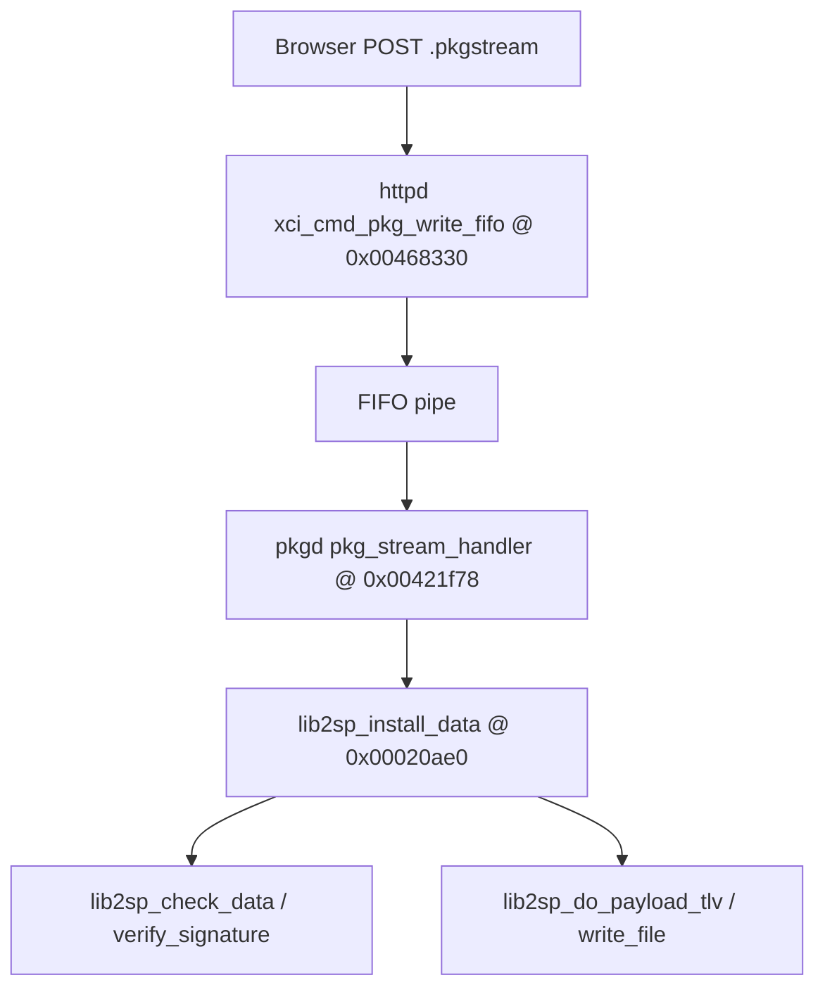

# Web-upload pkgstream memory-safety RE (532678)

**Scope:** Attacker controls only the **HTTP POST body** (`.pkgstream` bytes) through the firmware-upgrade web UI. **Out of scope:** TOCTOU on `/tmp/pkgspool`, NAND/paramtool flash, `pkgc --noverifycert`, production re-signing, unsigned PKCS#7 bypass.

**Product:** `att-5268-11.5.1.532678_prod_lightspeed-install`  
**Machine-readable findings:** [`output/ghidra_web_memory_bugs_532678.json`](../output/ghidra_web_memory_bugs_532678.json)  
**Fuzz carriers:** [`tools/pkgstream_mutate.py`](../tools/pkgstream_mutate.py) → `output/pkgstreams/mutations/`  
**Ghidra decompiles:** [`reference/ghidra_mcp_lib2sp_11_5_1_532678/`](ghidra_mcp_lib2sp_11_5_1_532678/)

---

## Attack model



| Stage | Binary | Symbol | EA |
|-------|--------|--------|-----|
| Chunked upload | `httpd` | `xci_cmd_pkg_write_fifo` | `0x00468330` |
| Stream consumer | `pkgd` | `pkg_stream_handler` | `0x00421f78` |
| Incremental parse | `lib2sp.so` | `lib2sp_install_data` | `0x00020ae0` |
| TLV / CMS dispatch | `lib2sp.so` | `lib2sp_install_2sp_data` | `0x0001f60c` |

Ghidra programs: `/Firmware/upgrade_chain/httpd`, `/Firmware/532678/pkgd`, `/Firmware/532678/lib2sp.so.0.0.0` @ `http://127.0.0.1:8089`.

---

## Integrity gate (why unsigned carriers fail)

`pkg_stream_handler` enables PKCS#7 verification when CMDB/transport flags include **`0x400000`**:

```c
if ((*(uint *)(param_1 + 4) & 0x408000) == 0x400000)
    lib2sp_enable_verify(...);
else
    lib2sp_disable_verify(...);
```

`lib2sp_disable_verify` is **not** reachable from the browser; only `pkg_verify_cert_1_svc` / `pkgc --noverifycert` flips that bit ([`pkgstream_security.md`](pkgstream_security.md) §5.9).

**Implication:** Web upload cannot skip signature verification without a **memory bug** (pre-verify crash/corruption) or a **valid production signature**. Mutated unsigned carriers are useful for **parser DoS / crash hunting**, not for installing arbitrary SCRIPT/FILE content on a stock device.

---

## Web-path hardening (narrows fuzz)

From [`pkgd_pkg_stream_handler.c`](ghidra_mcp_lib2sp_11_5_1_532678/pkgd_pkg_stream_handler.c) after `lib2sp_create_context`:

| Call | Limit | Effect |
|------|-------|--------|
| `lib2sp_set_max_tlv_size(ctx, 0x20000)` | 128 KiB TLV | Rejects **M6** oversize length fields |
| `lib2sp_set_max_signature_size(ctx, 0x40000)` | 256 KiB CMS | Caps PKCS#7 blob |
| `lib2sp_disallow_compression(ctx)` | — | **M2** BZ2 outer wrapper blocked on UI path |

---

## Verify vs install ordering (stream loop)

Per downloaded chunk in `pkg_stream_handler` (~L477–502):

1. If verify mode active (`iStack_2b4 != 0`): **`lib2sp_check_data(ctx, buf, len)`** on the chunk.
2. Inner loop: **`lib2sp_install_data(ctx, buf+off, remain, &consumed)`** until chunk drained.

So **digest/signature helpers may run on the same bytes** that **`lib2sp_install_data`** parses (magic scan, TLV walk). Pre-verify parser bugs (**M1–M4**, **M6**) remain in scope for malformed/synthetic carriers.

---

## Call graph summary (Ghidra MCP, May 2026)

### `httpd` — `xci_cmd_pkg_write_fifo` @ `0x00468330`

**Callees:** `xci_cmd_pkg_run_fifo_base`, `open64`, `write`, `lite_getq`, `lite_putbq`, `lite_freemsg`, `webs_conn_data_*`, `close`, `unlink`.

**Role:** `xci_cmd_pkg_run_fifo_base` creates/opens FIFO; handler **`write()`**s POST queue chunks until EOF. No verify toggle in `httpd`.

### `pkgd` — `pkg_stream_handler` @ `0x00421f78`

**Init:** max TLV, max signature, **disallow_compression**, verify enable/disable, space monitor.  
**Hot loop:** `lib2sp_check_data` (optional) → `lib2sp_install_data`.

### `lib2sp` — `lib2sp_install_data` @ `0x00020ae0`

**Callees:** `memcpy`/`memcmp`/`memmove`, `malloc`/`free`, `BZ2_bzDecompress*`, **`lib2sp_install_2sp_data`**.

**State 1 (M1):** Copies into `ctx+0x419` with `n = min(remaining_chunk, 8 - bytes_already_in_magic_buf)`. After 8 bytes, compares to `2WIRE_SP` or `BZh`.

**State 2 (M2):** `malloc(0xffd0)` decompress buffer; feeds decompressed bytes to `lib2sp_install_2sp_data`. Web path sets `disallow_compression` — treat BZ2 mutants as regression tests only.

**State 3+:** Direct `lib2sp_install_2sp_data` on stream bytes.

### `lib2sp` — `lib2sp_install_2sp_data` @ `0x0001f60c`

**Dispatch:** `if (*ctx < 7) indirect_jump(jump_table[state])`. States **≥ 7** → `EINVAL (0x16)`.

**Callees (representative):** `lib2sp_payload_data`, `lib2sp_verify_signature`, `lib2sp_verify_tlv`, `demarshall_2sp_file`, `demarshall_2sp_script`, `lib2sp_internal_check_data`, `asn1_get_encoding`.

---

## Memory hypothesis table

| ID | Function | EA | Phase | Web test | Verdict |
|----|----------|-----|-------|----------|---------|
| **M1** | `lib2sp_install_data` | `0x00020ae0` | Pre-verify | Split/malformed header | **Bounded** — 8-byte magic buffer |
| **M2** | BZ2 in `lib2sp_install_data` | `0x00020ae0` | Pre-verify | `BZh` prefix | **Mitigated** on web (`disallow_compression`) |
| **M3** | `demarshall_2sp_file` | `0x000149d8` | Parse | FILE TLV mutants | **Bounds checked** — fuzz `gate==99` short path |
| **M4** | `demarshall_2sp_script` | `0x000154d8` | Parse | SCRIPT TLV mutants | **Bounds checked** — fuzz offset sums |
| **M5** | `lib2sp_write_file` | `0x0001a234` | Post-verify | Signed carrier only | **Post-auth** — `snprintf(..., 0x1002)` path |
| **M6** | max TLV in `pkg_stream_handler` | `0x00421f78` | Pre-verify | Oversize TLV len | **Cap 0x20000** — boundary fuzz |
| **M7** | `xci_cmd_pkg_write_fifo` | `0x00468330` | httpd | Huge POST | **DoS** baseline; no OOB seen in summary |
| **M8** | `lib2sp_install_2sp_data` | `0x0001f60c` | Both | State fuzz | **Gated** — needs corrupt ctx |
| **M9** | `lib2sp_verify_signature` | `0x0001c294` | Verify | CMS blob | **ASN.1 review** — `asn1_run_encoding` length checks |

### `demarshall_2sp_file` (532678)

Extended layout: requires `gate >= 100` **and** `gate <= param_2` (TLV body length). Final checks: `path_off+path_len <= param_2`, `hash_off+hash_len <= param_2`. Short path when `gate < 100` uses 32-bit `file_size` — **high-value fuzz:** `gate==99` with huge size fields.

See [`lib2sp_demarshall_2sp_file_532678.c`](ghidra_mcp_lib2sp_11_5_1_532678/lib2sp_demarshall_2sp_file_532678.c).

### `demarshall_2sp_script` (532678)

Requires `*param_3 <= param_2` and each of path/script/hash offset+length pairs ≤ `param_2`. See [`lib2sp_demarshall_2sp_script_532678.c`](ghidra_mcp_lib2sp_11_5_1_532678/lib2sp_demarshall_2sp_script_532678.c).

### `lib2sp_write_file` stack path (M5)

`snprintf(auStack_103c, 0x1002, ...)` then optional `memcpy` into `param_2+param_2[8]+0x24` when `param_2[5]==0x2f` with `local_30` capped by remaining write size. Only reached after verify + valid FILE install — **not web-exploitable without signed carrier + separate bug**.

---

## Lab matrix (`pkgstream_mutate.py`)

```powershell
python tools/pkgstream_mutate.py --out output/pkgstreams/mutations
```

Upload each `output/pkgstreams/mutations/*.pkgstream` via web UI on an **owned** lab CPE. Record: `pkgd`/`httpd` restart, syslog, serial console. **Success criterion for RE phase:** crash, hang, or observable memory corruption (not successful unsigned install).

| Mutation ID | Hypothesis | Notes |
|-------------|------------|-------|
| `trunc_header` | M1 | < 24 bytes |
| `bad_magic` | M1 | Invalid magic |
| `tlv_oversize_len` | M6 | Length 0x20001 |
| `tlv_past_eof` | M6 | Length past EOF |
| `bz2_outer` | M2 | Should fail early on web |
| `file_gate99` | M3 | Short FILE layout |
| `script_wrap` | M4 | Hostile offsets |
| `max_tlv` | M6 | Exactly 0x20000 |

Manifest: `output/pkgstreams/mutations/mutation_manifest.json` (includes lib2spy dry-run per file).

Optional base carrier:

```powershell
python tools/pkgstream_mutate.py --base M:\path\to\install.pkgstream --out output/pkgstreams/mutations
```

---

## Console payload (contingent — not built)

Only relevant if a memory bug yields **root code execution** or **arbitrary file write**:

```sh
#!/bin/sh
paramtool -set gw:trust_engcert true
echo w 0xb0000180 0x00E03700 1 w > /proc/bcmlog
```

(`0x00E03700` vs `0x00C03700` enables UART RX — [`console_uart_disable.md`](console_uart_disable.md).)

**Status:** No confirmed memory primitive → **no `poc_console_enable.pkgstream` artifact**. A future signed minimal SCRIPT carrier requires `tools/pkgstream_build.py` + production CMS (out of scope here).

---

## Out of scope (documented)

| Item | Why excluded |
|------|----------------|
| `/tmp/pkgspool` TOCTOU (`0666`) | Needs second local writer |
| `pkgc --noverifycert` | Not browser-reachable |
| NAND / `paramtool` flash | Not HTTP POST |
| Unsigned integrity bypass | PKCS#7 gate on web path |
| Production re-signing | No private key in repo |

---

## Related references

- [`pkgstream_security.md`](pkgstream_security.md) — trust model, §5.12 compression
- [`firmware_upgrade_process.md`](firmware_upgrade_process.md) — end-to-end upgrade
- [`ghidra_httpd_upgrade_chain_evidence.json`](ghidra_httpd_upgrade_chain_evidence.json) — httpd XCI strings (527064 slice; FIFO pattern same class)
- [`output/lib2spy_532678_install_pkgstream.json`](../output/lib2spy_532678_install_pkgstream.json) — production FILE paths
