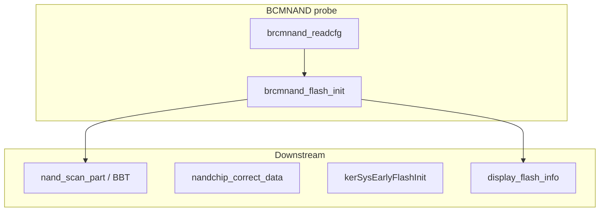
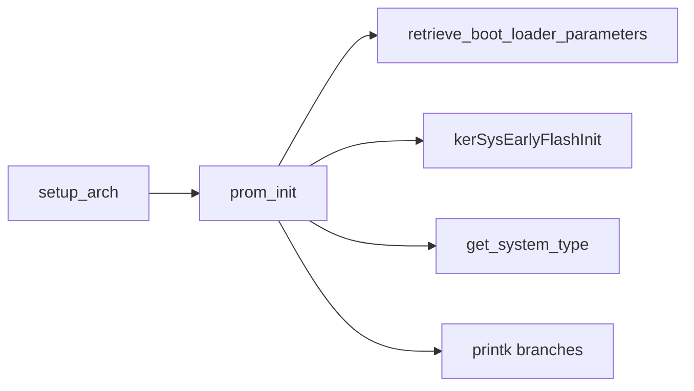

# Printk anchor map ([`fwupgrade.txt`](fwupgrade.txt) §196–367) and Ghidra xrefs

Cross-reference **early boot text** with **kernel rodata `printk` format strings** in the loaded **`…_ghidra_m00_kernel`** database (MIPS KSEG0 addresses). **U-Boot** lines do not share Linux `.text`/`.rodata`; use them for **layout / partition geometry** only.

**Related:** **[`issue.md`](issue.md)** (MTD / OpenTL strategy), **[`opentl_kernel_ghidra.md`](opentl_kernel_ghidra.md)** (OpenTL driver RE), **[`prom_init_ghidra.md`](prom_init_ghidra.md)** (BCM63xx **`prom_init`** / early **`mtdparts=`** defaults), **[`…_ghidra_m00_kernel.kallsyms.txt`](firmware_11.5.1.532678/11.5.1.532678/install_package/pkgstream_carves/att-5268-11.5.1.532678_prod_lightspeed-install_uimage_0x01ae4b7e_36645b10_ghidra_m00_kernel.kallsyms.txt)**.

---

## Kernel virtual address ↔ symtab ↔ uImage load

Use one consistent **kernel virtual address (VA)** everywhere in Ghidra, **kallsyms**, and **`.symtab` `st_value`** for defined symbols: on this image they are **MIPS KSEG0** addresses (`0x80……`).

| Concept | This 5268 kernel carve |
|--------|-------------------------|
| **Linked load VMA** | **`0x80010000`** — first byte of the contiguous kernel image in VA space (matches **`vmlinux-to-elf`** PT_LOAD for `.kernel` and typically **`ih_load`** in the legacy uImage header for the kernel member). |
| **`e_entry` / `ih_ep`** | **`0x80458130`** (`kernel_entry`) — same in ELF header and uImage; not the load base. |
| **Symtab / kallsyms address** | Already a **VA**. Example: `parse_cmdline_partitions` @ **`0x8027dee8`**; rodata string @ **`0x804d4280`** — use these **unchanged** in Ghidra when the program’s image base matches the ELF. |
| **Byte offset inside the decompressed kernel blob** | **`offset = VA − 0x80010000`** for any VA that lies in the loaded `.kernel` PROGBITS range (stop at segment size **`0x58c670`** for this ELF — see **[`…_ghidra_m00_kernel.elf.md`](firmware_11.5.1.532678/11.5.1.532678/install_package/pkgstream_carves/att-5268-11.5.1.532678_prod_lightspeed-install_uimage_0x01ae4b7e_36645b10_ghidra_m00_kernel.elf.md)**). Example: **`0x804d4280 − 0x80010000 = 0x4c4280`**. |
| **uImage file layout** | The **gzip-peeled** `*_ghidra_m00_kernel.bin` is **only** the kernel member bytes (see **`uimage-ghidra`** carve notes). Offsets in that file align with **`VA − 0x80010000`** from the start of the member. Do **not** add the pkgstream file offset of the uImage unless you are addressing inside the **container** file. |

**Rule of thumb:** treat **symtab/kallsyms/Ghidra** addresses as the **final VA**; subtract **`0x80010000`** only when you need a **file offset** into the **kernel slice** binary.

---

## Scope split

| Region | fwupgrade lines | Role for NAND dump / reader |
|--------|------------------|------------------------------|
| **U-Boot** | ~204–295 | **MTD layout**, **OpenTL geometry** (`TL_debug`, `nflaattach`, virtual/raw blocks, disklabel sectors), **mtdparts** — inputs for [`partition-map`](mtd_parts/partition-map.json) / [`tl_bbm`](opentl/tl_bbm.py) boot-trace fields. Not Linux kernel symbols. |
| **Linux kernel (early)** | ~338–367 | **BCMNAND / BRCMNAND** driver: chip dimensions, scan, ECC — Ghidra anchors on kernel ELF. |

---

## A. U-Boot strings (layout; not in Linux kernel Ghidra DB)

- **`BCMNAND: … page=2048B, spare=64`** — **2048 + 64 OOB** page model.
- **`mtdparts=…524288(loader),1048576(mtdoops),-(tlpart)`** and **`0x00180000-0x08000000 : "tlpart"`** — MTD byte ranges.
- **`TL_debug: … mediasize=64768 … 1012 … spares=85`**, **`Adjusting virtual blocks … 30 bb … 1 stat`**, **`resetting statsBlock statistics …`**, **`nand_geom: cap=251132`** — BBM/stats/capacity.
- **`get_partition_info_disklabel` / `Partition(N)` / `Part(5) … 384 to 245888`** — disklabel ↔ **512-byte** sectors.

---

## B. Kernel printks (lines 338–350): raw NAND / ECC / NVRAM

| printk (abbrev.) | Why it matters |
|------------------|----------------|
| **`BCMNAND: Bootcfg=… Cfg=…`** | Controller register dump — **`brcmnand_readcfg`**. |
| **`BCMNAND: System strap=…`** | Strap / timing. |
| **`BCMNAND: NAND: AccControl=…`** | MMIO access window. |
| **`BCMNAND: size=128MB, block=128KB, page=2048B, spare=64`** | Canonical geometry ([`tl_physical.py`](opentl/tl_physical.py)). |
| **`BRCMNAND device: block: … page: … name: nand0`** | MTD registration — **`display_flash_info`**. |
| **`>> nand_scan_part - Total … bad and … good blocks`** | BBT / scan — **`brcmnand_flash_init`**. |
| **`BRCM NAND flash device: nand0, id …`** | Flash ID line. |
| **`nandchip_correct_data: ECC1 …` / `Oldbyte=`** | ECC path for raw page interpretation. |
| **`kerSysEarlyFlashInit: NVRAM size=… CRC …`** | NVRAM blob (4092 B); separate from **`tlpart`** OpenTL mapping. |

### B.1 Decode: [`fwupgrade.txt`](fwupgrade.txt) lines **475–484** (BCMNAND probe + MTD cmdline)

Captured timings differ across boots; **register values** below match the **`att`** recovery trace around **`[ 2.891000]`**.

| Line | Kernel message (prefix) | rodata VA | Role |
|------|-------------------------|-----------|------|
| **475** | **`BCMNAND: pReg=…`** | **`0x804f6154`** | Format **`pReg=%x Cfg=%x CsAndNor=%x Acc=%x Id=%x`** — probe reads **`brcmnand_ctrl_read`** MMIO at **`0x248`**, **`0x218`**, **`0x240`**, **`0x260`** after programming **`_DAT_b0000214 = 0x40000001`**. **Xref:** **`0x8045dbbc`** inside **`brcmnanddrv_probe`** @ **`0x8045dab8`**. |
| **476** | **`BCMNAND: System strap=…`** | **`0x804f6188`** | Format **`BCMNAND: System strap=%x %x,%d,%d`** — SoC **strap word**, then **page-related hex** ( **`0x800` = 2048 B page**, same as **`page=2048B`** on line 478), plus two **decimal** parameters (**`11`**, **`1`**) from strap-derived math (exact naming requires vendor BCM NAND sources; treat as **timing / address-cycle / chip-count–style** knobs). **Xref:** **`0x8045dbdc`** (same probe path). |
| **477** | **`BCMNAND: NAND: AccControl=…`** | **`0x804f61ac`** | **CPU/bus access window** for the NAND controller (**`f7001010`** on this board — same class as MMIO discussion in [`output/opentl_mount/brcmnand_oob_ghidra.md`](output/opentl_mount/brcmnand_oob_ghidra.md)). **Xrefs** include **`0x8045dc14`** (**`brcmnanddrv_probe`** continuation), **`0x802dbf04`** / **`0x802dc078`**. |
| **478** | **`BCMNAND: size=128MB…`** | **`0x804f61e4`** | **`size=%lluMB, block=%dKB, page=%dB, spare=%d`** — geometry after scan; **`128MiB`**, **`128KiB`** erase, **`2048`** page, **`64`** OOB — canonical for [`opentl`](opentl) tooling. **Xrefs:** **`0x8045dd80`** (**probe / init path**), **`0x802dbfb4`** (**`brcmnand_flash_init`** @ **`0x802db134`**). |
| **479** | **`BCMNAND: Init done`** | **`0x804f6270`** | Controller ready for MTD registration. **Xref:** **`0x8045de24`**. |
| **480–482** | **`MTD partition(i) offset=…`** | *(generic MTD)* | **`cmdlinepart`** parser ([`firmware.md`](firmware.md): **`mtdparts=mtd-0:524288(loader),1048576(mtdoops),-(tlpart)`**). Sizes **524288 + 1048576 + 132644864 = 134217728`** bytes = **128 MiB**, matching line **478**. **`num=3`** is the partition count. |
| **483–484** | **`cmdlinepart partitions found` / `Creating 3 MTD partitions`** | *(generic MTD)* | Standard Linux **`mtdparts=`** application on **`mtd-0`** after raw NAND exists. |

**`pReg=` vs `Bootcfg=`:** The **`Bootcfg=`** line (**`0x80502d4c`**, **`brcmnand_readcfg`** @ **`0x802dbd5c`**) is an alternate dump style — full MMIO mapping in §**C.1**. This capture uses the **`pReg=`** family from **`brcmnanddrv_probe`** — same driver, different printk site.

---

## C. Ghidra: BCMNAND strings → rodata → xrefs

Addresses **KSEG0** (prefix **`0x80…`**). Captured from **Ghidra MCP** (`search_strings`, `get_xrefs_to`, `analyze_function_complete`) on the **`…80458130`** kernel image.

| Format string / substring | rodata | Xref from | Function |
|---------------------------|--------|-----------|----------|
| `BCMNAND: pReg=%x Cfg=%x CsAndNor=%x Acc=%x Id=%x` | `0x804f6154` | `0x8045dbbc` | **`brcmnanddrv_probe`** @ **`0x8045dab8`** [PARAM] |
| `BCMNAND: System strap=%x %x,%d,%d` | `0x804f6188` | `0x8045dbdc` | **`brcmnanddrv_probe`** [PARAM] |
| `BCMNAND: NAND: AccControl=%x` | `0x804f61ac` | `0x8045dc14`, `0x802dbf04`, `0x802dc078` | probe / flash-init |
| `BCMNAND: size=%lluMB, block=%dKB, page=%dB, spare=%d` | `0x804f61e4` | `0x8045dd80`, `0x802dbfb4` | probe; **`brcmnand_flash_init`** |
| `BCMNAND: Init done` | `0x804f6270` | `0x8045de24` | probe continuation |
| **`BCMNAND: Bootcfg=%x Cfg=%x CsAndNor=%x Base=%x Acc=%x Id=%x`** | `0x80502d4c` | `0x802dbdc8` | **`brcmnand_readcfg`** @ **`0x802dbd5c`** [PARAM] — see §**C.1** |
| `BRCMNAND device: block: %lu page: …` | `0x80502e38` | `0x802dbe78` | printk site (BCMNAND probe) |
| `BRCM NAND flash device` | `0x805028f0` | `0x802da5d0` | **`display_flash_info`** [PARAM] |
| `>> nand_scan_part - Total %ld bad and %ld good blocks found` | `0x80502c58` | `0x802db358` | **`brcmnand_flash_init`** [PARAM] |
| `nandchip_correct_data: ECC1 …` | `0x80503028` | `0x802dd0a8` | **`nandchip_correct_data`** [PARAM] |
| `nandchip_correct_data Oldbyte=%x …` | `0x80503060` | `0x802dd0cc` | **`nandchip_correct_data`** |
| `%s: NVRAM size=%d CRC %x %x` | `0x80500dbc` | `0x802d0710` | **`kerSysEarlyFlashInit`** [PARAM] |

### C.1 `brcmnand_readcfg` @ **`0x802dbd5c`**

**Caller:** **`brcmnand_flash_init`** (**`0x802db134`**) — **`jal`** from **`0x802db1c8`** (same init path that assigns **`brcmnand_scan`**, **`brcmnand_program_page`**, etc.).

**Behavior:**

1. **`memset(DAT_806717a0, 0, 0x10a8)`** — clears **`0x10a8`** bytes of driver/global state at **`0x806717a0`**.
2. **`_DAT_b0000004 |= 0x100000`** — sets the same controller **enable / gate** style bit used in **`brcmnanddrv_probe`** on **`_DAT_b0000004`**.
3. **`printk`** (**full format** **`0x80502d4c`**):

   **`BCMNAND: Bootcfg=%x Cfg=%x CsAndNor=%x Base=%x Acc=%x Id=%x`**

**Arguments** (MIPS **`printk`**; values read relative to **`s0 = 0xb0000200`** in disassembly):

| Printed field | Source |
|---------------|--------|
| **Bootcfg** | **`*(uint32_t*)0xb0000214`** (`lw 0x14(s0)`) |
| **Cfg** | **`*(uint32_t*)0xb0000248`** (`lw 0x48(s0)`) |
| **CsAndNor** | **`*(uint32_t*)0xb0000218`** (`lw 0x18(s0)`) |
| **Base** | **`0`** (**`sw zero, 0x10(sp)`** — always zero on this path) |
| **Acc** | **`*(uint32_t*)0xb0000240`** (`lw 0x40(s0)`, passed on stack) |
| **Id** | **`*(uint32_t*)0xb0000260`** (`lw 0x60(s0)`, passed on stack) |

**Contrast with `pReg=` (§B.1):** **`brcmnanddrv_probe`** prints **`pReg=%x …`** (**`0x804f6154`**) using **`brcmnand_ctrl_read`** at offsets **`0x248`**, **`0x218`**, **`0x240`**, **`0x260`** after programming **`0xb0000214 = 0x40000001`**. **`brcmnand_readcfg`** is the **`Bootcfg=`** dump inside **flash init**, sampling the **`0xb0000200`** register window ( **`Base`** forced **0** here).

---

**`brcmnand_flash_init`** (`0x802db134`): calls **`brcmnand_readcfg`**; assigns **`brcmnand_read_spare_area`**, **`brcmnand_write_pages`**, **`brcmnand_block_erase`**, **`brcmnand_scan`**, **`brcmnand_program_page`**, **`brcmnand_load_page`**, etc.; printk **`0x80502bb8`** (bad BBT size), **`0x80502c58`** (scan totals). **Callers:** **`flash_init`**, **`select_system_flash`**.

---

## D. Extension: OpenTL / `ntl_*` printk anchors (kernel)

Boot **line 367** ends before OpenTL driver chatter; strings live in **`.rodata`** like **`§1** of **[`opentl_kernel_ghidra.md`](opentl_kernel_ghidra.md)**. Sample Ghidra xrefs (same DB):

| String (substring) | rodata | Xref from | Function |
|--------------------|--------|-----------|----------|
| `OPENTL: add_mtd for %s` | `0x804f719c` | `0x802871b8` | **`opentl_add_mtd`** [PARAM] |
| `OPENTL: get geo(%d)` | `0x804f7088` | `0x80286824` | **`opentl_getgeo`** [PARAM] |
| `ntl_access_pages: Wrong params …` | `0x804f8120` | `0x8028a87c` | **`ntl_access_pages`** [PARAM] |

**kallsyms** (same build): **`opentl_accesssectors`** `0x80286884` (`t`), **`ntl_access_pages`** `0x8028a574` (`T`).

Other **`OPENTL:`** rodata hits include **`0x804f7068`** … **`0x804f73f8`** (`tl_malloc`, `access page`, `add_mtd`, `could not mount`, etc.) — full xref sweep in **`opentl_kernel_ghidra.md` §1**.

---

## E. `prom_init` — early default `mtdparts=` / UBI (`arch` PROM)

**Full RE:** **[`prom_init_ghidra.md`](prom_init_ghidra.md)** (entry **`0x80565588`**, caller **`setup_arch`**). Key **`.rodata`** anchors overlapping this note:

| printk / string role | rodata VA |
|----------------------|-----------|
| **`%s prom init`** | **`0x804d4174`** |
| **`Found arg %s …`** | **`0x804d4184`** |
| **`Found env %s …`** | **`0x804d41b4`** |
| **`U-boot mtdparts missing ?, using default %s`** | **`0x804d41e8`** |
| Embedded **`mtdparts=mtd-0:393216(loader),-(ubipart) ubi.mtd=ubipart`** | **`0x804d4280`** |

---

## Follow-ups

1. **`brcmnand_readcfg`** decompilation — full register→**Bootcfg** printk mapping.
2. **REST** `http://127.0.0.1:8089` / Ghidra MCP **`analyze_function_complete`** for long outputs if MCP truncates.
3. Deep OpenTL path remains **`opentl_accesssectors` → `ntl_access_pages` → `ntl_read_page`** — see **[`opentl_kernel_ghidra.md`](opentl_kernel_ghidra.md) §2–§5**.

---

*Generated May 2026: implements printk anchor plan; Ghidra MCP session on `att-5268-…80458130` kernel. §E `prom_init` added May 2026.*
