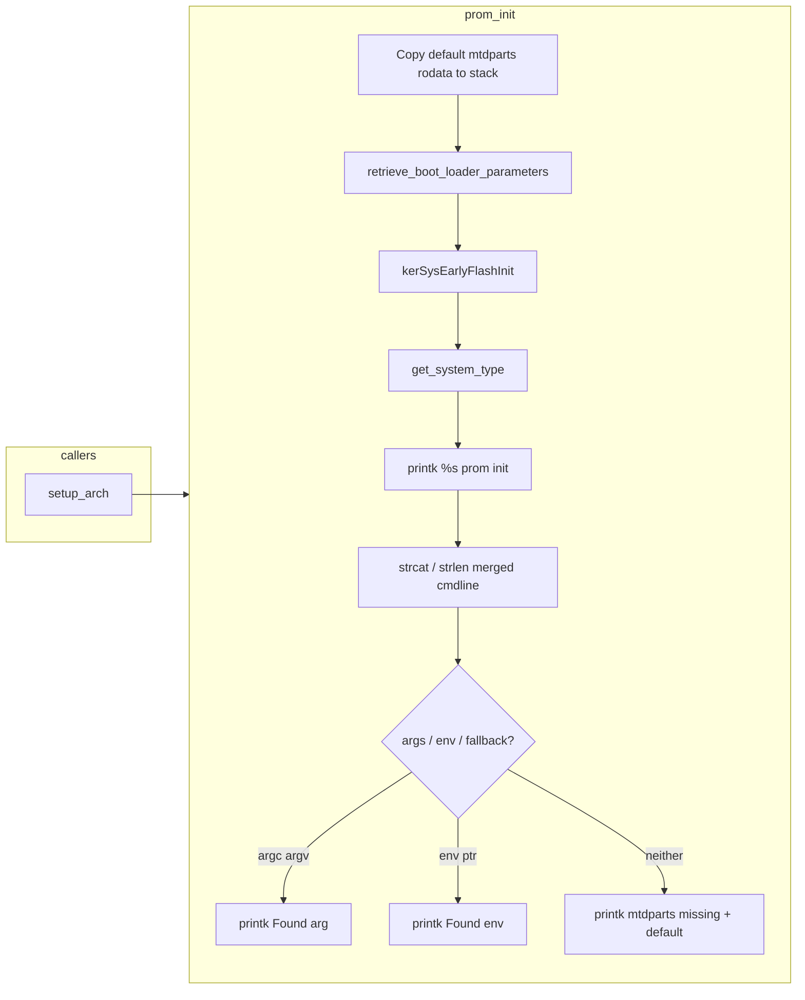
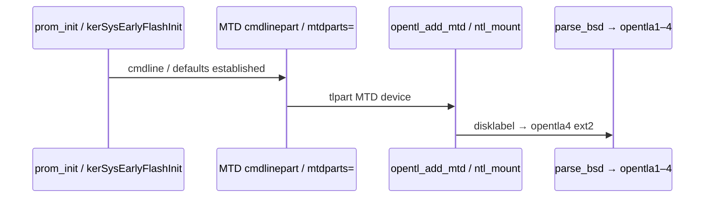

# `prom_init` — BCM63xx early PROM (kernel Ghidra RE)

Reverse-engineering notes for **`prom_init`** on the **`att-5268-11.5.1.532678`** Linux **3.4.11-rt19** kernel ELF (**`…_ghidra_m00_kernel.elf`**). Addresses are **MIPS KSEG0**. Symbol from **`kallsyms`**: **`80565588 T prom_init`**.

**Related:** **[`printk_anchor_fwupgrade_ghidra.md`](printk_anchor_fwupgrade_ghidra.md)** (VA/load-base rules), **[`opentl.md`](opentl.md)** (OpenTL / **`opentla*`** diagrams), **[`opentl_kernel_ghidra.md`](opentl_kernel_ghidra.md)** (OpenTL driver stack).

---

## 1. Role and placement

| Item | Value |
|------|--------|
| **Caller** | **`setup_arch`** @ **`0x80566d18`** (only direct caller in this image). |
| **Entry / body (merged)** | **`0x80565588`** … **`0x805659ab`** |
| **Purpose** | Early board PROM path for **Broadcom BCM63xx-class** images: seed **default `mtdparts=` + `ubi.mtd=`** string, merge **CFE/PROM** boot arguments / env pointers, **printk** diagnostics, then branch into **`kerSysEarlyFlashInit`** before the rest of **`setup_arch`**. |

This is **not** the generic **`drivers/mtd/cmdlinepart.c`** parser (`parse_cmdline_partitions`); it is **vendor `arch/mips/bcm63xx`** (or equivalent) glue that runs **before** the Linux **`mtdparts=`** command line is fully normalized.

---

## 2. Callees (confirmed from decompilation)

| Symbol | Address | Role |
|--------|---------|------|
| **`retrieve_boot_loader_parameters`** | **`0x8056550c`** | Copy **PROM/CFE** parameter strings into kernel globals (see **`kallsyms`**). |
| **`kerSysEarlyFlashInit`** | **`0x802d05cc`** | Broadcom **early NAND / NVRAM** setup (printk **`NVRAM size=`** path in **[`printk_anchor_fwupgrade_ghidra.md`](printk_anchor_fwupgrade_ghidra.md)** §B). |
| **`get_system_type`** | **`0x80012640`** | Returns **board / platform** string for first **`printk`**. |
| **`printk`** | **`0x8045f2d0`** | Kernel **`printk`** (must **not** be marked **`noreturn`** if you want **`prom_init`** to include code after the first call — see §7). |
| **`strcat`** | **`0x8021bcbc`** | Concatenate strings when building the merged command-line buffer. |
| **`strlen`** | **`0x8021be54`** | Measure merged line length vs **`0x1000`** limit. |

**Note:** Ghidra’s **“callees”** list may include **`BpGetBoardParms`** etc. from **data xref** noise; treat the table above as the **actual control-flow** callees.

---

## 3. Embedded default MTD string (`0x804d4280`)

The kernel **`.rodata`** contains the **default** command fragment (also analyzed standalone):

```text
mtdparts=mtd-0:393216(loader),-(ubipart) ubi.mtd=ubipart
```

**Semantics:** **`mtd-0`** partition **`393216` (0x60000) bytes** named **`loader`**, remainder **`ubipart`**, and **`ubi.mtd=ubipart`** for the UBI layer. Same string block sits near the **`U-boot mtdparts missing`** diagnostics (**`0x804d41xx`**).

---

## 4. `.rodata` format strings used in `prom_init`

| VA | Approximate format (from `.rodata`) |
|----|-------------------------------------|
| **`0x804d4174`** | **`%s prom init\n`** — first status line; **`%s`** ← **`get_system_type()`**. |
| **`0x804d4184`** | **`Found arg %s of length %d left=%d\n`** — branch when PROM exposes **argc/argv-style** args and space remains in the **`0x1000`** buffer. |
| **`0x804d41b4`** | **`Found env %s of length %d \n`** — branch when a **pointer to env text** is present. |
| **`0x804d41e8`** | **`U-boot mtdparts missing ?, using default %s\n`** — fallback; **`%s`** ← **stack copy** of the **`0x804d4280`** default string (`acStack_78` in decompilation). |

---

## 5. Control-flow summary

1. **Copy** **`0x30`** bytes from **`0x804d4280`** in **`0x10`**-byte chunks, then **three tail bytes** — reproduces the **embedded default `mtdparts=`** into a **stack buffer** (~**`0x57`** bytes total including terminator semantics).
2. **`retrieve_boot_loader_parameters()`** — ingest **CFE/PROM** argv/env pointers into **`DAT_8059xxxx`** / **`DAT_805911d4`** region (names from Ghidra labels).
3. **`kerSysEarlyFlashInit()`** — early flash (**NVRAM**, controller probe ordering).
4. **`get_system_type()`** → **`printk("%s prom init\n")`**.
5. **`strcat`** onto **`DAT_805911d4`** with a short **`rodata`** fragment (**`DAT_804f25f8`** in Ghidra — separator / continuation bytes).
6. **`strlen`** merged line; compare against **`0x1000`** and board counters (**`DAT_8059e4e0`** etc.).
7. **Three-way branch:**
   - **Args path** → **`printk(Found arg …)`** → **`return`**.
   - **Else env path** → **`printk(Found env …)`** → **`return`**.
   - **Else** → **`printk(U-boot mtdparts missing …, default)`** → **`return`**.

---

## 6. Call graph (Mermaid)



---

## 7. Ghidra housekeeping (merged body / decompilation)

If **`prom_init`** stops at the **first `jal printk`** (**~188 instructions**):

1. Clear **`printk`** **incorrect “No Return”** (**`set_function_no_return(0x8045f2d0, false)`**).
2. **`clear_instruction_flow_override`** on **`0x8056563c`** (the **`jal printk`** after **`get_system_type`**) — override was **`CALL_RETURN`**, which hid fall-through to **`0x80565644`**.
3. **Delete / recreate** **`prom_init`** at **`0x80565588`** so the body spans **`0x80565588`–`0x805659ab`**.

---

## 8. Relationship to **`opentla*`** (conceptual)

**`prom_init`** does **not** call **`opentl_add_mtd`** directly. It runs **much earlier**, fixing **how `mtdparts=` / UBI defaults appear** before **`mtdparts=`** parsing and MTD device registration. The **OpenTL** stack (**[`opentl.md`](opentl.md)** §2, **[`opentl_kernel_ghidra.md`](opentl_kernel_ghidra.md)**) attaches later when **`tlpart`** is exposed as **`mtd`** and **`opentla0`** is parsed via **`parse_bsd`**.

Temporal ordering:



---

*May 2026 — Ghidra MCP session on `att-5268-…80458130` kernel after merging `prom_init` body and fixing `printk` flow.*
