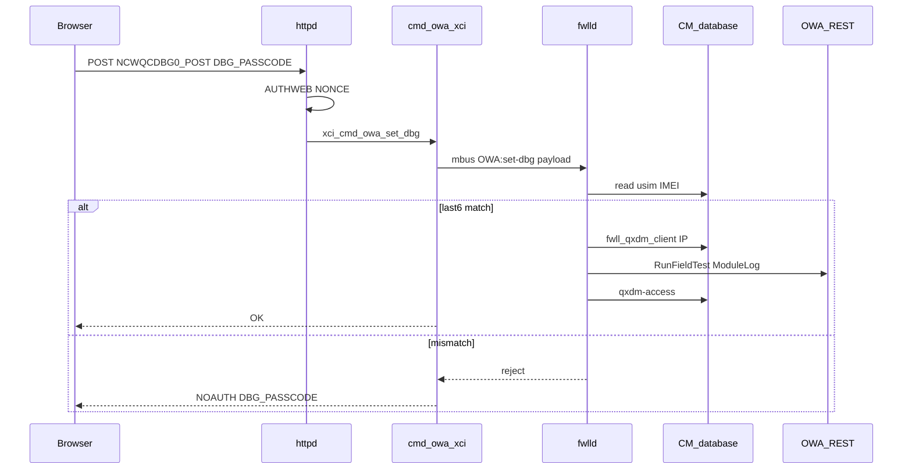

# QxDM debug passcode (PACE 5268AC / ATT Lightspeed)

Firmware evidence: `att-5268-11.14.1.533857_prod_lightspeed-install` pkgstream dissect (`M:\old\electronics\5268ac\current\...`). Web routing: [`httpd_endpoints.md`](httpd_endpoints.md).

## Passcode algorithm

**The QxDM debug passcode is the last six characters of the cellular module IMEI** (Lua string suffix, not a numeric hash).

```lua
-- squashfs-root/var/lua-apps/fwlld/fwlld.lua (OWA:set-dbg handler)
local oidstr = 'cmlegacy.fwll_cellular_intf.0.usim'
owa_imei = tran:map_get(oidstr, 'IMEI')
elseif string.sub(owa_imei, -6) ~= payload.dbg_passcode then
    syslog(syslog.err, "Invalid passcode for QxDM access " .. new_state)
    return
end
```

**Example:** IMEI `351234567890123` → passcode `890123`.

The same check appears across many **11.13.x–11.14.x** pkgstream builds in the gateway firmware corpus.

## How to obtain the passcode on a live unit

| Source | Where |
|--------|--------|
| **CM (authoritative for validation)** | OID `cmlegacy.fwll_cellular_intf.0.usim`, field `IMEI` |
| **Web UI (same value)** | Status page `C_0_0`: `OWA:GET_USIM` → `DATA[@NAME='IMEI']` (label **LTE-IMEI** in lang XML) |
| **Derived passcode** | `string.sub(imei, -6)` — must be exactly six characters |

**Prerequisites:** logged-in `AUTHWEB` session; QxDM form only on vhosts `home0:0` / `home0:1` ([`NCWQCDBG0.xsl`](M:/old/electronics/5268ac/current/_att-5268-11.14.1.533857_prod_lightspeed-install.pkgstream.extracted/squashfs-root-1/ui/newxsl/pages/NCWQCDBG0.xsl)).

**POST** [`NCWQCDBG0_POST.xml`](M:/old/electronics/5268ac/current/_att-5268-11.14.1.533857_prod_lightspeed-install.pkgstream.extracted/squashfs-root-1/ui/newxsl/pages/NCWQCDBG0_POST.xml): realm `tech-write`, `AUTHWEB` on `home0`/`wra0`, POST + `NONCE`.

## URL and page flow

| Step | Artifact |
|------|----------|
| Browser | `/xslt?PAGE=NCWQCDBG0` or rewrite `/ncwqcdbg` |
| GET page | [`NCWQCDBG0.xml`](M:/old/electronics/5268ac/current/_att-5268-11.14.1.533857_prod_lightspeed-install.pkgstream.extracted/squashfs-root-1/ui/newxsl/pages/NCWQCDBG0.xml) — `OWA:GET_PARAMS`, `OWA:GET_DBG` |
| POST | [`NCWQCDBG0_POST.xsl`](M:/old/electronics/5268ac/current/_att-5268-11.14.1.533857_prod_lightspeed-install.pkgstream.extracted/squashfs-root-1/ui/newxsl/pages/NCWQCDBG0_POST.xsl) — `CMD MOD="OWA" NAME="SET_DBG"`, form `DBG_PASSCODE`, `QXDM_STATE` from `ENABLE_DBG` |
| Wrong passcode UI | `ERRORLIST/PARAM[@WEBARG='DBG_PASSCODE'][@CODE='NOAUTH']` → lang **"Passcode was not correct."** |



## httpd `OWA` XCI module (`cmd_owa.c`)

Strings in **`/usr/bin/httpd`** (11.14.1 pkgstream) show the bridge from XSLT to mbus (no separate Lua handler in httpd):

| String / symbol | Role |
|-----------------|------|
| `xci_mod/cmd_owa.c` | OWA command module source |
| `xci_cmd_owa_set_dbg` / `owa_set_dbg_args` | `SET_DBG` handler |
| `DBG_PASSCODE`, `QXDM_STATE`, `IMEI` | Argument / field names |
| `dbg_passcode`, `qxdm_state` | mbus payload keys |
| `OWA:set-dbg` | mbus event name (subscriber: `fwlld.lua`) |
| `mbus_emit`, `mbus_emit_with_trans` | Event dispatch |
| `validate_session_ipaddress` | Client IP for enable path |
| `GET_DBG`, `GET_PARAMS`, `GET_USIM` | Related OWA commands |
| `NOAUTH` (`xci_mod/xci_lib.c`) | Status returned to XSLT on auth failure |

**Inferred `SET_DBG` behavior:** parse `DBG_PASSCODE` and `QXDM_STATE` from the page command args; on enable, attach the session client IP (`validate_session_ipaddress`); emit **`OWA:set-dbg`** with `dbg_passcode`, `qxdm_state`, and `ipaddr`. If `fwlld` rejects the passcode, the XCI layer maps the failure to **`NOAUTH`** on `DBG_PASSCODE` for the NCWQCDBG0 error XSLT.

Ghidra project note: the loaded `httpd` sample may be an older 10.5.x build without `cmd_owa.c`; use the **11.14.1** binary under the current pkgstream extract for OWA string correlation.

## After successful enable (`fwlld.lua`)

1. **Firewall:** `update_fw_for_qxdm(client_ip)` sets `cmlegacy.fw.0.params` → `fwll_qxdm_client` to the browser IP (enable requires `payload.ipaddr`).
2. **Modem:** [`rest.lua`](M:/old/electronics/5268ac/current/_att-5268-11.14.1.533857_prod_lightspeed-install.pkgstream.extracted/squashfs-root/var/lua-apps/fwlld/rest.lua) `set_owa_qxdm_access` → `RunFieldTest` / `ModuleLog` with `data = "enable,<passcode>"`.
3. **CM state:** `cmlegacy.fwll_cellular_intf.0.params` → `qxdm-access` (comment in Lua: volatile across reboot).

## `PACE 5268AC u42.rom` (NAND dump)

[`PACE 5268AC u42.rom`](D:/electronics/5268ac/PACE%205268AC%20u42.rom) is a **16 MiB NAND flash** image ([`PACE 5268AC u42.rom.txt`](D:/electronics/5268ac/PACE%205268AC%20u42.rom.txt): uImage kernels, LZMA, JFFS2 @ `0xF80000`).

**Binwalk extract** (`extractions/PACE 5268AC u42.rom.extracted/`):

| Offset | Contents |
|--------|----------|
| `0xF80000` | JFFS2 — **Airties/wifi persist only** (hostapd, `wireless_conf.txt`, etc.) |
| `0x42000` / `0x7E2000` | LZMA → large `decompressed.bin` (kernel images); **no** cleartext `fwlld.lua` / `NCWQCDBG` strings |
| Full `.rom` grep | No `Invalid passcode for QxDM` / `OWA:set-dbg` in raw image |

Application logic (Lua, XSLT, `cmd_owa.c`) lives in **pkgstream SquashFS** on other flash regions; use the **pkgstream dissect corpus** for passcode RE, not the `u42` JFFS2 slice alone.

## Security note

The passcode is **knowledge of the IMEI suffix** — weak if IMEI is on a label or the status page, but still behind **web session auth** and vhost checks. Enabling QxDM opens **firewall access** for the requesting client IP via `fwll_qxdm_client`.

## See also

- [`httpd_endpoints.md`](httpd_endpoints.md) — `/ncwqcdbg` rewrite
- [`httpd.md`](httpd.md) — XSLT / XCI stack overview
