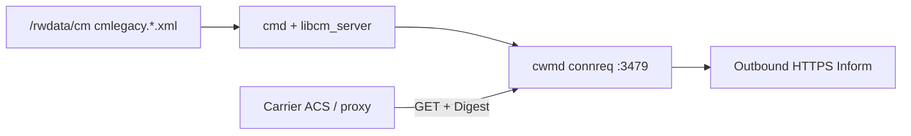

# TR-069 Connection Request (inbound HTTP on port 3479)

Carrier **Connection Request** on the AT&T 5268AC / Pace gateway wakes **`cwmd`** so the CPE opens an outbound HTTPS CWMP session to **`mgmt.acs_url`**. The ACS (or carrier proxy) sends an HTTP **GET** to a predictable path on the CPE WAN/LAN address with **Digest** authentication.

This is **not** the web UI, **not** BDC diagnostic pull (port **61001**), and **not** outbound Inform POSTs.

See also: [`cwmp_cpe_authentication.md`](cwmp_cpe_authentication.md), [`cmdb_security.md`](cmdb_security.md), [`bdc_diagnostic_pull.md`](bdc_diagnostic_pull.md), [`output/ghidra_tr069_connreq.json`](../output/ghidra_tr069_connreq.json), [`LEGAL.md`](../LEGAL.md).

**Lab tooling:** `python -m tr069 identity|probe|connreq` — standalone module (does not modify `acspy`).

---

## Architecture



| Component | Role |
|-----------|------|
| **`cwmd`** | `cwmd_connreq_*`, `connreq_*` HTTP state machine |
| **`librgw_compat`** | `tw_ulib_mgmt_get_connreq_*` CMDB getters |
| **`libboard`** | `board_info_serialnumber()` for expected URI path |
| Firewall | CMDB **`bind`** row **`pm_cms`** → TCP **3479** on **ANY** |

Flash logs use prefix **`acs:`**; the binary is **`/usr/bin/cwmd`**.

---

## On-wire protocol (Ghidra 11.5.1.532678)

| Item | Value |
|------|--------|
| Port | **3479** (CMDB `connreq_port`, default `0xd97`) |
| Scheme | **HTTP** (no TLS on connreq listener) |
| Method | **GET** only |
| Path | **`/tr069_connreq_00D09E-{serial}`** — rodata `"/tr069_connreq_%s-%s"` @ `0x0043e9e8`, OUI constant `00D09E` @ `0x0043ea00` |
| Path check | Built from **`board_info_serialnumber()`**, compared with `strcasecmp` in `connreq_generate_response` @ `0x0040d5bc` |
| Digest realm | **`TR069 Connection Request`** @ `0x0043ea44` |
| Digest user | CMDB **`connreq_username`** (e.g. `00D09E-15171N098922`) |
| Digest secret | CMDB **`connreq_passwd`** (`base64:…` in XML) |
| Success | HTTP **204** → internal wake flag → **`cwmd_wakeup`** |
| Challenge | HTTP **401** + `WWW-Authenticate: Digest …` |
| Bad URI | HTTP **404** |

Example (carrier capture):

```http
GET /tr069_connreq_00D09E-15171N098922 HTTP/1.1
Authorization: Digest username="00D09E-15171N098922", realm="TR069 Connection Request",
  nonce="…", uri="/tr069_connreq_00D09E-15171N098922", response="…"
Host: 99.105.33.21:3479
```

---

## Credential provenance

| Item | Scope | Notes |
|------|--------|--------|
| **Storage** | Per-CPE **CMDB** `TABLE mgmt` in `/rwdata/cm` | Not in install squashfs |
| **`connreq_username`** | Fleet OUI + serial mirror | `00D09E-{sn}` |
| **`connreq_passwd`** | Per-device digest secret | `base64:…`; used only for inbound connreq |
| **`connreq_port`** | Product default **3479** | Writable via CM |
| **`connreq_sysname`** | Optional bind interface | e.g. `bband3:ip6net` in flash scripts |
| **Path serial** | Factory **`board_info_serialnumber`** | Should match CMDB suffix; path is not parsed from username |

Live connreq requires **this unit's** CMDB extract — not firmware image alone.

---

## LAN vs WAN reachability

**Expect Connection Request to fail from the LAN** (e.g. `192.168.1.254:3479`) even when `netstat` shows `:::3479` LISTEN. That matches carrier design and this firmware’s CMDB defaults.

| Factor | Effect |
|--------|--------|
| **`mgmt.connreq_sysname`** | Provisioning sets **`bband3:ip6net`** (WAN broadband IPv6 net), not `pm_hm_if_ip6lan` / LAN bridge. Connreq is tied to the **subscriber** interface. |
| **`ConnectionRequestURL` notify** | CMDB `notifyparams` marks the URL as **`2&Subscriber`** — ACS uses the **WAN** address published to the TR-069 data model, not the gateway LAN IP. |
| **`pm_cms` firewall bind** | Port **3479** is opened for app **CMS** on **ANY**, but unlike **`pm_sshd`** there is **no `allow_lan`** param on this bind row — LAN hairpin to connreq is not the same as “open SSH from LAN”. |
| **Your capture** | ACS hit **`99.105.33.21:3479`** (public CPE address) via carrier Squid — not `192.168.1.254`. |
| **NAT hairpin** | Even with a pinhole, many home gateways **do not** loop back LAN → WAN IP:3479; the ACS path is **inbound from the Internet**. |

**What to try on a lab unit**

1. On the gateway: `netstat -tlnp | grep 3479` or `ss -tlnp sport = :3479` — confirm `cwmd` is listening.
2. Use the **WAN/public IPv4** (status page, TR-069 parameter, or your packet capture), not the LAN default gateway IP.
3. Test from **outside** the LAN (phone off Wi‑Fi, VPS, or carrier-side path) — same as production ACS.
4. From LAN only, you may still get **TCP timeout** or **RST** depending on firewall/NAT; that is not proof connreq is “off”, only that **LAN is the wrong path**.

**Contrast:** BDC diagnostic pull (**61001**) is a separate listener and is documented for lab LAN/HTTPS probes with `bdcspy`. Connreq is not interchangeable with the web UI on **80/443**.

---

## Security notes

- **Predictable URL** exposes OUI + serial before auth completes.
- **HTTP-only** on 3479 — digest protects the secret but not metadata on the wire.
- **WAN reachable** when `pm_cms` bind is enabled; carrier proxies (e.g. Squid `Via:`) connect from their infrastructure.
- **Not unauthenticated** — Digest is required, but anyone with CMDB (`connreq_passwd`) or a captured Authorization header can wake the CPE from anywhere port 3479 is reachable.
- **`keycode`** is for **outbound** Inform HTTP userinfo, **not** connreq digest.

---

## Tooling

```bash
# Offline identity from NAND CMDB
python -m tr069 identity --cmdb cmlegacy.203.xml

# Probe WWW-Authenticate challenge — use WAN/public IP, not LAN, for connreq
python -m tr069 probe --host <wan-ipv4> --cmdb cmlegacy.203.xml

# Full Connection Request (owned lab CPE only; typically requires off-LAN path)
python -m tr069 connreq --host <wan-ipv4> --cmdb cmlegacy.203.xml
```

Python API:

```python
from tr069.identity import connreq_identity_from_cmdb
from tr069.connreq import ConnreqClient

ident = connreq_identity_from_cmdb("cmlegacy.203.xml")
client = ConnreqClient.from_identity("192.168.1.254", ident, decode_password=True)
result = client.send()
```

---

## Comparison with other inbound channels

| Channel | Port | Auth | Tool |
|---------|------|------|------|
| **TR-069 ConnReq** | 3479 | Digest (`connreq_*`) | `tr069 connreq` |
| **BDC pull** | 61001 | Basic (`pull_*`) | `bdcspy pull` |
| **Web UI** | 80/443 | Device Access Code | browser / `paceflash` |
